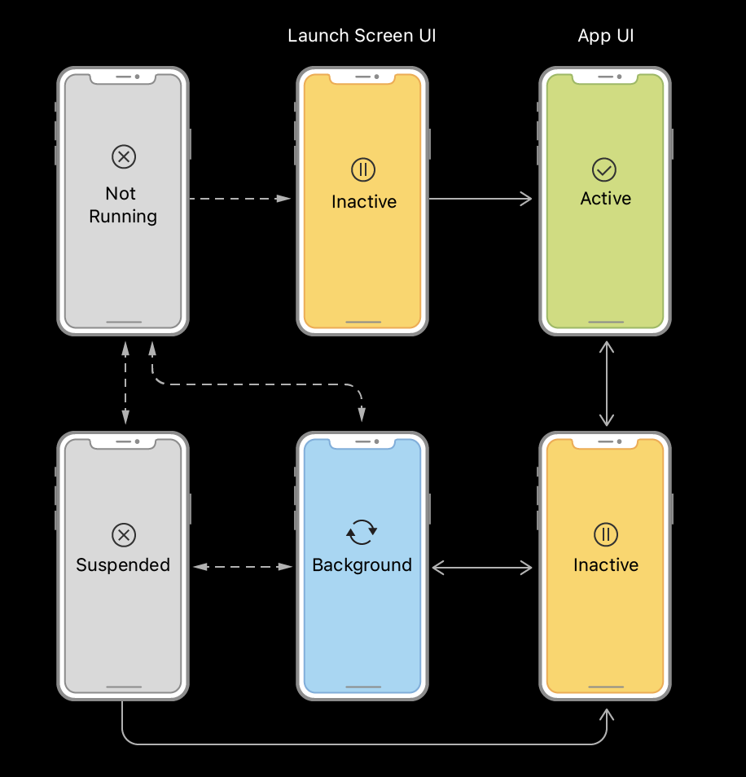

# [iOS Application Life Cycle](https://developer.apple.com/documentation/uikit/app_and_environment/managing_your_app_s_life_cycle)

The iOS application life cycle is different depending on whether or not an app supports scenes:

* In iOS 12 and earlier, or in apps that choose not to support scenes, [UIApplicationDelegate](https://developer.apple.com/documentation/uikit/uiapplicationdelegate) is used to respond to life cycle events.
* If an app is running on iOS 13 or later and has chosen to support scenes, [UISceneDelegate](https://developer.apple.com/documentation/uikit/uiscenedelegate) is used to respond to life cycle events.

 

## [App-Based Life Cycle](https://developer.apple.com/documentation/uikit/app_and_environment/managing_your_app_s_life_cycle#2928645)

An iOS app can be in one of five states: Active, Inactive, Background, Suspended or Not Running.

#### Active

The app is running in the foreground, receiving events and actively being used.

#### Inactive

The app is running in the foreground but is not receiving any events (it may be executing code though). This is generally a brief transition state between the 'Active' state and the 'Background' state. The app is in an 'Inactive' state when it is about to enter the active state (opening or switching to an app) or leave the active state (closing or leaving an app). This state is also entered whenever there is a system interruption such as an incoming phone call or an emergency alert.

#### Background

The app is running in the background and cannot receive any events. It can execute code but may have limited resources. An app will enter the background state whenever a user switches to another application. An app can remain in this state if it has requested extra execution time (ex: finishing a network request, saving data) or if it is performing a background task such as playing audio (ex: Spotify) or updating location information (ex: Google Maps). Otherwise, it will move into the 'Suspended' state.

#### Suspended

The app is loaded in memory making it easier to transition back to an active state if needed, but it cannot execute code or receive events, preserving battery life. If the system needs to free up memory, it will terminate suspended applications and won't notify them before doing so.

#### Not Running

The app is not running or loaded in memory, meaning that it cannot execute code and does not take up any resources. An application is in this state if it has yet to be launched or if it has been terminated by the user or the system.

 

**State** | **Running Location** | **Loaded In Memory** | **Can Execute Code** | **Can Receive Events**
---|---|---|---|---
**Active** | Foreground | :heavy_check_mark: | :heavy_check_mark: | :heavy_check_mark:
**Inactive** | Foreground | :heavy_check_mark: | :heavy_check_mark: |
**Background** | Background | :heavy_check_mark: | :heavy_check_mark: |
**Suspended** | N/A | :heavy_check_mark: | |
**Not Running** | N/A | | |

 

### Transitioning Between States

The following diagrams show the state transitions that occur in an app. After launch, the system puts the app in the inactive or background state, depending on whether the UI is about to appear onscreen. When launching to the foreground, the system transitions the app to the active state automatically. After that, the state fluctuates between active and background (transitioning through inactive) until the app terminates.

 | 
---|---

 

## UIApplication.State

An application can have one of three states: `active`, `inactive` or `background`. This state is represented by the enum `UIApplication.State` which can be accessed through [`UIApplication.shared.applicationState`](https://developer.apple.com/documentation/uikit/uiapplication/1623003-applicationstate).

 

## Links

* [Managing your app's lifecycle](https://developer.apple.com/documentation/uikit/app_and_environment/managing_your_app_s_life_cycle)
* [iOS App Life Cycle](https://medium.com/@boredbanana/ios-app-life-cycle-ec1b31cee9dc)
* [Execution States for a Swift iOS App](https://www.codingexplorer.com/execution-states-swift-ios-app/)
* [How to Remove SceneDelegate](https://stackoverflow.com/questions/59006550/how-to-remove-scene-delegate-from-ios-application)