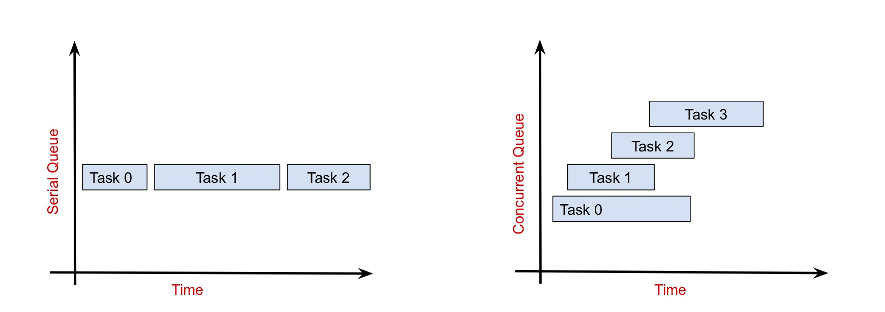

# Concurrency

## [Grand Central Dispatch (GCD)](https://developer.apple.com/documentation/dispatch)

Grand Central Dispatch is a framework provided by Apple that simplifies the process of writing concurrent code. GCD manages a collection of "dispatch queues" which are used to schedule the execution of tasks. Developers push their tasks onto one of the dispatch queues, and GCD takes care of executing these tasks from a pool of threads.

<br/>

## [Dispatch Queue](https://developer.apple.com/documentation/dispatch/dispatchqueue)

A dispatch queue is a FIFO queue that stores blocks of code to be executed. Dispatch queues can be serial or concurrent and tasks can be scheduled on them either synchronously or asynchronously.

### Serials vs. Concurrent Queues

Serial queues execute their tasks in order, one at a time. Each task must be completed before the next one can start. Concurrent queues on the other hand can run multiple tasks at the same time. Tasks are started in order but are not necessarily completed in order; tasks started later may finish before tasks that started earlier.



The code below creates a serial queue (`DispatchQueue` is serial by default) and adds two tasks to it. The first task takes five seconds to complete and the second task takes two seconds to complete.

```swift
let queue = DispatchQueue(label: "example")

queue.async {
    print("Task 1 started")
    sleep(5)
    print("Task 1 ended")
}

queue.async {
    print("Task 2 started")
    sleep(2)
    print("Task 2 ended")
}
```
Since it is a serial queue, these tasks are executed one at a time as can be seen by the print statements:

```
Task 1 started
Task 1 ended
Task 2 started
Task 2 ended
```
"Task 1 started" gets printed first, followed by "Task 1 ended" five seconds later. Then "Task 2 started " is printed, followed by "Task 2 ended" two seconds later.

However, if we change the queue to a concurrent one like so:

```swift
let queue = DispatchQueue(label: "example", attributes: .concurrent)
```

The tasks are executed differently:

```
Task 1 started
Task 2 started
Task 2 ended
Task 1 ended
```

"Task 1 started" and "Task 2 started" are printed right away, indicating that both tasks have been started. Two seconds later, "Task 2 ended" is printed and three seconds after that, "Task 1 ended" is printed. This is because we are now executing the tasks on a concurrent queue. The tasks are started in order and then run simultaneously. Since the second task doesn't take as much time, it finishes before the first task.

#### Pros and Cons

Serial queues have a predictable completion order and therefore prevent race conditions. However they are slower than concurrent queues because tasks can only be executed one at a time. Concurrent queues are fast because they can execute multiple tasks at once, allowing each task to complete sooner. However, the completion order of tasks is unpredictable and can result in race conditions. When the order of task completion is important, serial queues should be used - otherwise concurrent queues can be used.

<br/>

### Sync vs. Async

As mentioned above, tasks can be scheduled onto a queue either synchronously or asynchronously. When a task is scheduled synchronously, execution will stop and wait until the task is completed before continuing on. When a task is scheduled asynchronously, execution continues on without waiting for the task to be completed (the task gets completed on another thread).

This can be demonstrated with the following example:

```swift
print("before scheduling")
queue.async {
    for i in 1...3 {
        print(i)
    }
}
print("after scheduling")

// before scheduling
// after scheduling
// 1
// 2
// 3
```
As can be seen by the print statements above, execution continues without waiting for the task to be completed.

If we change `async` to `sync`, this behaviour changes; execution is halted until the task is completed:

```swift
let queue = DispatchQueue(label: "example")

print("before scheduling")
queue.sync {
    for i in 1...3 {
        print(i)
    }
}
print("after scheduling")

// before scheduling
// 1
// 2
// 3
// after scheduling
```
Synchronous scheduling is often referred to as "blocking" and asynchronous scheduling is often referred to as "non-blocking". Work can be scheduled either synchronously or asynchronously on both serial and concurrent queues. If we take the concurrent queue example from above, we can have it behave like a serial queue by changing from `async` to `sync`:

```swift
let queue = DispatchQueue(label: "example", attributes: .concurrent)

queue.sync {
    print("Task 1 started")
    sleep(5)
    print("Task 1 ended")
}

queue.sync {
    print("Task 2 started")
    sleep(2)
    print("Task 2 ended")
}

// Task 1 started
// Task 1 ended
// Task 2 started
// Task 2 ended
```
