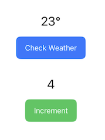
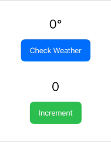
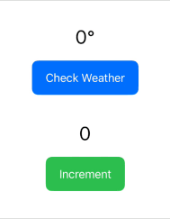
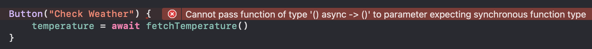
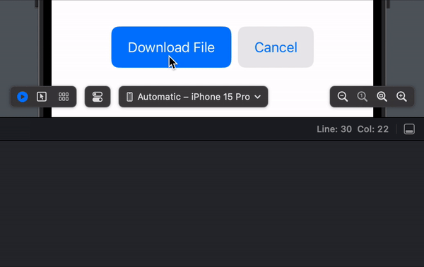
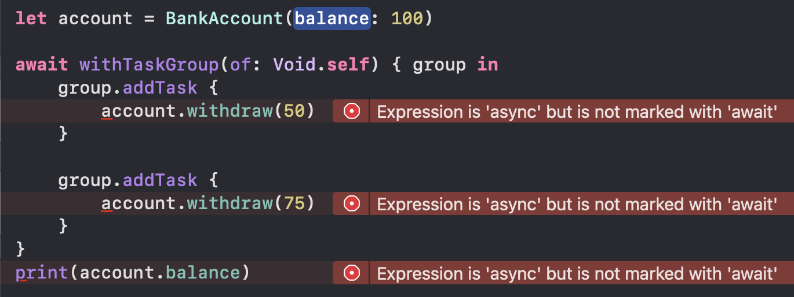

# Swift Concurrency

Swift 5.5 introduced a new approach for writing asynchronous code that provides a safer and more readable way to manage concurrent tasks compared to traditional techniques like Grand Central Dispatch. This new approach allows you to write asynchronous code in a way that looks and feels synchronous, making it less error prone and much easier to reason about.

<br/>

## [async/await](https://docs.swift.org/swift-book/documentation/the-swift-programming-language/concurrency/#Defining-and-Calling-Asynchronous-Functions)

### Synchronous vs. Asynchronous Functions

Most functions that you encounter are *synchronous* - they execute all of their work in order, line by line on a single thread. They are very easy to understand but an important downside is that they are *blocking* - the thread that a synchronous function runs on can't do any other work until the function has finished.

*Asynchronous* functions on the other hand can be suspended partway through their execution, allowing other work to take place. When an asynchronous function is suspended, it doesn't block the current thread - it allows other code to execute while it waits for the operation to complete.

<br/>

### Defining and Calling Asynchronous Functions

To make a function asynchronous, simply add the `async` keyword to its declaration, right after the parameters.

```swift
func fetchTemperature() async -> Int {
    return Int.random(in: -20...30)
}
```
To call an asynchronous function, you must use the `await` keyword. Failing to do so will result in a compiler error.

```swift
let temperature = await fetchTemperature()
```

The `await` keyword marks a possible suspension point, indicating that the current piece of code might pause execution while it waits for the asynchronous function to return. This is also called "yielding a thread" because, behind the scenes, Swift suspends the execution of your code on the current thread and runs some other code on that thread instead.

<br/>

### Blocking Example

Let's look at a practical example. Suppose we had a simple application that fetches the temperature from a server and displays it on screen, as well as a button that increments a counter:



Our code might look something like this:

```swift
struct ContentView: View {
    @State private var temperature = 0
    @State private var count = 0

    var body: some View {
        VStack {
            Text("\(temperature)°")

            Button("Check Weather") {
                temperature = fetchTemperature()
            }

            Text("\(count)")

            Button("Increment") {
                count += 1
            }
        }
    }

    func fetchTemperature() -> Int {
        sleep(3)
        return Int.random(in: -20...30)
    }
}
```
> Note: Modifiers have been excluded for brevity

<br/>

Notice how the `fetchTemperature()` function sleeps for 3 seconds, simulating the delay that a network request might make. When we trigger this function by pressing the "Check Weather" button, our UI freezes up and we can't interact with the other button to increment the count. This is because `fetchTemperature()` is a *synchronous* function - it blocks the current thread until it has finished all of its work.



<br/>

We can improve this by changing `fetchTemperature()` to an *asynchronous* function:

```swift
func fetchTemperature() async -> Int {
    sleep(3)
    return Int.random(in: -20...30)
}
```

And calling it using `await`:

```swift
Button("Check Weather") {
    Task {
        temperature = await fetchTemperature()
    }
}
```
> Note: We are also executing the asynchronous function within a `Task`. More on that later.

<br/>

Now, whenever we press the "Check Weather" button, our UI no longer freezes and we are free to interact with the other button while the `fetchTemperature()` function performs its work.



<br/>

### Where asynchronous functions can be called

Because code written with `await` needs to be able to suspend execution, there are only certain places where asynchronous functions can be called:

1. From another asynchronous function
2. From the static main() method of a structure, class or enumeration that's marked with @main
3. From an unstructured child task

<br/>

### Calling asynchronous functions from asynchronous functions

Asynchronous functions can call other asynchronous functions and doing so is quite straightforward. Suppose we wanted to build an app that created thumbnails by fetching images from a server, resizing them and then uploading them back to the server. These three actions might take some time so we could put them in separate asynchronous functions and then call them in sequence from another asynchronous function, `createThumbnails()`:

```swift
func fetchImages() async -> [UIImage] {
    print("Fetching images...")
    sleep(3)
    return [UIImage(), UIImage(), UIImage()]
}

func resizeImages(_ images: [UIImage]) async -> [UIImage] {
    print("Resizing images...")
    sleep(3)
    return images
}

func uploadImages(_ images: [UIImage]) async -> String {
    print("Uploading images...")
    sleep(3)
    return "OK"
}

func createThumbnails() async -> String {
    let images = await fetchImages()
    let resizedImages = await resizeImages(images)
    let result = await uploadImages(resizedImages)
    return result
}

let result = await createThumbnails()
print(result)
```

Each of the `await` calls inside `createThumbnails()` is a potential suspension point which is why they are explicitly marked. Swift will run each of the `await` calls in sequence, waiting for the previous one to complete. While `createThumbnails()` is waiting for each call to complete, the thread it is running on is free to do other work.

<br/>

### Asynchronous throwing functions

Using `async` and `await` when calling asynchronous functions is very similar to using `throws` and `try` when calling throwing functions - both keywords need to be used and you cannot have one without the other. When you have a function that is both asynchronous and throwing, you need to use all four keywords, with `async` placed before `throws` and `try` placed before `await`.

For example, the following function is both asynchronous and throwing because it performs a network request using `URLSession` which can fail and throw an error. So we mark the function with `async throws` and call it with `try await`:

```swift
func fetchNews() async throws -> Data? {
    let url = URL(string: "https://hws.dev/news-1.json")!
    let (data, _) = try await URLSession.shared.data(from: url)
    return data
}

let data = try await fetchNews()
```

<br/>

### Calling asynchronous functions in parallel

Calling an asynchronous function with `await` only executes one piece of code at a time - the caller waits for that code to finish before moving on to run the next line of code.

For example, suppose we wanted to download three books and store them in an array like so:

```swift
func downloadBook(name: String) async -> String {
    print("Downloading \(name)...")
    sleep(2)
    return ("Contents of \(name)")
}

let book1 = await downloadBook(name: "Harry Potter")
let book2 = await downloadBook(name: "The Hobbit")
let book3 = await downloadBook(name: "Catch-22")

let books = [book1, book2, book3]
print(books)
```
As can be seen from the print statements that appear one at a time, each book is being downloaded completely before the next one starts downloading.


However, there is no need for these operations to wait for each other - each book can download independently or even at the same time. To call an asynchronous function and let it run in parallel with code around it, write `async` in front of `let` when you define a constant, and then write `await` each time you use the constant.

If we change our code accordingly,

```swift
async let book1 = downloadBook(name: "Harry Potter")
async let book2 = downloadBook(name: "The Hobbit")
async let book3 = downloadBook(name: "Catch-22")

let books = await [book1, book2, book3]
print(books)
```

we can see that all three books start downloading at the same time, but our code doesn't continue execution until all of the books have been successfully downloaded.


> Note: Using `async let`, doesn't guarantee that asynchronous tasks will be run in parallel - this will only happen if there are enough system resources available. Also, using `async let` doesn't guarantee the order in which the tasks are completed.

<br/>

#### When to use `await` vs. `async let`

- Call asynchronous functions with `await` when the code on the following line depends on that function’s result. This creates work that is carried out sequentially.
- Call asynchronous functions with `async let` when you don’t need the result until later in your code. This creates work that can be carried out in parallel.

<br/>

## [Tasks](https://developer.apple.com/documentation/swift/task)

In our earlier example where we had a button that fetched the temperature asynchronously, we wrapped our asynchronous function call in something called a `Task`:

```swift
Button("Check Weather") {
    Task {
        temperature = await fetchTemperature()
    }
}
```

If we were to remove the task and try to call `fetchTemperature()` directly, we would get a compiler error:



This is because asynchronous code cannot run directly in a synchronous function. However, tasks create concurrent environments that allow asynchronous code to be triggered from synchronous functions.

Tasks are essentially units of work that can be run asynchronously. In fact, all asynchronous code runs as part of some task. In our earlier example where we used `async let` to download books, each `async let` implicitly created a task.

<br/>

### Task Initialization

Tasks are initialized by passing a closure containing the code that will be executed by a given task. After this code has run to completion, the task has finished, resulting in either a failure or result value.

```swift
Task {
    print("Hello World")
}
```

> Note: Tasks start running as soon as they are created - they do not need to be explicitly started.

<br/>

### Task Return Values

It is possible for tasks to return values. To read the returned value of a task, you need to store a reference to the task and access its `value` property using `await`:

```swift
let task = Task {
    return Int.random(in: 1...10)
}

let number = await task.value
print(number)
```

> Note: Tasks will be created, started and run to completion regardless of whether you store a reference to them. If you don't care about the result of a task, you can simply create it and let it run in a "fire and forget" manner.

<br/>

### Task Errors

Tasks can also throw errors. Here we have a task that can randomly fail, so we use a `do-catch` block along with `try await` to access the value returned by the task:

```swift
enum FetchError: Error {
    case failed
}

let task = Task {
    if Bool.random() {
        throw FetchError.failed
    }

    return Int.random(in: 1...10)
}

do {
    let number = try await task.value
    print(number)
} catch {
    print(error)
}
```

<br/>

### Creating Multiple Tasks

A task itself only does one thing at a time, but when you create multiple tasks, Swift can schedule them to run simultaneously. For example, suppose we had the following asynchronous function to download an album:

```swift
func downloadAlbum(name: String) async {
    print("Downloading \(name)...")
    try? await Task.sleep(nanoseconds: UInt64.random(in: 1_000_000_000...3_000_000_000)) // Simulate network delay
    print("Finished downloading \(name)")
}
```
> Note: `Task.sleep()` causes a task to sleep for the specificed number of nanoseconds. It can throw an error which is why it must be marked with `try`. Unlike `sleep()`, `Task.sleep()` does *not* block the underlying thread, allowing it to pick up work from elsewhere if needed.

If we then triggered three separate tasks, we can see based on the timing of the print statements that all three tasks are started at once and run at the same time.

```swift
Task {
    await downloadAlbum(name: "folklore")
}

Task {
    await downloadAlbum(name: "reputation")
}

Task {
    await downloadAlbum(name: "1989")
}
```


Notice how even though all of the tasks are running at the same time, the order in which they start and finish is not guaranteed and can be different every time.

<br/>

### Tasks in SwiftUI

In SwiftUI, it is very common to start a task as soon as a view appears by creating a task within the `.onAppear` closure:

```swift
struct ContentView: View {
    @State private var temperature: Int = 0

    var body: some View {
        VStack {
            Text("\(temperature)°")
        }
        .onAppear {
            Task {
                await fetchTemperature()
            }
        }
    }

    func fetchTemperature() async {
        sleep(2)
        temperature = Int.random(in: -20...30)
    }
}
```

This functionality is so common that iOS15 introduced the [`.task()`](https://developer.apple.com/documentation/swiftui/view/task(priority:_:)) modifier which adds an asynchronous task to perform before a view appears. Using this new modifier, we could rewrite the above code as follows:

```swift
struct ContentView: View {
    @State private var temperature: Int = 0

    var body: some View {
        VStack {
            Text("\(temperature)°")
        }
        .task {
            await fetchTemperature()
        }
    }

    func fetchTemperature() async {
        sleep(2)
        temperature = Int.random(in: -20...30)
    }
}
```

The `.task()` modifier has some added benefits that make it preferable over adding a task to `.onAppear()`:

- Asynchronous work can be performed directly within a `.task()` modifier - you do not need to create a `Task`
- `.task()` will automatically cancel the task if the view is destroyed
- `.task()` can take an `id` parameter that allows you to cancel and restart the task when the value of `id` changes
- `.task()` can take a priority parameter that allows you to specify the priority of the task relative to other tasks

<br/>

## Task Cancellation

Tasks in Swift use *cooperative cancellation*, which means that not only do we need to request that a task be cancelled, but the task itself must also check if it has been cancelled and respond accordingly.

For example, suppose we created an app with two buttons, one to download a file and another to cancel the download operation.


Our code might like something like this:

```swift
struct ContentView: View {
    @State private var task: Task<Void, Error>?

    var body: some View {
        HStack {
            Button("Download File") {
                downloadFile()
            }

            Button("Cancel") {
                cancelDownload()
            }
        }
    }

    func downloadFile() {
        task = Task {
            for i in 1...100 {
                usleep(50_000)
                print("\(i)%")
            }
        }
    }

    func cancelDownload() {
        task?.cancel()
    }
}
```

<br/>

The `downloadFile()` function, creates a task that prints the numbers from 1 to 100, sleeping for a fraction of a second between each in order to simulate downloading a file over a period of time. We store a reference to this task so that it can be cancelled if the 'Cancel' button is pressed.

However, when we press the 'Cancel' button, the task doesn't stop - it continues running:



By calling `.cancel()` on the task, we're essentially setting a boolean flag, but the task itself isn't checking this value so it just keeps on executing.

<br/>

### Handling Task Cancellation

There are two ways that a task can check for cancellation and stop running:

- Calling the `Task.checkCancellation()` method
- Reading the `Task.isCancelled` property

<br/>

#### Task.checkCancellation()

Calling `Task.checkCancellation()` checks if the task has been cancelled and if so, stops the task by throwing a `CancellationError`. If we insert this method in the for-loop of the `downloadFile()` function, we can check for cancellation before every sleep cycle.

```swift
func downloadFile() {
    task = Task {
        do {
            for i in 1...100 {
                try Task.checkCancellation()
                usleep(50_000)
                print("\(i)%")
            }
        } catch is CancellationError {
            print("Task was cancelled")
        }
    }
}
```
Now when the 'Cancel' button is pressed, `Task.checkCancellation()` throws an error and the task is stopped:


<br/>

#### Task.isCancelled

If you require more flexibility or need to perform clean-up work before stopping a task (ex: closing network connections or deleting temporary files), you can check the `Task.isCancelled` property instead. When checking the `Task.isCancelled` property, you must cancel the task manually. In this example, we cancel the task by returning:

```swift
func downloadFile() {
    task = Task {
        for i in 1...100 {
            if Task.isCancelled {
                print("Performing cleanup")
                return
            }
            usleep(50_000)
            print("\(i)%")
        }
    }
}
```


<br/>

### Automatic Cancellation

Some parts of Foundation automatically check for task cancellation and will throw their own cancellation error without your input. For example, `Task.sleep()` checks for cancellation and will automatically terminate the sleep and throw a `CancellationError`:

```swift
func downloadFile() {
    task = Task {
        for i in 1...100 {
            try await Task.sleep(nanoseconds: 50_000_000)
            print("\(i)%")
        }
    }
}
```


It is important to be aware of these automatic cancellation checks and to provide your own where appropriate to prevent expensive operations from continuing to run after a task has been cancelled.

<br/>

## [Task Groups](https://developer.apple.com/documentation/swift/taskgroup?ref=blixt-dev)

Task groups allow you to combine multiple parallel tasks together and wait for the result when all the tasks have finished. They are a more advanced version of `async let` and allow you to dynamically add tasks at runtime. Child tasks may run in parallel or in serial, but the task group will only be marked as finished once all of its child tasks are done. Each task inside the group must return the same kind of data.

<br/>

### Creating a Task Group

Task groups are created using the `withTaskGroup(of:)` function where the `of` argument refers to the data type that each task in the group will return. Within the body of the `withTaskGroup` closure, we pass the code for the group to execute including calls to `addTask()` for each task to add to the group. Finally, because task groups execute asynchronously, they must be called with `await`.

For example, the following task group has three tasks which don't return anything, so we pass in `Void.self`:

```swift
 await withTaskGroup(of: Void.self) { group in
    group.addTask {
        print("Task 1")
    }

    group.addTask {
        print("Task 2")
    }

    group.addTask {
        print("Task 3")
    }
}
```

<br/>

The three child tasks above are very simple and don't take any significant time so they will likely be executed in order, however the order in which child tasks start and finish is not guaranteed. We can see this behaviour if we increase the amount of time each child task takes:

```swift
print("Starting task group...")

await withTaskGroup(of: Void.self) { group in
    group.addTask {
        print("Task 1 started")
        try? await Task.sleep(nanoseconds: UInt64.random(in: 1_000_000_000...3_000_000_000))
        print("Task 1 finished")
    }

    group.addTask {
        print("Task 2 started")
        try? await Task.sleep(nanoseconds: UInt64.random(in: 1_000_000_000...3_000_000_000))
        print("Task 2 finished")
    }

    group.addTask {
        print("Task 3 started")
        try? await Task.sleep(nanoseconds: UInt64.random(in: 1_000_000_000...3_000_000_000))
        print("Task 3 finished")
    }
}

print("Finished task group")
```


As we can see from the print statements, all three tasks are started at the same time but finish in a different order. The final print statement, "Finished task group", isn't executed until the task group has completed.

<br/>

### Dynamically Adding Tasks to a Group

In the examples above, the number of child tasks is known at compile time and they are added to the group in a similar way that we would use `async let` to create child tasks. One big advantage of task groups is the ability to add tasks dynamically. For example, we could rewrite the code above to add a random number of tasks using a for-loop:

```swift
await withTaskGroup(of: Void.self) { group in
    for i in 1...Int.random(in: 2...5) {
        group.addTask {
            print("Task \(i) started")
            try? await Task.sleep(nanoseconds: UInt64.random(in: 1_000_000_000...3_000_000_000))
            print("Task \(i) finished")
        }
    }
}
```
<br/>

### Returning Values from Task Groups

So far we have just seen task groups that execute some code but don't return anything. However, it is very common when working with task groups for each child task to return a value and to have those values aggregated into a single value that gets returned from the task group itself.

For example, suppose we had the following function for downloading an image:

```swift
func downloadImage(name: String) async -> UIImage {
    print("Downloading image called \(name)...")
    try? await Task.sleep(nanoseconds: UInt64.random(in: 1_000_000_000...3_000_000_000))
    return UIImage()
}
```

We could then create a task group that downloads multiple images and returns them in an array like so:

```swift
let imageNames = ["beach.jpg", "desert.png", "mountain.jpg"]

let images = await withTaskGroup(of: UIImage.self) { group in
    for name in imageNames {
        group.addTask {
            return await downloadImage(name: name)
        }
    }

    var allImages = [UIImage]()
    for await image in group {
        allImages.append(image)
    }

    return allImages
}

print("Successfully downloaded \(images.count) images")
```

Notice how we pass `UIImage.self` when creating the task group to indicate that each child task will return a `UIImage`. After creating the child tasks, we can add their returned values (images) to an array one by one as each child task completes, using `for await`. Finally, once all child tasks have completed, we can return the array of images from the task group.

<br/>

#### Implicit vs Explicit Return Types

The return type of the task group above (`[UIImage]`) is implicit, but it is often a good idea to explicitly declare the return type in order to improve readability. This can be done in one of two ways:

Declaring the return type as part of the closure:

```swift
let images = await withTaskGroup(of: UIImage.self) { group -> [UIImage] in
```
Or using the `returning` argument of `withTaskGroup()`:

```swift
let images = await withTaskGroup(of: UIImage.self, returning: [UIImage].self) { group in
```

<br/>

### Throwing Task Groups

Any child tasks created with `withTaskGroup()` cannot throw errors. If you want child tasks to be able to throw errors that bubble upwards to be handled outside the task group, you can use `withThrowingTaskGroup()` instead.

For example, the `downloadImage()` function could fail to fetch the image from the server. We could simulate this by making it a throwing function that throws 20% of the time:

```swift
enum DownloadError: Error {
    case failure
}

func downloadImage(name: String) async throws -> UIImage {
    print("Downloading image called \(name)...")
    if Int.random(in: 1...5) == 5 {
        throw DownloadError.failure
    }
    try? await Task.sleep(nanoseconds: UInt64.random(in: 1_000_000_000...3_000_000_000))
    return UIImage()
}
```
Then we call `withThrowingTaskGroup` with `try await` and wrap it in a do-catch block to catch any errors if they occur.

```swift
let imageNames = ["beach.jpg", "desert.png", "mountain.jpg"]
do {
    let images = try await withThrowingTaskGroup(of: UIImage.self) { group in
        for name in imageNames {
            group.addTask {
                return try await downloadImage(name: name)
            }
        }

        var allImages = [UIImage]()
        for try await image in group {
            allImages.append(image)
        }
        return allImages
    }
    print("Successfully downloaded \(images.count) images")
} catch {
    print("Error downloading images")
}
```

<br/>

## [Actors](https://docs.swift.org/swift-book/documentation/the-swift-programming-language/concurrency/#Actors)

Tasks allow you to break your program up into isolated, concurrent pieces that are safe to run at the same time. However, when multiple tasks need to share or access the same information, this can lead to data races. Actors aim to solve this issue completely by only allowing synchronized access to their isolated data.

To better explain actors, let's first demonstrate the problem that they solve. Suppose we had the following class that represents a bank account:

```swift
class BankAccount {
    private(set) var balance: Double = 0.0

    init(balance: Double) {
        self.balance = balance
    }

    func deposit(_ amount: Double) {
        balance += amount
    }

    func withdraw(_ amount: Double) -> Bool {
        if balance >= amount {
            balance -= amount
            return true
        }
        return false
    }
}
```

If we had an instance of a bank account with a balance of \$100 and two separate threads attempted to withdraw some money at the same time (\$50 and \$75 respectively), we could end up in a situation where both transactions go through and we are left with a negative balance of -\$25. But we are checking that the balance is greater or equal to the amount to withdraw so how could this happen? Let's break it down:

1. We have a bank account with a balance of 100
2. Thread one checks if `balance >= amount`. 100 is greather than 50 so we move inside the if statement
3. Thread two checks if `balance >= amount`. Thread one hasn't yet deducted its amount so the balance is still 100. 100 is greater than 75 so thread two moves inside the if statement.
4. Thread one performs `balance -= amount`. 50 is subtracted from 100, leaving a balance of 50.
5. Thread two performs `balance -= amount`. 75 is subtracted from 50, leaving a balance of -25.

This is an example of a data race - when the same memory is accessed from multiple threads without synchronization and at least one access is a write.

We can simulate this problem like so:

```swift
let account = BankAccount(balance: 100)

await withTaskGroup(of: Void.self) { group in
    group.addTask {
        account.withdraw(50)
    }

    group.addTask {
        account.withdraw(75)
    }
}
print(account.balance)
```

The resulting balance might be 50, it might be 25 or it might be -25. By adding a short delay after checking the balance within the `withdraw` function, we can increase the likelihood of a data race occurring:

```swift
func withdraw(_ amount: Double) -> Bool {
    if balance >= amount {
        usleep(UInt32.random(in: 100_000...500_000))
        balance -= amount
        return true
    }
    return false
}
```

<br/>

### Using Actors to Prevent Data Races

Before actors were introduced, the problem above would have to be prevented using locks or other synchronization methods to only allow one thread to have access to the bank account instance at a time. Actors take care of all this work for us by only allowing one task to have access to its mutable state at a time. If a task requests access to an actor while it is already in use, the task will be suspended while it waits for access to be granted.

To create an actor, simply use the `actor` keyword to define a type, just as you would a `struct` or a `class`:

```swift
actor BankAccount {
    private(set) var balance: Double = 0.0

    init(balance: Double) {
        self.balance = balance
    }

    func deposit(_ amount: Double) {
        balance += amount
    }

    func withdraw(_ amount: Double) -> Bool {
        if balance >= amount {
            usleep(UInt32.random(in: 100_000...200_000))
            balance -= amount
            return true
        }
        return false
    }
}
```

<br/>

This change now creates some compiler errors where we attempt to access the bank account instance:



<br/>

This is because `account` is now an actor and when accessing any mutable properties or functions of an actor, you must use `await`:

```swift
let account = BankAccount(balance: 100)

await withTaskGroup(of: Void.self) { group in
    group.addTask {
        await account.withdraw(50)
    }

    group.addTask {
        await account.withdraw(75)
    }
}
await print(account.balance)
```

<br/>

Now only one task can have access to the bank account at a time, ensuring that read and write operations are not interleaved between threads and only valid bank transactions go through.

> Note: By using an actor we have removed the possibility of a data race (ending up with a balance of -25) but we technically still have what is called a 'race condition', where the correctness of a program depends on the unpredictable order of events. The task group above has two tasks that each make a withdrawal but we have no control over which task will be executed first, leaving our balance in a non-deterministic state (either a balance of 50 or a balance of 25).

<br/>


## Links

- [Hacking with Swift Concurrency Guide](https://www.hackingwithswift.com/quick-start/concurrency)
- [Async Await in Swift Explained with Code Examples](https://www.avanderlee.com/swift/async-await/)
- [SwiftUI task vs. onAppear](https://byby.dev/swiftui-task-vs-onappear)
- [Actors in Swift: How to use and prevent data races](https://www.avanderlee.com/swift/actors/)
- [Data Race vs Race Condition in Swift](https://byby.dev/data-race-vs-race-condition)
- [Isolated vs Nonisolated](https://byby.dev/swift-actor-isolation)