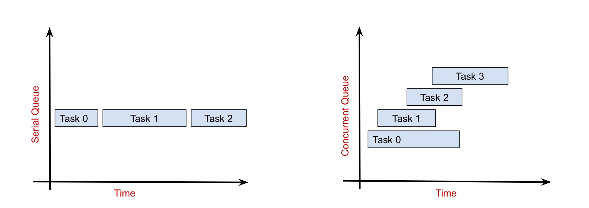

# [Grand Central Dispatch (GCD)](https://developer.apple.com/documentation/dispatch)

Grand Central Dispatch is a framework provided by Apple that simplifies the process of writing concurrent code. GCD manages a collection of "dispatch queues" which are used to schedule the execution of tasks. Developers push their tasks onto one of the dispatch queues, and GCD takes care of executing these tasks from a pool of threads.

<br/>

## [Dispatch Queue](https://developer.apple.com/documentation/dispatch/dispatchqueue)

A dispatch queue is a FIFO queue that stores blocks of code to be executed. Dispatch queues can be serial or concurrent and tasks can be scheduled on them either synchronously or asynchronously.

<br/>

### Serial vs. Concurrent Queues

Serial queues execute their tasks in order, one at a time. Each task must be completed before the next one can start. Concurrent queues on the other hand can run multiple tasks at the same time. Tasks are started in order but are not necessarily completed in order; tasks started later may finish before tasks that started earlier.



The code below creates a serial queue (`DispatchQueue` is serial by default) and adds two tasks to it. The first task takes five seconds to complete and the second task takes two seconds to complete.

```swift
let queue = DispatchQueue(label: "example")

queue.async {
    print("Task 1 started")
    sleep(5)
    print("Task 1 ended")
}

queue.async {
    print("Task 2 started")
    sleep(2)
    print("Task 2 ended")
}

// Task 1 started
// Task 1 ended
// Task 2 started
// Task 2 ended
```
Since it is a serial queue, these tasks are executed one at a time as can be seen by the print statements. "Task 1 started" gets printed first, followed by "Task 1 ended" five seconds later. Then "Task 2 started " is printed, followed by "Task 2 ended" two seconds later.

However, if we change the queue to a concurrent one, the tasks are executed differently:

```swift
let queue = DispatchQueue(label: "example", attributes: .concurrent)

queue.async {
    print("Task 1 started")
    sleep(5)
    print("Task 1 ended")
}

queue.async {
    print("Task 2 started")
    sleep(2)
    print("Task 2 ended")
}

// Task 1 started
// Task 2 started
// Task 2 ended
// Task 1 ended
```

"Task 1 started" and "Task 2 started" are printed right away, indicating that both tasks have been started. Two seconds later, "Task 2 ended" is printed and three seconds after that, "Task 1 ended" is printed. This is because we are now executing the tasks on a concurrent queue. The tasks are started in order and then run simultaneously. Since the second task doesn't take as much time, it finishes before the first task.

#### Pros and Cons

Serial queues have a predictable completion order and therefore prevent race conditions. However they are slower than concurrent queues because tasks can only be executed one at a time. Additionally, due to their blocking behaviour, if you are not careful, they can result in deadlocks. Concurrent queues are fast because they can execute multiple tasks at once, allowing each task to complete sooner. However, the completion order of tasks is unpredictable and can result in race conditions. When the order of task completion is important, serial queues should be used - otherwise concurrent queues can be used.

<br/>

### Sync vs. Async

As mentioned above, tasks can be scheduled onto a queue either synchronously or asynchronously. When a task is scheduled synchronously, execution will stop and wait until the task is completed before continuing on. When a task is scheduled asynchronously, execution continues on without waiting for the task to be completed (the task gets completed on another thread).

This can be demonstrated with the following example:

```swift
print("before scheduling")
queue.async {
    for i in 1...3 {
        print(i)
    }
}
print("after scheduling")

// before scheduling
// after scheduling
// 1
// 2
// 3
```
As can be seen by the print statements above, execution continues without waiting for the task to be completed.

If we change `async` to `sync`, this behaviour changes; execution is halted until the task is completed:

```swift
let queue = DispatchQueue(label: "example")

print("before scheduling")
queue.sync {
    for i in 1...3 {
        print(i)
    }
}
print("after scheduling")

// before scheduling
// 1
// 2
// 3
// after scheduling
```
Synchronous scheduling is often referred to as "blocking" and asynchronous scheduling is often referred to as "non-blocking". Work can be scheduled either synchronously or asynchronously on both serial and concurrent queues. If we take the concurrent queue example from above, we can have it behave like a serial queue by changing from `async` to `sync`:

```swift
let queue = DispatchQueue(label: "example", attributes: .concurrent)

queue.sync {
    print("Task 1 started")
    sleep(5)
    print("Task 1 ended")
}

queue.sync {
    print("Task 2 started")
    sleep(2)
    print("Task 2 ended")
}

// Task 1 started
// Task 1 ended
// Task 2 started
// Task 2 ended
```
> Tip: It is helpful to remember that sync/async affects the current thread *from* which you are dispatching, whereas serial/concurrent affects the destination queue *to* which you are dispatching.

<br/>

## Main and Global Dispatch Queues

The examples thus far have used custom, created queues, however iOS provides five dispatch queues for you to use: One serial queue (Main) and four concurrent queues (Global) of varying prioirty. You can still create your own dispatch queues if necessary, but usually the provided ones are enough.

<br/>

### [Main Dispatch Queue](https://developer.apple.com/documentation/dispatch/dispatchqueue/1781006-main)

The main dispatch queue is a globally available serial queue that executes tasks on the main thread. To schedule a task on the main queue, use `DispatchQueue.main.async`:

```swift
DispatchQueue.main.async {
    print("Main: \(Thread.isMainThread)")
}
// Main: true
```

All UI related operations must be performed on the main thread. In fact, if you try to update any UI from a background thread it will result in a crash. A common example of this is when a network request returns and you want to update your UI with the retrieved data. In the completion handler of the network request, any code that modifies UI, must be moved to the main thread by putting it inside `DispatchQueue.main.async {}`:

```swift
let task = URLSession.shared.dataTask(with: url) { (data, response, error) in
   if let data = data {
      // Redirect to the main thread.
      DispatchQueue.main.async {
         self.label.text = "\(data.count) bytes downloaded"
      }
   }
}
task.resume()
```

Since the main thread is used for updating the UI, it should not be used for any long or heavy tasks that could block execution, making the app unresponsive (such as making network requests or I/O operations). These sorts of tasks should be executed on a background queue instead, leaving the main thread free to update the UI.

> Important: Tasks should only be dispatched to the main queue asynchronously and **never** synchronously. Using `DispatchQueue.main.sync` will result in a deadlock.

<br/>

### [Global Concurrent Queues](https://developer.apple.com/documentation/dispatch/dispatchqueue/2300077-global)

Global concurrent queues are concurrent and do not execute tasks on the main thread. To schedule a task on a global concurrent queue, use `DispatchQueue.global()` with either `sync` or `async`:

```swift
DispatchQueue.global().async {
    print("Global: \(Thread.isMainThread)")
}
// Global: false
```

There are four global dispatch queues of varying priority: high, default, low and background. Tasks on a higher priority queue are more likely to be completed sooner than tasks on a lower priority queue (although this is not guaranteed).

<br/>
#### [Quality-of-service (QoS)](https://developer.apple.com/documentation/dispatch/dispatchqos)

When scheduling a task on global concurrent queues, you can specify the priority of your task by using the enum [`DispatchQoS.QoSClass`](https://developer.apple.com/documentation/dispatch/dispatchqos/qosclass). There are six different DispatchQoS values, listed below in order from highest priority to lowest.

* [userInteractive](https://developer.apple.com/documentation/dispatch/dispatchqos/1780708-userinteractive): The quality-of-service class for user-interactive tasks, such as animations, event handling, or updates to your app's user interface. The type of work assigned to this QoS should be virtually instantaneous, otherwise the interface may appear frozen.

* [userInitiated](https://developer.apple.com/documentation/dispatch/dispatchqos/1780759-userinitiated): The quality-of-service class for tasks that prevent the user from actively using your app. Assign this QoS to tasks that the user has initiated and that require immediate results, like opening a saved document or loading the content of an email. The type of work assigned to this QoS should be nearly instantaneous, such as a few seconds or less.

* [default](https://developer.apple.com/documentation/dispatch/dispatchqos/2016062-default): The default quality-of-service class. Assign this class to tasks or queues that your app initiates or uses to perform active work on the user's behalf. This value is assigned if you don't specify a quality-of-service value explicitly.

* [utility](https://developer.apple.com/documentation/dispatch/dispatchqos/1780791-utility): The quality-of-service class for tasks that the user does not track actively and that do not prevent the user from continuing to use your app (ex: downloading or importing data).

* [background](https://developer.apple.com/documentation/dispatch/dispatchqos/1780981-background): The quality-of-service class for maintenance or cleanup tasks that you create. Assign this QoS to tasks or dispatch queues that you use to perform work while your app is running in the background.

* [unspecified](https://developer.apple.com/documentation/dispatch/dispatchqos/1780703-unspecified): The absence of a quality-of-service class.

Specifying a different QoS for asynchronous tasks doesn't guarantee the order in which those tasks will be performed since they will be running on different threads. But it is more likely that the tasks running at a higher priority will be completed first. In the following example, a different output is produced every time, but in almost every case, the userInteractive task finishes first. 

```swift
DispatchQueue.global(qos: .background).async {
    for _ in 1...5 {
        print("background")
    }
}

DispatchQueue.global(qos: .userInteractive).async {
    for _ in 1...5 {
        print("userInteractive")
    }
}

// userInteractive
// background
// userInteractive
// userInteractive
// userInteractive
// background
// userInteractive
// background
// background
// background
```
Because higher priority work is performed more quickly and with more resources than lower priority work, it typically requires more energy than lower priority work. Accurately specifying appropriate QoS classes for the work your app performs ensures that your app is responsive and energy efficient.

<br/>

## [Dispatch Group](https://developer.apple.com/documentation/dispatch/dispatchgroup)

Dispatch Groups allow you to aggregate multiple asynchronous tasks together and either wait for or be notified when all the tasks are finished executing. Dispatch Groups are useful when you need to perform more than one asynchronous task before moving on to a secondary step in your program.

The following example uses a Dispatch Group to wait for two asynchronous tasks to complete before continuing execution. 

```swift
let queue = DispatchQueue.global()
let group = DispatchGroup()

group.enter()
queue.async {
    sleep(3)
    print("Task 1 done")
    group.leave()
}

group.enter()
queue.async {
    sleep(1)
    print("Task 2 done")
    group.leave()
}

group.wait()
print("Continue execution")

// Task 2 done
// Task 1 done
// Continue execution
```

Pairs of `enter()` and `leave()` are used to add tasks to a group. If you forget to call `enter()` before a task, it won't be added to the group. If you forget to call `leave()` when a task finishes, the group will be left waiting and your program's execution won't be resumed. An easier way of adding tasks to a dispatch group is by passing the group into the async method:

```swift
let queue = DispatchQueue.global()
let group = DispatchGroup()

queue.async(group: group) {
    sleep(3)
    print("Task 1 done")
}

queue.async(group: group) {
    sleep(1)
    print("Task 2 done")
}

group.wait()
print("Continue execution")

// Task 2 done
// Task 1 done
// Continue execution
```

If you do not want to wait for all tasks to finish executing, you can instead let the tasks run asynchronously and be notified using the `notify()` method:

```swift
let queue = DispatchQueue.global()
let group = DispatchGroup()

queue.async(group: group) {
    sleep(3)
    print("Task 1 done")
}

queue.async(group: group) {
    sleep(1)
    print("Task 2 done")
}

group.notify(queue: queue) {
    print("All tasks done")
}

print("Continue execution right away")

// Continue execution right away
// Task 2 done
// Task 1 done
// All tasks done
```

<br/>

## To Cover
* Other scheduling methods
	* asyncAfter
	* asyncAndWait
	* concurrentPerform
* Common Multithreading Problems
	* Race conditions
	* Data Races
	* Deadlocks
	* Thread explosion

<br/>

## Links
* [iOS Concurrency and Threading Video](https://www.youtube.com/watch?v=iTcq6L-PaDQ)
* [Mastering iOS Concurrency](https://youtu.be/X9H2M7xMi9E)
* [Diagnosing Threading Issues](https://developer.apple.com/documentation/xcode/diagnosing-memory-thread-and-crash-issues-early)