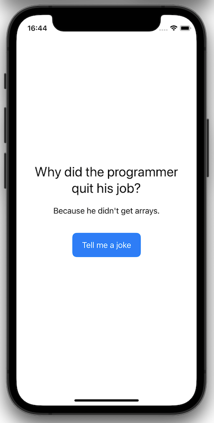
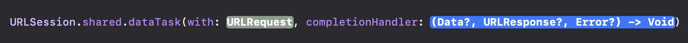

# Networking

There are many ways in which network requests can be made in Swift:

1. **URLSession** - Native API provided by Apple for making HTTP requests
2. **Concurrency (async/await)** - Newer approach introduced in Swift 5.5
3. **Third-party libraries** such as Alamofire
4. **Combine Framework** - Useful for handling data streams and complex asynchronous workflows

<br/>

Regardless of the way in which you choose to make your network requests, you will need to follow these essential steps:

1. **Define a Model:** Create a model (struct) to represent the JSON data that you expect to receive from the network call. This model should conform to the `Decodable` protocol so that it can be decoded from JSON by a `JSONDecoder`.
2. **Create a URL:** Create a `URL` representing the endpoint of the network request you intend to make
3. **Configure the URLRequest (optional):** If you need to set the HTTP method or specify any headers or body data, you can configure a `URLRequest` object. If you are making a simple GET request, you can often skip this step.
4. **Execute the Network Call:** Make the network request using one of the methods listed above
5. **Handle the Response:** Handle the response returned from the network request, checking the status code and catching any errors
6. **Decode the Data:** If the network request was successful and no errors were encountered, you can decode the returned data (typically JSON) into your model struct using a `JSONDecoder`

<br/>

## [URLSession](https://developer.apple.com/documentation/foundation/urlsession)

Suppose we wanted to create a simple application that fetched jokes from the internet and displayed them on screen with the click of a button:



We could do this using `URLSession` like so:

```swift
// 1. Define a model
struct Joke: Codable {
    let setup: String
    let punchline: String
}

// View struct (modifiers have been omitted for brevity)
struct ContentView: View {
    @State private var joke: Joke?

    var body: some View {
        VStack {
            VStack {
                if let joke {
                    Text(joke.setup)
                    Text(joke.punchline)
                }
                Button("Tell me a joke") {
                    fetchJoke()
                }
            }
        }
    }

    func fetchJoke() {
        // 2. Create a URL
        guard let url = URL(string: "https://official-joke-api.appspot.com/jokes/random") else {
            print("Failed to create URL!")
            return
        }

        // 3. Create and configure a URLRequest (optional - you can also just pass url directly to URLSession.shared.dataTask)
        let request = URLRequest(url: url)

        let task = URLSession.shared.dataTask(with: request) { data, response, error in
            // 5. Handle the response
            if let error = error {
                print(error.localizedDescription)
                return
            }

            guard let response = response as? HTTPURLResponse, response.statusCode == 200 else {
                print("Invalid response")
                return
            }

            guard let data = data else {
                print("Error retrieving data!")
                return
            }

            // 6. Decode the data
            do {
                let decodedData = try JSONDecoder().decode(Joke.self, from: data)
                DispatchQueue.main.async {
                    self.joke = decodedData
                }
            } catch {
                print("Error decoding response: \(error.localizedDescription)")
                return
            }
        }

        // 4. Execute the Network Call
        task.resume()
    }
}
```

<br/>

### 1. Define the Model

The url we are using to fetch jokes is `https://official-joke-api.appspot.com/jokes/random` and if you enter it into a browser, you can see that the returned JSON object looks like this:

```
{
  "type": "general",
  "setup": "Why are fish so smart?",
  "punchline": "Because they live in schools!",
  "id": 304
}
```
In order to use this JSON data in our code, we need to define a struct to represent the data:

```swift
struct Joke: Decodable {
    let setup: String
    let punchline: String
}
```
When defining a model, you only need to include the properties of the JSON object that you need. In our case we are only interested in `setup` and `punchline` so we can exclude `type` and `id`.

It is also important that the property names within your model exactly match those within the JSON object - otherwise your retrieved data won't be able to be decoded. If you want to have different property names than those within the JSON object, you can specify different names by using `CodingKeys`.

Lastly, the struct must conform to `Decodable` (or `Codable` if you want to adopt the `Encodable` protocol as well) so that a `JSONDecoder` can convert raw JSON data into an instance of your struct.

Read more about encoding and decoding custom types [here](https://developer.apple.com/documentation/foundation/archives_and_serialization/encoding_and_decoding_custom_types).

<br/>

### 2. Create a URL

This step is very straightforward. Simply pass a url string into a URL initializer and ensure that it was successfully created. 

```swift
guard let url = URL(string: "https://official-joke-api.appspot.com/jokes/random") else {
    print("Failed to create URL!")
    return
}
```

<br/>

### 3. Configure the URLRequest

This step is often not required, especially if you are making a simple GET request in which case a URLSession will automatically create a URLRequest for you under the hood. However, if you need to make a different type of http request (ex: POST) or you need to specify any headers or body data, you will need to initialize a URLRequest manually:

```swift
let request = URLRequest(url: url)
// configure the request here
```

<br/>

### 4. Execute the Network Call

To execute a network call with URLSession, we need to first create a `URLSessionDataTask` which will retrieve the contents of our URL and then trigger it by calling `resume()`. The [initializer](https://developer.apple.com/documentation/foundation/urlsession/1410330-datatask) for a `URLSessionDataTask` takes two parameters: a `URLRequest` (which we have defined above) and a completion handler (a function) to execute when the request returns.



The completion handler is often written inline using a trailing closure and should take care of handling errors, checking the response and decoding the data.

```swift
let task = URLSession.shared.dataTask(with: request) { data, response, error in
    // Handle errors
    // Check the response
    // Decode data
}

task.resume() // Trigger the network call
```
<br/>
> Note: If we do not need to configure a `URLRequest`, we can pass a `URL` into `dataTask` instead:

>```swift
let task = URLSession.shared.dataTask(with: url) { data, response, error in
    // Handle errors
    // Check the response
    // Decode data
}
```

<br/>

### 5. Handle the Response

As can be seen above, the completion handler takes three optional parameters: data, response and error. If and how you handle these values is up to you and and your use case, but they are typically handled in reverse order like so:

```swift
let task = URLSession.shared.dataTask(with: request) { data, response, error in
    if let error = error {
        print(error.localizedDescription)
        return
    }

    guard let response = response as? HTTPURLResponse, response.statusCode == 200 else {
        print("Invalid response")
        return
    }

    guard let data = data else {
        print("Error retrieving data!")
        return
    }
}
```

<br/>

#### error

If the network request succeeded then `error` will be `nil`. If it failed, then `error` will hold an `Error` object indicating why (ex: no internet connection, timed out, no permissions etc.). Here we check if `error` holds a value and if so, we print the description and exit out of the completion handler.

```swift
if let error = error {
    print(error.localizedDescription)
    return
}
```

<br/>

#### response

If the network request successfully returned, the `response` will hold an object of type `HTTPURLResponse` which provides response metadata such as HTTP headers and a status code. It is common to check that the response exists and that the statusCode is 200 (indicating that the request succeeded) as opposed to something like 404 (Not found). Depending on the complexity of your app, you may need to check for and handle various status codes differently.

```swift
guard let response = response as? HTTPURLResponse, response.statusCode == 200 else {
    print("Invalid response")
    return
}
```

<br/>

#### data

Finally, after checking that we don't have any errors and the response is valid, we need to confirm that data was actually returned from the server.

```swift
guard let data = data else {
    print("Error retrieving data!")
    return
}
```

<br/>

### 6. Decode the Data

Now that we have confirmed that the request was successful, there were no errors and we have some data to work with, we can convert the raw JSON data into our model struct using a `JSONDecoder`. This operation might fail so it has to be marked with `try` and put within a `do-catch` block.

```swift
do {
    let decodedData = try JSONDecoder().decode(Joke.self, from: data) // Decode the JSON data into a Joke struct
    DispatchQueue.main.async {
        self.joke = decodedData // Assign the Joke struct to our @State property
    }
} catch {
    print("Error decoding response: \(error.localizedDescription)")
    return
}
```

It is important to note that the completion handler is asynchronous; it runs on a background thread when the network request returns. All UI operations *must* be performed on the main thread, so when we assign our decoded data to our @State property `self.joke` (triggering a refresh of the UI), this must be wrapped with `DispatchQueue.main.async` so that it occurs on the main thread.

<br/>

## Better Error Handling

## Swift Concurrency (async/await)
