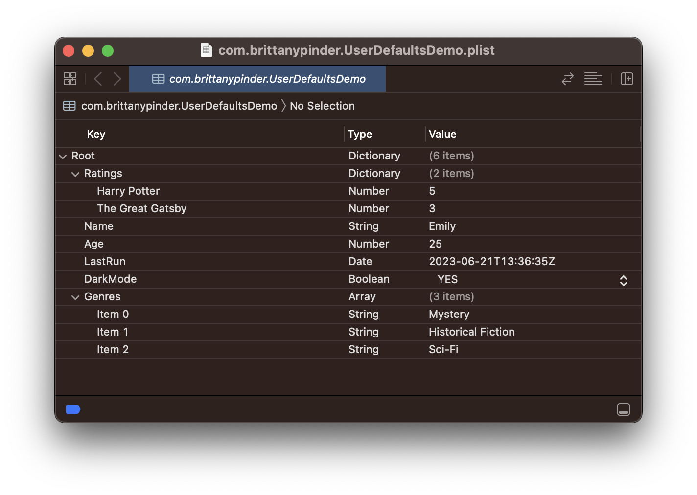

# [UserDefaults](https://developer.apple.com/documentation/foundation/userdefaults)

UserDefaults is a system provided by Apple that allows you to store key-value pairs persistently across application launches. These key-value pairs are stored in a Property List (plist) within your app's Library folder.

UserDefaults is *not* a database and should not be used for storing large amounts of data. Any changes made to UserDefaults results in the entire plist being rewritten, and reading even just one key-value pair requires loading the entire plist into memory. As such, the more data that is stored in UserDefaults, the more expensive these operations become.

UserDefaults is intended for storing small bits of data like user preferences and application settings (ex: audio volume, preferred units of measurement, whether or not notification are enabled etc). The values stored in UserDefaults are referred to as *defaults* because they're commonly used to determine an app's default state at startup or the way it acts by default.

> Important: The UserDefaults plist is not encyrpted and is easily accessible, so it should not be used to store sensitive information like passwords, API keys or whether or not the user has paid for premium features.

<br/>

## How to Use UserDefaults

In order to use UserDefaults, you need access the global instance `UserDefaults.standard`. To simplify the code, this is often stored in a constant like so:

```swift
let defaults = UserDefaults.standard
```

<br/>

### Writing to UserDefaults

Key/value pairs can be written to UserDefaults by using the [`set(_ :forKey:)`](https://developer.apple.com/documentation/foundation/userdefaults/1414067-set) method:

```swift
defaults.set(25, forKey: "Age")
defaults.set("Emily", forKey: "Name")
defaults.set(true, forKey: "DarkMode")
defaults.set(Date(), forKey: "LastRun")

let genres = ["Mystery", "Historical Fiction", "Sci-Fi"]
defaults.set(genres, forKey: "Genres")

let ratings = ["Harry Potter": 5, "The Great Gatsby": 3]
defaults.set(ratings, forKey: "Ratings")
```

UserDefaults supports any types that can be written to a plist such as floats, doubles, integers, booleans, strings, dates, arrays and dictionaries. Custom types need to be converted to `NSData` before they can be written to UserDefaults.

<br/>

### Reading from UserDefaults

When reading values from UserDefaults, you need to use the function that corresponds with the type of the value you are reading:

```swift
let age = defaults.integer(forKey: "Age")
let name = defaults.string(forKey: "Name") ?? ""
let darkMode = defaults.bool(forKey: "DarkMode")
let lastRun = defaults.object(forKey: "LastRun") as? Date ?? Date()
let genres = defaults.array(forKey: "Genres") as? [String] ?? [String]()
let ratings = defaults.dictionary(forKey: "Ratings") as? [String:Int] ?? [String:Int]()
```

It is important to note that if you attempt to get the value of a key that doesn't exist, a default value will be returned. For example, if we tried to retrieve the "Age" key using "age" instead, we would get a value of 0 instead of 25:

```swift
let wrongAge = defaults.integer(forKey: "age")
print(wrongAge) // 0
```
Because of this, it is good practice to use constants instead of raw strings when writing to and reading from UserDefaults:

```swift
// Somewhere else in your app
struct Keys {
    static let age = "Age"
}

defaults.set(25, forKey: Keys.age)

let correctAge = defaults.integer(forKey: Keys.age)
print(correctAge) // 25
```

<br/>

### Removing Values from UserDefaults

In order to remove a key/value pair from UserDefaults, use the [`removeObject(forKey:)`](https://developer.apple.com/documentation/foundation/userdefaults/1411182-removeobject) method, passing in the key you would like to remove:

```swift
defaults.removeObject(forKey: "Age")
```

<br/>

### Resetting UserDefaults

If you want to remove all key/value pairs from UserDefaults, use the [`removePersistentDomain(forName:)`](https://developer.apple.com/documentation/foundation/userdefaults/1417339-removepersistentdomain) method, passing in the bundle id:

```swift
if let bundleID = Bundle.main.bundleIdentifier {
    defaults.removePersistentDomain(forName: bundleID)
}
```

<br/>

## Manually Accessing the UserDefaults plist

In order to find the path to the UserDefaults plist, add the following line to the `didFinishLaunchingWithOptions` method in the AppDelegate:

```swift
print(NSSearchPathForDirectoriesInDomains(.libraryDirectory, .userDomainMask, true).first! as String)
```
When you run the app (on a simulator), a file path will be printed that looks something like this:

```
/Users/brittanypinder/Library/Developer/CoreSimulator/Devices/6BC44775-22B0-478D-8F0B-192D9E15EF87/data/Containers/Data/Application/53BBC363-B066-43A3-8667-8D5F834AB4FD/Library
```
If you go into this path, there will be a folder called "Preferences". Inside that folder is your UserDefaults plist which you can open, view and edit.



<br/>

## Links

* [UserDefaults Video Tutorial](https://www.youtube.com/watch?v=HxVOahmfwz0&ab_channel=PaulHudson)
* [UserDefaults in SwiftUI](https://www.hackingwithswift.com/books/ios-swiftui/storing-user-settings-with-userdefaults)