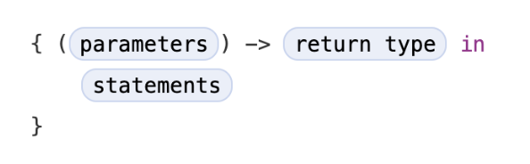

# Closures


- Closures are self-contained blocks of functionality that can be passed around and used in your code, much like lambdas in C++

Capturing Values

* Closures can capture and store references to any constants and variables from the context in which they are defined. This is known as *closing over* those constants and variables.
* Swift handles all of the memory management of capturing for you

Global and nested functions are actually special cases of closures. Closures take one of three forms:

* Global functions are closures that have a name and don't capture any values
* Nested functions are closures that have a name and can capture values from their enclosing function
* Closure expressions are unnamed closures written in a lightweight syntax that can capture values from their surrounding context.

Swift’s closure expressions have a clean, clear style, with optimizations that encourage brief, clutter-free syntax in common scenarios. These optimizations include:

* Inferring parameter and return value types from context
* Implicit returns from single-expression closures
* Shorthand argument names
* Trailing closure syntax

<br/>

## Closure Expressions

As discussed in [Functions](https://github.com/brittpinder/ios-reference/tree/main/swift/functions#function-types-as-parameter-types), functions can be passed as parameters to other functions. In the below example, `calculate` takes a function of type `(Int, Int) -> Int`. We can then define a function that conforms to this type (`add`) and pass it to the `calculate` function.

```swift
func calculate(num1: Int, num2: Int, operation: (Int, Int) -> Int) -> Int {
    return operation(num1, num2)
}

func add(num1: Int, num2: Int) -> Int {
    return num1 + num2
}

var result = calculate(num1: 3, num2: 6, operation: add)
print(result) // 9
```
<br/>

Rather than storing a function in a variable so that you can pass it to another function (which can be quite verbose) closures allow you to define a function inline, while you are passing it as a parameter.

You define a closure using *closure expression syntax* which takes the following form:



> The start of the closure’s body is introduced by the `in` keyword. This keyword indicates that the definition of the closure’s parameters and return type has finished, and the body of the closure is about to begin.

For example, instead of storing the `add` function in a variable, we could define it when we make the call to `calculate` by using a closure:

```swift
var result = calculate(num1: 3, num2: 6, operation: {(a: Int, b: Int) -> Int in
    return a + b
})
print(result) // 9
```

> Note: The parameters in closure expression syntax can be in-out parameters, but they can’t have a default value. Variadic parameters can be used if you name the variadic parameter. Tuples can also be used as parameter types and return types.

<br/>

### Inferring Type from Context

Because closures are passed as an argument to a method, Swift can infer the types of its parameters and the type of its return value. This means that you can simplify your closure expression by removing these types.

The following two calls to `calculate` have the same behaviour. The only difference is that the first uses the full closure syntax, while the second omits the parameter types and return type:

```swift
calculate(num1: 3, num2: 6, operation: {(a: Int, b: Int) -> Int in
    return a + b
})

calculate(num1: 3, num2: 6, operation: { a, b in
    return a + b
})
```
> Because all of the types can be inferred, the return arrow (`->`) and the parentheses around the names of the parameters can also be omitted

You can still choose to include explicit types in your closure expressions if you wish, and doing so is encouraged if it avoids ambiguity when reading the code.

<br/>

### Implicit Returns from Single-Expression Closures

If your closure body is a single expression, you can simplify the syntax further by omitting the `return` keyword:

```swift
calculate(num1: 3, num2: 6, operation: { a, b in
    a + b
})
```
<br/>

### Shorthand Argument Names

Swift automatically provides shorthand argument names to inline closures, which can be used to refer to the values of the closure's arguments by the names of `$0`, `$1`, `$2` and so on. If you use these shorthand argument names within your closure expression, you can omit the closure's argument list from its definition:

```swift
calculate(num1: 3, num2: 6, operation: {
    $0 + $1
})
```
> The `in` keyword can also be omitted, because the closure expression is made up entirely of its body

At this point, the closure is so short, it can be reduced to one line:

```swift
calculate(num1: 3, num2: 6, operation: { $0 + $1 })
```
<br/>

### Trailing Closures

If the last argument in a function is a closure, you are allowed to use *trailing closure syntax* where the closure is placed *after* the closing parentheses of the function call.

```swift
calculate(num1: 3, num2: 6) { $0 + $1 }
```
> When using trailing closure syntax you don't write the argument label for the closure

<br/>

### Operator Methods

Closure expressions can be simplified even further if they are essentially an operator method such as `>`, `<=`, `+`, `*` etc.

Since Swift's arithmetic addition operator (`+`) matches the `calculate` function's parameter type of `(Int, Int) -> Int`, it can simply be passed as the entire closure, and Swift will infer that you want to add two values of type `Int`.

```swift
calculate(num1: 3, num2: 6, operation: + )
```

<br/>

### Another Example

To demonstrate the various closure syntax expression options using another example, we can take a look at Swift's `sorted(by:)` function which sorts an array of values based on the output of a sorting closure that you provide:

```swift
var names = ["Pam", "Dwight", "Angela", "Michael", "Jim"]

var sortedNames = names.sorted(by: { (s1: String, s2: String) -> Bool in
    return s1 < s2
})

print(sortedNames) // ["Angela", "Dwight", "Jim", "Michael", "Pam"]
```
The closure variations shown below all have the same behaviour of sorting an array of strings alphabetically:

```swift
// Full closure syntax
names.sorted(by: { (s1: String, s2: String) -> Bool in
    return s1 < s2
})

// Type inference
names.sorted(by: { s1, s2 in
    return s1 < s2
})

// Implicit return
names.sorted(by: { s1, s2 in
    s1 < s2
})

// Shorthand argument names
names.sorted(by: { $0 < $1 })

// Trailing closure
names.sorted() { $0 < $1 }

// Operator Method
names.sorted(by: <)
```

<br/>

## Trailing Closures

### Multiple Trailing Closures

As shown in the previous section, when the last argument of a function is a closure, you can use trailing closure syntax to place the closure *outside* the function call. However, if you are calling a function that takes multiple closure arguments and they all appear at the end, it is possible to have multiple trailing closures.

Consider the following function that rolls a die and executes one of two closures provided depending on whether the number rolled is even or odd.

```swift
func rollDie(numSides: Int, isOdd: () -> Void, isEven: () -> Void) {
    let number = Int.random(in: 1...numSides)

    if number % 2 == 0 {
        isEven()
    } else {
        isOdd()
    }
}
```

Using trailing closure syntax, we can call this function like so:

```swift
func oddFunc() {
    print("You rolled an odd number")
}

rollDie(numSides: 6, isOdd: oddFunc) {
    print("You rolled an even number")
}
```

However, this feels quite awkward because we've defined the `isEven` parameter as a trailing closure, but the `isOdd` function has to be defined elsewhere in order to be passed as an argument. Using multiple trailing closures, we can define both closures inline like so:

```swift
rollDie(numSides: 6) {
    print("You rolled an odd number")
} isEven: {
    print("You rolled an even number")
}
```
> Note: If a function takes multiple closures, you omit the argument label for the first trailing closure and you label the remaining trailing closures.

<br/>

### Trailing Closure as the Only Argument

If a closure expression is provided as the only argument and you provide that expression as a trailing closure, you don’t need to write a pair of parentheses `()` after the function or method’s name when you call the function.

For example, the `sorted` example from above:

```swift
names.sorted() { $0 < $1 }
```

could be written like so:

```swift
names.sorted { $0 < $1 }
```

This type of syntax is often used with the [`Array.map()`](https://developer.apple.com/documentation/swift/array/map(_:)-87c4d) function.

```swift
let numbers = [1, 2, 3, 4, 5]

let numbersSquared = numbers.map { $0 * $0 }

print(numbersSquared) // [1, 4, 9, 16, 25]
```

<br/>

## Capturing Values

<br/>

## Closures are Reference Types

<br/>

## Escaping Closures

<br/>

## AutoClosures


<br/>

## Links

* [Apple Documentation on Closures](https://docs.swift.org/swift-book/documentation/the-swift-programming-language/closures)
* [Jonathan Rasmusson's Documentation](https://github.com/jrasmusson/level-up-swift/tree/master/4-closures)
* [Video Explanation](https://www.youtube.com/watch?v=ND44vQ5iJyc&ab_channel=SeanAllen)