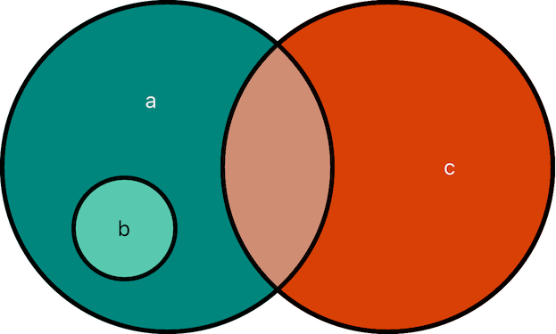

# [Sets](https://docs.swift.org/swift-book/documentation/the-swift-programming-language/collectiontypes/#Sets)

A set is an unordered collection of unique elements that have the same type. You can use a set instead of an array when the order of items isn't important or when you need to ensure that an item only appears once.

A type must be *hashable* in order to be stored in a set. All of Swift's primitive types (String, Int, Double and Bool) are hashable by default. Enumeration cases without associated values are also hashable by default. You can store your own custom types in a set by making them conform to the [`Hashable`](https://developer.apple.com/documentation/swift/hashable) protocol.

<br/>

## Creating Sets

Unlike arrays, sets do not have shorthand syntax. When creating an empty set, you need to specify the type either explicitly or implicitly using `Set<Element>`:

```swift
// Explicit Type
var numbers: Set<Int> = Set<Int>()
var numbers1: Set<Int> = []

// Implicitly derived type
var numbers2 = Set<Int>()
```
A set can also be created and initialized with values by using an *array literal*:

```swift
var numbers3: Set<Int> = [4, 6, 8, 2]
```
Because of type inference, the above can be written in a shorter form:

```swift
var numbers4: Set = [4, 6, 8, 2]
```
> When creating a set, the `Set` keyword must be used. If the `Set` keyword were removed from the above declaration, an array would be created instead.

<br/>

## Accessing Sets

Like arrays, sets have the `count` and `isEmpty` properties:

```swift
var fruits: Set = ["apple", "banana", "pear"]
print(fruits.count) // 3
print(fruits.isEmpty) // false
```
It is important to remember that sets are *unordered*, which means the order in which you add elements to a set is not guaranteed. If the order of elements is important, you should instead use an array.

```swift
print(fruits) // ["pear", "banana", "apple"]
```

<br/>

## Inserting Elements into a Set

Add elements to a set using the `insert` method:

```swift
fruits.insert("orange")
print(fruits) // ["pear", "banana", "orange", "apple"]
```

This function returns a tuple which you can use to check if the element was successfully added or not. If it was not added, it means that the element already existed in the set.

```swift
let result = fruits.insert("banana")
print(result.inserted) // false
print(fruits) // ["pear", "banana", "orange", "apple"]
```
<br/>

## Removing Elements from a Set

Remove an element from a set using the `remove` method:

```swift
fruits.remove("pear")
print(fruits) // ["apple", "banana", "orange"]
```
This method returns the removed element if it was found, otherwise it returns `nil`:

```swift
let removedElement = fruits.remove("pineapple")
print(removedElement) // nil
print(fruits) // ["apple", "banana", "orange"]
```
To empty a set of all its elements, you can either use the `removeAll` method which provides you the option of maintaining the capacity of the set, or you can simply assign the set to an empty set of square brackets `[]`.

```swift
fruits.removeAll(keepingCapacity: true)
print(fruits) // []
print(fruits.capacity) // 6

fruits = []
print(fruits.capacity) // 0
```
<br/>

## Iterating over a Set

To iterate over the elements of a set, use a `for-in` loop:

```swift
var colors: Set = ["blue", "yellow", "green", "red"]

for color in colors {
    print(color)
}
// yellow
// red
// green
// blue
```
Since sets are unordered, the order can vary every time you iterate over a set. One way around this is to use the `sorted()` method which returns the set's elements as an array sorted using the `<` operator:

```swift
for color in colors.sorted() {
    print(color)
}
// blue
// green
// red
// yellow
```
You can also use `forEach` to call a closure on every element of a set (with a random order):

```swift
colors.forEach { color in
    print(color)
}
// green
// blue
// yellow
// red
```
> Note: When using `forEach` you cannot use `continue` or `break` to skip iterations or exit out of the loop. Using `return` will only exit from the current call of the closure and won't skip subsequent calls.

<br/>

## Finding Elements in a Set

To check whether a set contains a particular value, use the `contains` method:

```swift
var nums: Set = [4, 3, 10, 15]

let containsFive = nums.contains(5)
print(containsFive) // false

let containsThree = nums.contains(3)
print(containsThree) // true
```
You can also use the `contains(where:)` method to check if a set contains values that meet a certain criteria:

```swift
let containsOddNumbers = nums.contains(where: {$0 % 2 == 1})
print(containsOddNumbers) // true
```
Use `allSatisfy` to check if all the elements in a set meet a certain condition:

```swift
let allValuesAreLessThanTwenty = nums.allSatisfy({$0 < 20})
print(allValuesAreLessThanTwenty) // true
```

<br/>

## Performing Set Operations

There are four set operations you can perform to efficiently combine two sets together, determine which values two sets have in common or determine whether two sets contain all, some or none of the same values:


The examples below use the following two sets containing marine animals and mammals:

```swift
let marineAnimals: Set = ["Shark", "Whale", "Dolphin", "Crab"]
let mammals: Set = ["Cow", "Whale", "Lion", "Dolphin", "Cheetah"]
```

### Intersection

Creates a new set with only the values common to both sets. This allows us to create a set with all of the marine animals that are also mammals.

```swift
let intersection = marineAnimals.intersection(mammals)
print(intersection) // ["Dolphin", "Whale"]
```

### Symmetric Difference

Creates a new set with values in either set, but not both. This allows us to create a set with all animals that are either marine animals or mammals, but not both.

```swift
let symmetricDifference = marineAnimals.symmetricDifference(mammals)
print(symmetricDifference) // ["Cheetah", "Crab", "Shark", "Lion", "Cow"]
```

### Union

Creates a new set with all the values in both sets. This allows us to create a set with all animals, marine and/or mammal:

```swift
let union = marineAnimals.union(mammals)
print(union) // ["Crab", "Whale", "Dolphin", "Cow", "Lion", "Cheetah", "Shark"]
```

### Subtracting

Creates a new set with values not in the specified set. This allows us to create a set with all marine animals that are not mammals.

```swift
let subtracting = marineAnimals.subtracting(mammals)
print(subtracting) // ["Shark", "Crab"]
```
The `subtracting` method is the only set operation where the order of the sets matter. If we were to reverse the two sets in the above operation, we would instead create a set with all mammals that aren't marine animals:

```swift
let subtracting1 = mammals.subtracting(marineAnimals)
print(subtracting1) // ["Cheetah", "Lion", "Cow"]
```
> Tip: You can modify a set in place by using these methods’ mutating counterparts: `formUnion(_:)`, `formIntersection(_:)`, `formSymmetricDifference(_:)`, and `subtract(_:)`.

<br/>

## Set Membership and Equality

When comparing sets to each other, there are certain words that are used to describe these comparisons. The following illustration depicts three sets, a, b and c.
* Set a is a *superset* of set b, because it contains all the elements in b.
* Set b is a *subset* of set a, because all of the elements in b are also contained by a.
* Set b and set c are *disjoint* because they share no common elements



The following examples use the sets from above along with the new sets, `bigCats` and `africanPredators`:

```swift
let marineAnimals: Set = ["Shark", "Whale", "Dolphin", "Crab"]
let mammals: Set = ["Cow", "Whale", "Lion", "Dolphin", "Cheetah"]
let bigCats: Set = ["Lion", "Cheetah"]
let africanPredators: Set = ["Cheetah", "Lion"]
```

### isSubset(of:)

The set `bigCats` is a subset of both `mammals` and `africanPredators` because all of its elements are also contained by both of those sets.

```swift
print(bigCats.isSubset(of: mammals)) // true
print(bigCats.isSubset(of: africanPredators)) // true
print(bigCats.isSubset(of: marineAnimals)) // false
```

### isSuperset(of:)

Conversely, both `mammals` and `africanPredators` are supersets of `bigCats` because they both contain all the elements that are in `bigCats`.

```swift
print(mammals.isSuperset(of: bigCats)) // true
print(africanPredators.isSuperset(of: bigCats)) // true
print(marineAnimals.isSubset(of: bigCats)) // false
```

### isStrictSubset(of:)

This method determines whether a set is a subset, but not equal to, a specified set.

* The set `bigCats` is a strict subset of `mammals` because all of its elements are contained by `mammals` but it is not *equal to* `mammals`.
* The set `bigCats` is a subset of `africanPredators` but not a *strict* subset because it is equal to `africanPredators`.

``` swift
print(bigCats.isStrictSubset(of: mammals)) // true
print(bigCats.isStrictSubset(of: africanPredators)) // false
```

### isStrictSuperset(of:)

This method determines whether a set is a superset, but not equal to, a specified set.

* The set `mammals` is a strict superset of `bigCats` because it contains all of the elements in `bigCats` but is not *equal to* `bigCats`.
* The set `africanPredators` is a superset of `bigCats`, but not a *strict* superset because it is equal to `bigCats`.

```swift
print(mammals.isStrictSuperset(of: bigCats)) // true
print(africanPredators.isStrictSuperset(of: bigCats)) // false
```

### isDisjoint(with:)

This method determines whether two sets have no values in common. The set `bigCats` is disjoint with `marineAnimals` because they have no elements in common.

```swift
print(bigCats.isDisjoint(with: marineAnimals)) // true
print(bigCats.isDisjoint(with: mammals)) // false
```

### Equality

To check if two sets contain exactly the same values, use the `==` operator:

```swift
print(bigCats == africanPredators) // true
print(mammals == marineAnimals) // false
```

<br/>

## Links

* [Set API Reference](https://developer.apple.com/documentation/swift/set)
* [Article on Hashable](https://betterprogramming.pub/what-is-hashable-in-swift-6a51627f904)