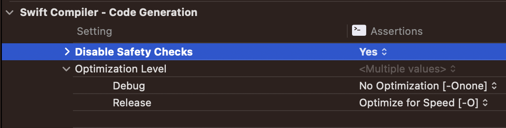

# Error Handling and Assertions

In general, there are two types of errors that can occur during runtime:

* **Anticipated Errors**
	* Typically caused by external factors (eg: bad user input or failed network requests)
	* Recoverable using [error handling](#error-handling) techniques
* **Unexpected Errors**
	* Typically caused by developer mistakes/bugs (eg: trying to access a nil value or an out of range index)
	* Unrecoverable and will cause your app to crash or behave incorrectly
	* Discovered and corrected during development through the use of [assertions and preconditions](#assertions-and-preconditions)

<br/>


## Error Handling

Error handling is the process of responding to and recovering from error conditions in your program. It allows you to determine the underlying cause of failure, and handle it accordingly.

For example, when attempting to read from a file, a number of problems could occur such as the file not being found, the file not having read permissions or the file not being encoded in a compatible format. Distinguishing among these different situations allows a program to resolve some errors and to communicate to the user any errors it can't resolve.

<br/>

### Representing and Throwing Errors

In Swift, errors are represented by values of types that conform to the `Error` protocol. For example, here is how you could represent the error conditions when creating a username:

```swift
enum UsernameError: Error {
    case tooShort
    case tooLong
    case invalidCharacter(character: Character)
}
```

Throwing an error lets you indicate that something unexpected happened and the normal flow of execution can't continue. For example, the following code throws an error to indicate that a username is too short:

```swift
throw UsernameError.tooShort
```
<br/>

### Handling Errors

When an error is thrown, some surrounding piece of code must be responsible for handling the error - for example, by correcting the problem, trying an alternative approach, or informing the user of the failure. There are four ways of handling errors in Swift:

1. [Propogating Errors Using Throwing Functions](#1-propogating-errors-using-throwing-functions)
2. [Handling Errors Using Do-Catch](#2-handling-errors-using-do-catch)
3. [Converting Errors to Optional Values](#3-converting-errors-to-optional-values)
4. [Disabling Error Propagation](#4-disabling-error-propogation)

<br/>

#### 1. Propogating Errors Using Throwing Functions

Any piece of code that has the possibility of throwing an error, must be wrapped in a *throwing function*. A throwing function is marked with the `throws` keyword:

```swift
func canThrowErrors() throws -> String

func cannotThrowErrors() -> String
```
A throwing function propogates errors that are thrown inside of it to the scope from which it is called. In the below example, we have a struct `User` which has an `init` method that can throw if the provided name doesn't meet certain requirements.

```swift
struct User {
    let name: String

    init(name: String) throws {
        guard name.count >= 5 else {
            throw UsernameError.tooShort
        }

        guard name.count <= 12 else {
            throw UsernameError.tooLong
        }

        for char in name {
            guard char.isLetter else {
                throw UsernameError.invalidCharacter(character: char)
            }
        }

        self.name = name
    }
}
```
If an error is encountered, the `init` method will exit and propogate that error to the scope in which the `init` method was called. That scope can either propogate the error further up the chain or handle it using one of the three remaining methods described below.

<br/>

#### 2. Handling Errors Using Do-Catch

One common way of handling errors is by using a `do-catch` block because it allows you to handle the various error types differently. If no error occurs, everything in the `do` block of code will be executed. Otherwise, the error will be handled by one of the `catch` blocks.

```swift
func createUser(name: String) -> User? {
    do {
        let user = try User(name: name)
        print("Created user with name: \(user.name)")
        return user
    } catch UsernameError.tooShort {
        print("Error: Username is too short!")
    } catch UsernameError.tooLong {
        print("Error: Username is too long!")
    } catch UsernameError.invalidCharacter(let character) {
        print("Error: Please remove invalid character \(character) from username")
    } catch {
        print("Error creating user: \(error)")
    }
    return nil
}

createUser(name: "abc") // Error: Username is too short!
createUser(name: "dwightschrute") // Error: Username is too long!
createUser(name: "pam-beasley") // Error: Please remove invalid character - from username
createUser(name: "jimhalpert") // Created user with name: jimhalpert
```
> Notice in the above example that the expression that can throw is preceded by the keyword `try`. This is a requirement; you must put `try` before any function call that can throw. There are two alternatives: `try?` and `try!` which are explained in detail later on.

<br/>

You can use [patterns](https://docs.swift.org/swift-book/documentation/the-swift-programming-language/patterns) with `do-catch` blocks to handle errors in many different ways including handling more than one error in one catch block, appending a condition using the `where` keyword, or simply checking if the error is of a certain type:

```swift
func createUser1(name: String) throws -> User? {
    do {
        let user = try User(name: name)
        return user
    } catch UsernameError.tooShort, UsernameError.tooLong {
        print("Error: username length is either too short or too long!")
    } catch UsernameError.invalidCharacter(let character) where character.isNumber {
        print("Error: username cannot contain a number!")
    } catch is UsernameError {
        print("Error: Couldn't create username!")
    }
    return nil
}

do {
    try createUser1(name: "janice")
} catch {
    print("Unexpected non-user-name-related error occurred: \(error)")
}
```
> Note: `catch` clauses don't have to handle every possible error that the code in the `do` clause can throw. If none of the catch clauses handle the error, the error propogates to the surrounding scope. However, the propogated error must be handled by *some* surrounding scope. If the error propogates to the top-level scope without being handled, you'll get a runtime error.

<br/>

#### 3. Converting Errors to Optional Values

Using `try?` before a throwing function allows you to handle all errors in the same way by converting the result of the throwing expression to an optional.

```swift
enum MathError: Error {
    case divisionByZero
}

func divide(dividend: Int, divisor: Int) throws -> Int {
    guard divisor != 0 else {
        throw MathError.divisionByZero
    }
    return dividend / divisor
}

let result1 = try? divide(dividend: 6, divisor: 3)
print(result1) // Optional(2)

let result2 = try? divide(dividend: 8, divisor: 0)
print(result2) // nil
```
In the above example, the first call to `divide` is successful, but because the `try?` keyword was used, the result is converted to an `Optional<Int>`. The second call to `divide` throws an error but it is handled by returning `nil`.

<br/>

It is very common to use `if let` syntax when using `try?` to handle an error:

```swift
if let result = try? divide(dividend: 6, divisor: 3) {
    print(result)
} else {
    print("Division Error!")
}
// Prints: 2

if let result = try? divide(dividend: 8, divisor: 0) {
    print(result)
} else {
    print("Division Error!")
}
// Prints: Division Error!
```
<br/>

#### 4. Disabling Error Propogation

If you are 100% certain that a throwing function won't throw an error at runtime, you can write `try!` before the expression to disable error propogation and wrap the call in a runtime assertion that no error will be thrown.

```swift
let result = try! divide(dividend: 16, divisor: 4)
print(result) // 4
```
However, if your assumptions are wrong and an error is actually thrown, you will get a runtime error.

<br/>

### Deciding which `try` variation to use

Use `try` when you want to handle any errors either through propogation or a `do-catch` block.

```swift
do {
    let fileContents = try String(contentsOfFile: "input.txt")
    print(fileContents)
} catch {
    print(error.localizedDescription)
}
```

Use `try?` when you don't care about the specific error and are more interested in success or failure.

```swift
if let fileContents = try? String(contentsOfFile: "input.txt") {
    print(fileContents)
} else {
    print("Unable to read file")
}
```

Use `try!` when you are absolutely certain that the throwing expression will not throw an error and you don't want to bloat your code with unnecessary error checking.

```swift
let fileContents = try! String(contentsOfFile: "input.txt")
print(fileContents)
```

<br/>

## Assertions and Preconditions

Assertions and preconditions help you to find mistakes and incorrect assumptions by silently checking the state of the program at runtime. You use them to make sure essential conditions are satisfied before executing any further code.

The main difference between assertions and preconditions is that assertions are only executed in Debug builds whereas preconditions are executed in both Debug and Release builds (with a few exceptions explained later on).

Because a failed assertion or precondition indicates an invalid program state, there is no way to catch a failed assertion, which means they shouldn't be used for recoverable or anticipated errors.

The five types of assertions and preconditions, in order from lowest to highest severity, are as follows:

* [`assert()`](#assert)
* [`assertionFailure()`](#assertionFailure)
* [`precondition()`](#precondition)
* [`preconditionFailure()`](#preconditionFailure)
* [`fatalError()`](#fatalError)

<br/>

### [assert()](https://developer.apple.com/documentation/swift/assert(_:_:file:line:))

`assert()` takes a condition to check along with an optional message to print if that check fails. If the condition fails, your app will crash, but *only* in Debug mode. Assertions get compiled out of Release builds which means they have no performance impact. You should therefore use them liberally throughout your code to sanity check any assumptions you have and help you discover bugs during development and testing.

In the following example, an `assert()` is used to double check that the `Person` struct isn't initialized with an `age` less than 0.

```swift
struct Person {
    var age: Int

    init(age: Int) {
        assert(age >= 0, "A person's age can't be less than zero.")
        self.age = max(0, age)
    }
}
```
<br/>

### [assertionFailure()](https://developer.apple.com/documentation/swift/assertionfailure(_:file:line:))

`assertionFailure()` is the same as `assert()` except that it doesn't take a condition. This means that it will *always* crash your app (in a Debug build). It should be used in areas of your code that shouldn't be reached (eg: the default case of a switch statement).

```swift
func rollDie() {
    let number = Int.random(in: 1...3)

    switch number {
    case 1:
        print("You rolled a one!")
    case 2:
        print("You rolled a two!")
    case 3:
        print("You rolled a three!")
    default:
        assertionFailure("Rolling a 3-sided die shouldn't have any other results.")
    }
}
```
>It is important to note that `assert(false)` and `assertionFailure()`, while similar, are not the same thing. The first expression says to the compiler, *"crash when this line is hit in debug mode if my condition fails"*, whereas the second expression says to the compiler, *"always crash in Debug mode if you hit this line"*. `assertionFailure()` therefore provides an optimization hint to the compiler that it can discard all the code that comes after it (although whether or not this actually happens is up to the compiler).

<br/>

### [precondition()](https://developer.apple.com/documentation/swift/precondition(_:_:file:line:))

`precondition()` is similar to `assert()` in that it takes a condition to check and an optional message to print if it fails. They key difference is that it will *not* be compiled out of Release builds, meaning that it has the potential to crash on a user's device.

However, if you disable safety checks in your build settings (something that should be avoided at all costs unless you *really* need the performance gain), preconditions will be compiled out of a Release build.



Use `precondition()` whenever a condition has the potential to be false, but must definitely be true for your code to continue execution, even when running on user devices (eg: checking that a subscript isn't out of bounds). Swift uses preconditions all the time to preserve data integrity. For example, it uses precondition to check that a range isn't created where the upper bound is less than the lower bound.

In the following example, a precondition is used to check that an index is within range. Without the precondition, the function would still crash if provided an out-of-range index, but the precondition allows us to provide a detailed error message and ensure that the app crashes in a more predictable way.

```swift
func removeAtIndex(array: inout [Int], index: Int) {
    precondition(index >= 0 && index < array.count, "Index is out of bounds!")
    array.remove(at: index)
}
```
<br/>

### [preconditionFailure()](https://developer.apple.com/documentation/swift/preconditionfailure(_:file:line:))

`preconditionFailure()` is the same as `precondition()` except that it doesn't have a condition - it will *always* crash your app (in both Debug and Release builds, as long as safety checks are enabled).

Unlike `assert()`, `assertionFailure()` and `precondition()`, `preconditionFailure()` has a return type of [`Never`](https://developer.apple.com/documentation/swift/never), which means that the Swift compiler will automatically warn you if you attempt to put executable code after it. It also means that you aren't forced to return a nonsense value from a function when you know you're in an invalid state. Use `preconditionFailure()` when continuing execution is dangerous and it's better to halt execution than continue.

```swift
enum Suit {
    case heart
    case diamond
    case spade
    case club
}

func getSuit(name: String) -> Suit {
    switch name {
    case "Heart":
        return Suit.heart
    case "Diamond":
        return Suit.diamond
    case "Spade":
        return Suit.spade
    case "Club":
        return Suit.club
    default:
        preconditionFailure("Unrecognized suit name!")
    }
}
```

In the above example, if the default case is reached, we aren't forced to return one of the `Suit` enum values because the `preconditionFailure()` indicates that the app will crash. If we had used `assertionFailure()` instead, the compiler would have complained about not providing a return value for all code paths.

<br/>

### [fatalError()](https://developer.apple.com/documentation/swift/fatalerror(_:file:line:))

`fatalError()` will *always* crash your app, regardless of whether you are building in Debug or Release, or even if you have disabled safety checks. There is no way to disable `fatalError()` assertions. Only use `fatalError()` when something has gone horribly wrong (eg: a core dependency for your app cannot be found)

```swift
guard let url = Bundle.main.url(forResource: "input", withExtension: "json") else {
    fatalError("Failed to locate input.json in bundle.")
}
```
> Note: Using `fatalError()` will copy the full path to your current file into your finished program, so you might inadvertently reveal something confidential. If this is a concern, `preconditionFailure()` might be a better choice.

<br/>

### Comparing Assertions and Preconditions

Type | Conditional | Crashes in Debug | Crashes in Release with Safety Checks Enabled | Crashes in Release with Safety Checks Disabled | Returns `Never`
---|---|---|---|---|---
`assert()` | :heavy_check_mark: | :heavy_check_mark: |  |  | 
`assertionFailure()` |  | :heavy_check_mark: |  |  | 
`precondition()` | :heavy_check_mark: | :heavy_check_mark: | :heavy_check_mark: |  | 
`preconditionFailure()` | | :heavy_check_mark: | :heavy_check_mark: |  | :heavy_check_mark: 
`fatalError()` | | :heavy_check_mark: | :heavy_check_mark: | :heavy_check_mark: | :heavy_check_mark: 

<br/>

## Links
* [Apple Documention on Error Handling](https://docs.swift.org/swift-book/documentation/the-swift-programming-language/errorhandling/)
* [Apple Documentation on Assertions and Preconditions](https://docs.swift.org/swift-book/documentation/the-swift-programming-language/thebasics/#Assertions-and-Preconditions)
* [Understanding Assertions](https://www.hackingwithswift.com/plus/intermediate-swift/understanding-assertions)
* [Swift Error Handling Strategies](https://www.vadimbulavin.com/swift-error-handling-with-result-throw-assert-precondition-and-fatalerror/)
* [StackOverflow explanation of try variations](https://stackoverflow.com/questions/32390611/try-try-try-what-s-the-difference-and-when-to-use-each)