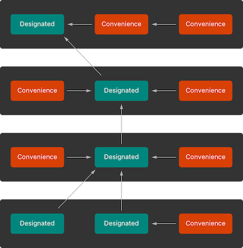
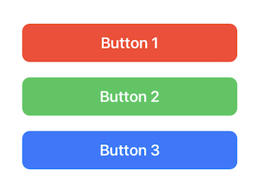
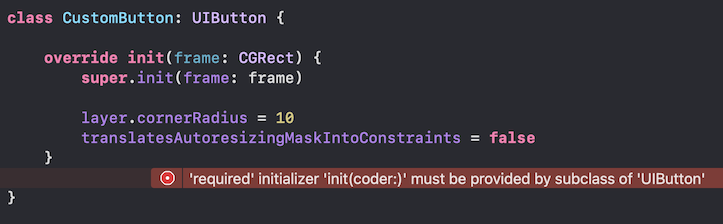
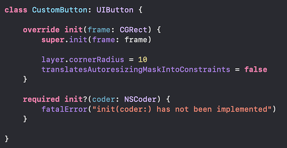

# [Initialization](https://docs.swift.org/swift-book/documentation/the-swift-programming-language/initialization)

*Initialization* is the process of preparing an instance of a class, structure or enumeration for use. This involves setting initial values for each stored property of that instance as well as any other setup that's required before the new instance is ready for use.

<br/>

## Setting Initial Values for Stored Properties

Classes and structures *must* set all of their stored properties to an appropriate initial value by the time an instance of that class or structure is created. This can be done either by assigning a default value as part of the property's definition or by setting an initial value within an initializer.

```swift
// Assigning a default value
class Farenheit {
    var temperature: Double = 32.0
}

// Setting initial value within initializer
class Farenheit {
    var temperature: Double

    init() {
        temperature = 32.0
    }
}
```
If a property always takes the same initial value, it is preferred to provide a default value rather than setting a value within an initializer.


> Note: When you assign a default value to a stored property, or set its initial value within an initializer, the value of that property is set directly, without calling any property observers.

<br/>

## Customizing Initialization

You can customize the initialization process by providing intialization parameters and/or defining multiple `init` methods with different signatures.

```swift
struct Celsius {
    var temperatureInCelsius: Double

    init(_ celsius: Double) {
        temperatureInCelsius = celsius
    }

    init(fromFahrenheit fahrenheit: Double) {
        temperatureInCelsius = (fahrenheit - 32.0) / 1.8
    }

    init(fromKelvin kelvin: Double) {
        temperatureInCelsius = kelvin - 273.15
    }
}

let bodyTemperature = Celsius(37.0)
print(bodyTemperature.temperatureInCelsius) // 37.0

let boilingPointOfWater = Celsius(fromFahrenheit: 212.0)
print(boilingPointOfWater.temperatureInCelsius) // 100.0

let freezingPointOfWater = Celsius(fromKelvin: 273.15)
print(freezingPointOfWater.temperatureInCelsius) // 0.0
```
<br/>

### Optional Property Types

If your class has a stored property of type `Optional`, it will automatically be initialized with a value of `nil`, so you don't need to explicitly set it during initialization.

```swift
class Dog {
    var name: String
    var toy: String?

    init(name: String) {
        self.name = name
        // No need to set toy because it is an optional
    }
}
```
<br/>

### Assigning Constant Properties During Initialization

You can assign a value to a constant property at any point during initialization, as long as it's set to a definite value by the time initialization finishes. Once a constant property is assigned a value, it can't be further modified.

```swift
class Person {
    let name: String

    init(name: String) {
        self.name = name
    }
}

var person = Person(name: "Bob")
person.name = "Robert" // Error: Cannot assign to property: 'name' is a let constant
```

<br/>

## Default Initializers

If a structure or class provides default values for all of its stored properties and doesn't provide at least one initializer itself, Swift will create a *default initializer* which simply creates a new instance with all of its properties set to their default values.

```swift
class ShoppingListItem {
    var name: String?
    var quantity = 1
    var purchased = false
}
var item = ShoppingListItem()
```

Structures additionally receive a *memberwise initializer* (if they don't define any of their own custom initializers). If the above class were converted to a struct, we could initialize it with a memberwise initializer:

```swift
struct ShoppingListItem {
    var name: String?
    var quantity = 1
    var purchased = false
}
var item = ShoppingListItem()
var anotherItem = ShoppingListItem(name: "Carrot", quantity: 3, purchased: true)
```

When you call a memberwise initializer, you can omit values for any properties that have default values:

```swift
var bread = ShoppingListItem(name: "Bread", purchased: true)
var juice = ShoppingListItem(name: "Juice", quantity: 2)
var unknown = ShoppingListItem(quantity: 4)
```
> Note: When you omit properties in a memberwise initializer, the remaining properties still need to be provided in order

<br/>

## Initializer Delegation for Value Types

Initializers can call other initializers to perform part of an instance’s initialization. This process, known as *initializer delegation*, avoids duplicating code across multiple initializers. Value types (structures and enumerations) don’t support inheritance, and so their initializer delegation process is relatively simple, because they can only delegate to another initializer that they provide themselves.

In the following example, the third initializer `init(center:size:)`, calculates an appropriate origin and then calls (or delegates) to the `init(origin:size:)` initializer.

```swift
struct Size {
    var width = 0.0, height = 0.0
}

struct Point {
    var x = 0.0, y = 0.0
}

struct Rect {
    var origin = Point()
    var size = Size()

    init() {}

    init(origin: Point, size: Size) {
        self.origin = origin
        self.size = size
    }

    init(center: Point, size: Size) {
        let originX = center.x - (size.width / 2)
        let originY = center.y - (size.height / 2)
        self.init(origin: Point(x: originX, y: originY), size: size)
    }
}
```

<br/>

## Initializer Delegation for Classes

The initializer delegation process for classes is much more complex because classes support inheritance. During initialization, not only do all of a class's properties need to be assigned an initial value, but also all of the properties that it inherits.

There are two types of initializers that help to ensure that all stored properties of a class receive an initial value: *designated initializers* and *convenience initializers*

<br/>

### Designated Initializers

Designated initializers are the **primary** initializers for a class. They fully initialize all properties introduced by a class and call an appropriate superclass initializer to continue the initialization process up the superclass chain.

Every class must have at least one designated initializer. In some cases, this requirement is satisfied by inheriting one or more designated initializers from a superclass. It is helpful to think of designated initializers as “funnel” points through which initialization takes place, and through which the initialization process continues up the superclass chain.

All initializers that we have seen thus far have been designated initializers. Here is another example:

```swift
class Polygon {
    var points: [Point]

    init(points: [Point]) {
        self.points = points
    }
}

var square = Polygon(points: [Point(x: 0, y: 0),
                              Point(x: 4, y: 0),
                              Point(x: 4, y: 4),
                              Point(x: 0, y: 4)])
```

The initializer above is "designated" because it initializes all of the class's stored properties.

<br/>

### Convenience Initializers

Convenience initializers are **secondary**, supporting initializers for a class. They are indicated with the `convenience` keyword and provide shortcuts to common initialization patterns that will save time or provide clearer intent. For example, we could add a convenience initializer to the class `Polygon` to make initializing squares much more straightforward by just specifying a length:

```swift
class Polygon {
    var points: [Point]

    init(points: [Point]) {
        self.points = points
    }

    convenience init(squareWithLength length: CGFloat) {
        let points = [
            Point(x: 0, y: 0),
            Point(x: length, y: 0),
            Point(x: length, y: length),
            Point(x: 0, y: length),
        ]

        self.init(points: points)
    }
}

var convenientSquare = Polygon(squareWithLength: 4)
```
Convenience initializers are not required, but if you define one it *must* ultimately call a designated initializer within the same class. Any class initializer that calls another initializer within the same class is a convenience initializer and *must* be marked with `convenience`.

<br/>

### Designated vs. Convenience Initializers

To simplify the relationships between designated and convenience initializers, Swift applies the following three rules for delegation calls between initializers:

1. A designated initializer must call a designated initializer from its immediate superclass.
2. A convenience initializer must call another initializer from the *same* class.
3. A convenience initializer must ultimately call a designated initializer.

A simple way to remember this is:

* Designated initializers must always delegate *up*
* Convenience initializers must always delegate *across*

An example of this is shown below. The top row represents the super class and the rows below are subclasses. As you can see, the designated intializers always call a designated initializer from their superclass and the convenience initializers always call another initializer (designated or convenience) from within the same class. The designated initializers in this hierarchy act as “funnel” points for class initialization.



Below is a practical example of a subclass of `UIButton`. It has a designated initializer and two convenience initializers.

```swift
class CustomButton: UIButton {
    // Designated Initializer: calls superclass designated initializer
    override init(frame: CGRect) {
        super.init(frame: frame)

        layer.cornerRadius = 10
        translatesAutoresizingMaskIntoConstraints = false
    }

    // Convenience Initializer: Calls designated initializer
    convenience init(color: UIColor, title: String) {
        self.init(frame: .zero)

        self.backgroundColor = color
        self.setTitle(title, for: .normal)
    }

    // Convenience Initializer: Calls convenience initializer
    convenience init(color: UIColor, title: String, width: CGFloat, height: CGFloat) {
        self.init(color: color, title: title)

        widthAnchor.constraint(equalToConstant: width).isActive = true
        heightAnchor.constraint(equalToConstant: height).isActive = true
    }
}
```

Buttons can be created using any of the three initializers defined in this class. Notice how using the convenience initializers greatly reduces the amount of manual setup required.



```swift
let button1 = CustomButton()
let button2 = CustomButton(color: .systemGreen, title: "Button 2")
let button3 = CustomButton(color: .systemBlue, title: "Button 3", width: 280, height: 50)

override func viewDidLoad() {
    super.viewDidLoad()

    button1.backgroundColor = .systemRed
    button1.setTitle("Button 1", for: .normal)
    button1.widthAnchor.constraint(equalToConstant: 280).isActive = true
    button1.heightAnchor.constraint(equalToConstant: 50).isActive = true

    button2.widthAnchor.constraint(equalToConstant: 280).isActive = true
    button2.heightAnchor.constraint(equalToConstant: 50).isActive = true

    // No need to manually configure button3 because the convenience initializer takes care of it
}
```
> Some implementation details such as arranging the buttons in a stackview have been excluded in order to better highlight the important parts of the example.

<br/>

### Two-Phase Initialization

Class initialization in Swift can be broken down into a two-phase process: Initialization and Customization. During the first phase, each stored property is assigned an initial value by the class that introduced it. After that, the second phase begins and each class is given the opportunity to customize its stored properties further before the new instance is considered ready for use.

Two-phase initialization prevents property values from being accessed before they’re initialized, and prevents property values from being set to a different value by another initializer unexpectedly. Swift’s compiler performs four helpful safety-checks to make sure that two-phase initialization is completed without error:

1. A designated initializer must ensure that all of the properties introduced by its class are initialized before it delegates up to a superclass initializer.
2. A designated initializer must delegate up to a superclass initializer before assigning a value to an inherited property.
3. A convenience initializer must delegate to another initializer before assigning a value to any property (including properties defined by the same class).
4. An initializer can’t call any instance methods, read the values of any instance properties, or refer to self as a value until after the first phase of initialization is complete.

The following example illustrates these rules:

```swift
class Vehicle {
    var maxSpeed: Float

    init() {
        maxSpeed = 0
    }
}

class LandVehicle: Vehicle {
    var numberOfWheels: Int

    override init() {
        numberOfWheels = 0  // Initialize values introduced by this class
        super.init()        // Initialize inherited values
        maxSpeed = 100      // Customize inherited values
    }

    convenience init(bicycleWithMaxSpeed: Float) {
        self.init()         // Call designated initializer
        numberOfWheels = 2  // Customize inherited values and values introduced by this class
        maxSpeed = bicycleWithMaxSpeed
    }
}
```

<br/>

## Failable Initializers

If an initializer can run into problems that prevent it from propertly initializing a struct, class or enum (ex: due to invalid parameter values or the absence of a required external resource), you can make it a *failable* initializer. Failable initializers create optional values and are indicated by `init?`. At the point where initialization fails, you simply return `nil`.

Below is an example of a failable initializer that fails when an empty string is passed as the `name`.

```swift
class Student {
    let name: String

    init?(name: String) {
        if name.isEmpty {
            return nil
        }
        self.name = name
    }
}

let student1 = Student(name: "Bridget")
print(student1 == nil) // false

let student2 = Student(name: "")
print(student2 == nil) // true
```

Failable initializers are used for numeric type conversions in Swift:

```swift
let number = Int("34")
print(number) // Optional(34)


let anotherNumber = Int("three")
print(anotherNumber) // nil
```

<br/>

### Failable Initializers for Enumerations

Failable initializers can be used to select an appropriate enumeration case based on one or more parameters. The initializer can then fail if the provided parameters don't match an appropriate enumeration case.

```swift
enum MeasurementUnit {
    case millimeter, centimeter, meter, kilometer

    init?(symbol: String) {
        switch(symbol) {
        case "mm":
            self = .millimeter
        case "cm":
            self = .centimeter
        case "m":
            self = .meter
        case "km":
            self = .kilometer
        default:
            return nil
        }
    }
}

if MeasurementUnit(symbol: "cm") != nil {
    print("Initialization succeeded")
}

if MeasurementUnit(symbol: "centimeter") == nil {
    print("Initialization failed")
}
```

When an enum has a raw value, it automatically receives a failable initializer that takes a parameter called `rawValue` which selects a matching enumeration case if one is found or returns nil if no matching value exists.

```swift
enum Suit: String {
    case heart
    case diamond
    case spade
    case club
}

let suit = Suit(rawValue: "spade")
print(suit) // Optional(Suit.spade)

let anotherSuit = Suit(rawValue: "clover")
print(anotherSuit) // nil
```

<br/>

### Propogation of Initialization Failure

Failable initializers can delegate across to other initializers (failable or non-failable) within the same class, struct or enum. Similarly, a subclass failable initializer can delegate up to a superclass initializer. In either case, if you delegate to another initializer that causes initialization to fail, the entire initialization process fails immediately, and no further initialization code is executed.

In the following example, `CartItem` models a shopping cart item where the quantity must be at least 1.

```swift
class Product {
    let name: String

    init?(name: String) {
        if name.isEmpty {
            return nil
        }
        self.name = name
    }
}

class CartItem: Product {
    let quantity: Int

    init?(name: String, quantity: Int) {
        if quantity < 1 {
            return nil
        }
        self.quantity = quantity
        super.init(name: name)
    }
}
```
The failable initializer of `CartItem` first validates that the `quantity` is at least 1 and then delegates to its superclass initializer which validates that the `name` is not `nil`.

```swift
func createCartItem(name: String, quantity: Int) {
    if let _ = CartItem(name: name, quantity: quantity) {
        print("Initialization was successful")
    } else {
        print("Initialization failed")
    }
}

createCartItem(name: "Book", quantity: 1) // Initialization was successful
createCartItem(name: "Shirt", quantity: 0) // Initialization failed
createCartItem(name: "", quantity: 1) // Initialization failed
```

<br/>

### Overriding Failable Initializers

It is possible to override a failable superclass initializer with either a failable or non-failable initializer. This enables you to define a subclass for which initialization can't fail, even though initialization of the superclass is allowed to fail.

> Note: the inverse does not apply; you cannot override a non-failable initializer with a failable one.

In the following example, `AutomaticallyNamedDocument` overrides the failable intializer of `Document` and ensures that `name` always has a valid value.

```swift
class Document {
    var name: String?

    init() {} // Creates a document with a nil name

    init?(name: String) { // Creates a document with a non-nil name
        if name.isEmpty {
            return nil
        }
        self.name = name
    }
}

class AutomaticallyNamedDocument: Document {
    override init() {
        super.init()
        self.name = "[Untitled]"
    }

    override init(name: String) { // Overrides failable initializer
        super.init()
        if name.isEmpty {
            self.name = "[Untitled]"
        } else {
            self.name = name
        }
    }
}
```

If you override a failable superclass initializer, the only way to call the superclass initializer is to force-unwrap the result of the failable superclass initializer:

```swift
class UntitledDocument: Document {
    override init() {
        super.init(name: "[Untitled]")!
    }
}
```
> If an empty string were passed in the example above (eg: `super.init(name: "")!`), it would result in a runtime error.

<br/>

## Required Initializers

Required initializers, indicated by the keyword `required`, must be implemented in every subclass. Required initializers guarantee that you can initialize a class or any of its subclasses with that initializer signature.

For example, suppose we had a class `Position` that contained an x and y value. We could mark its initializer as `required` to ensure that we can always create an instance of `Position` (either directly or through a subclass) by providing an x and y value:

```swift
class Position {
    let x: Int
    let y: Int

    required init(x: Int, y: Int) {
        self.x = x
        self.y = y
    }
}
```
If we subclass `Position` to create a `VisitedPosition` that holds a flag to indicate whether or not that position has been visited, we *must* override the required initializer from the base class. We must also mark this initializer as `required` to indicate that the initializer requirement applies to further subclasses in the chain.

```swift
class VisitedPosition: Position {
    var isVisited: Bool

    init(x: Int, y: Int, isVisited: Bool) {
        self.isVisited = isVisited
        super.init(x: x, y: y)
    }

    required init(x: Int, y: Int) {
        self.isVisited = false
        super.init(x: x, y: y)
    }
}
```
> Note: When overriding a required designated initializer, you don't write the `override` keyword

<br/>

You will often run into a required initializer when creating subclassing compoments from UIKit:



This stems from UI components being initialized from a storyboard file. When you subclass a UI component and don't implement the required initializer, Xcode complains because it doesn't know how to initialize an instance of that component from `NSCoder`. If you are creating your components programmatically, you can use the default "fix" for the error which will supply a required initializer that calls `fatalError`. You don't have to worry - this initializer will never be called because it can't be created from a storyboard.



<br/>

## Setting a Default Property Value with a Closure or Function

<br/>

# [Deinitialization](https://docs.swift.org/swift-book/documentation/the-swift-programming-language/deinitialization)

Deinitializers perform any custom cleanup just before an instance of that class is deallocated.


## Links

* [Apple Documentation on Initialization](https://docs.swift.org/swift-book/documentation/the-swift-programming-language/initialization)
* [Apple Documentation on Deinitialization](https://docs.swift.org/swift-book/documentation/the-swift-programming-language/deinitialization)
* [Convenience Initializer Video](https://www.youtube.com/watch?v=IPrYRyd2qQU&ab_channel=SeanAllen)
* [Required Initializer Video](https://www.youtube.com/watch?v=DGSoxiLNP_0&ab_channel=iOSAcademy)