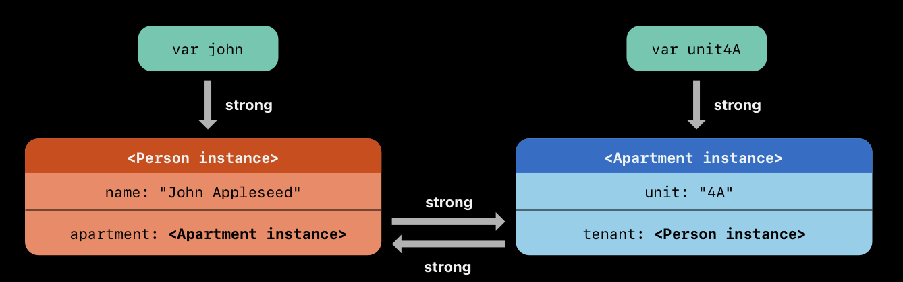

# Memory Management

Swift uses *Automatic Reference Counting (ARC)* to track and manage your app's memory usage. ARC automatically frees up the memory used by class instances when those instances are no longer needed, meaning that you don't need to worry about memory management yourself. However, there are a few cases where ARC requires more information about the relationships between parts of your code in order to manage memory for you.

<br/>

## How Automatic Reference Counting Works

Every time you create a new instance of a class, ARC allocates a chunk of memory to store information about that instance. When an instance is no longer needed, ARC frees up the memory used by that instance so that the memory can be used for other purposes instead.

If ARC were to deallocate an instance that was still in use, it would no longer be possible to access that instance’s properties or methods, and if you tried, your app would most likely crash. To make sure that instances don’t disappear while they’re still needed, **ARC tracks how many properties, constants, and variables are currently referring to each class instance**. ARC will not deallocate an instance as long as at least one active reference to that instance still exists. In other words, an object will only be deallocated once its reference count reaches 0.

Whenever you assign a class instance to a property, constant, or variable, that property, constant, or variable makes a *strong reference* to the instance. The reference is called a “strong” reference because it keeps a firm hold on that instance, and doesn’t allow it to be deallocated for as long as that strong reference remains.

To illustrate how strong references work, take a look at the following example:

```swift
class Employee {
    let name: String

    init(name: String) {
        self.name = name
        print("\(name) is being initialized")
    }

    deinit {
        print("\(name) is being deinitialized")
    }
}
```
Above, we have a class `Employee` that prints statements when it is initialized and when it is deinitialized which allows us to see when the memory is being allocated and deallocated. When we create an instance of this class, a strong reference is made between it and the variable `reference1`.

```swift
var reference1: Employee? = Employee(name: "Michael Scott") // Michael Scott is being initialized
```

We can then assign `reference1` to two other variables which will create two more strong references:

```swift
var reference2 = reference1
var reference3 = reference1
```
We now have in total, three strong references to the instance of `Employee`. If we break two of these strong references by assinging `nil` to two of the variables, a single strong reference remains, and the `Employee` instance isn't deallocated:

```swift
reference1 = nil
reference2 = nil
```
Finally, if we break the final strong reference, the deinitializer of the instance will be called and ARC will deallocate its memory:

```swift
reference3 = nil // Michael Scott is being deinitialized
```

<br/>

To demonstrate with another example, suppose we have the class `Office` which has an array of type `Employee`:

```swift
class Office {
    var name: String
    var employees = [Employee]()

    init(name: String) {
        self.name = name
    }

    func add(employee: Employee) {
        employees.append(employee)
    }
}
```
If we create an instance of `Office` and `Employee` and add that employee to the office, we now have two strong references to the employee instance. The first is through the variable `dwight` and the second is through the `employees` array inside `office`:

```swift
var office: Office? = Office(name: "Dunder Mifflin")
var dwight: Employee? = Employee(name: "Dwight Schrute") // Dwight Schrute is being initialized

office!.add(employee: dwight!)
```
If we set `dwight` to nil, the employee instance won't be deallocated because there is still one strong reference remaining. In fact, you can still access that instance through the `office` object:

```swift
dwight = nil
print(office!.employees[0].name) // Dwight Schrute
```
Finally, if we set `office` to nil, the remaining reference to the employee instance is removed, and the employee instance is deallocated:

```swift
office = nil // Dwight Schrute is being deinitialized
```

<br/>

## Strong Reference Cycles (Retain Cycles)

If you are not careful, it is possible to create situations where the reference count for an object can never reach 0, meaning that that object's memory can never be freed. An example of this is a retain cycle, where two class instances hold strong references to each other, keeping each other alive.

Consider the following classes representing a person and an apartment. Every instance of `Person` has an optional `Apartment`, and every instance of `Apartment` has an optional `Person`:

```swift
class Person {
    let name: String
    var apartment: Apartment?

    init(name: String) {
        self.name = name
        print("\(name) is being initialized")
    }

    deinit {
        print("\(name) is being deinitialized")
    }
}

class Apartment {
    let unit: String
    var tenant: Person?

    init(unit: String) {
        self.unit = unit
        print("Apartment \(unit) is being initialized")
    }

    deinit {
        print("Apartment \(unit) is being deinitialized")
    }
}
```
If we then create an instance of `Person` and an instance of `Apartment` and link them together, they will each hold a strong reference to each other.

```swift
var john: Person? = Person(name: "John") // John is being initialized
var unit4A: Apartment? = Apartment(unit: "4A") // Apartment 4A is being initialized

john!.apartment = unit4A
unit4A!.tenant = john
```


If we then break the strong references held by the variables `john` and `unit4A` by setting them to nil, the reference counts don't drop to zero and the instances aren't deallocated. This is what is referred to as a strong reference cycle (retain cycle) and it will cause memory leaks in your app.

```swift
john = nil
unit4A = nil
```
> Notice once you set these variables to nil, their deinitializers aren't called

<br/>

#### Another Example

Strong reference cycles can appear in other ways, such as variables going out of scope. In the following example, we have a function that creates an instance of `Person` and `Apartment`. As soon as the function exits, the variables go out of scope and are deinitialized as can be seen by the printed statements.

```swift
func memorySafeFunction() {
    var john = Person(name: "John") // John is being initialized
    var unit4A = Apartment(unit: "4A") // Apartment 4A is being intialized
}

memorySafeFunction()
// Apartment 4A is being deinitialized
// John is being deinitialized
```

However, if we link the `Person` and `Apartment` instances inside the function, their strong references to each other will remain after the variables have gone out of scope, meaning that the object instances won't be deallocated when the function exits.

```swift
func memoryUnsafeFunction() {
    var john = Person(name: "John") // John is being initialized
    var unit4A = Apartment(unit: "4A") // Apartment 4A is being intialized

    john.apartment = unit4A
    unit4A.tenant = john
}
memoryUnsafeFunction()
```

<br/>

## Resolving Strong Reference Cycles

- protocols and delegates - delegates should be weak