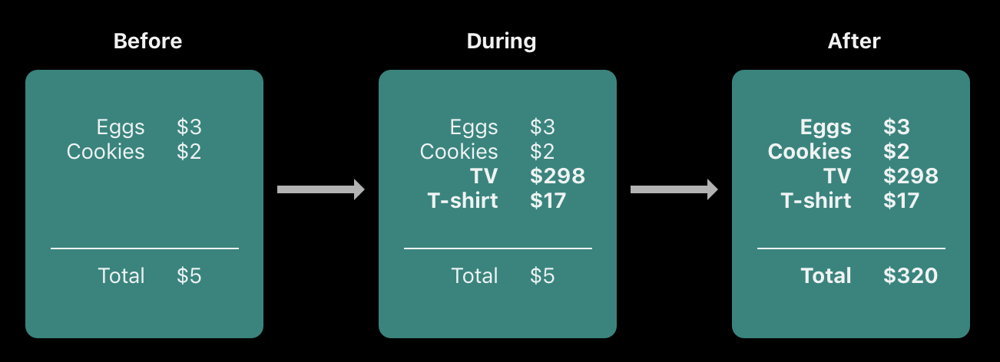
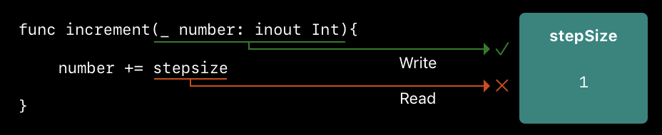

# Memory Management

Swift uses *Automatic Reference Counting (ARC)* to track and manage your app's memory usage. ARC automatically frees up the memory used by class instances when those instances are no longer needed, meaning that you don't need to worry about memory management yourself. However, there are a few cases where ARC requires more information about the relationships between parts of your code in order to manage memory for you.

<br/>

## How Automatic Reference Counting Works

Every time you create a new instance of a class, ARC allocates a chunk of memory to store information about that instance. When an instance is no longer needed, ARC frees up the memory used by that instance so that the memory can be used for other purposes instead.

If ARC were to deallocate an instance that was still in use, it would no longer be possible to access that instance’s properties or methods, and if you tried, your app would most likely crash. To make sure that instances don’t disappear while they’re still needed, **ARC tracks how many properties, constants, and variables are currently referring to each class instance**. ARC will not deallocate an instance as long as at least one active reference to that instance still exists. In other words, an object will only be deallocated once its reference count reaches 0.

Whenever you assign a class instance to a property, constant, or variable, that property, constant, or variable makes a *strong reference* to the instance. The reference is called a “strong” reference because it keeps a firm hold on that instance, and doesn’t allow it to be deallocated for as long as that strong reference remains.

To illustrate how strong references work, take a look at the following example:

```swift
class Employee {
    let name: String

    init(name: String) {
        self.name = name
        print("\(name) is being initialized")
    }

    deinit {
        print("\(name) is being deinitialized")
    }
}
```
Above, we have a class `Employee` that prints statements when it is initialized and when it is deinitialized which allows us to see when the memory is being allocated and deallocated. When we create an instance of this class, a strong reference is made between it and the variable `reference1`.

```swift
var reference1: Employee? = Employee(name: "Michael Scott") // Michael Scott is being initialized
```

We can then assign `reference1` to two other variables which will create two more strong references:

```swift
var reference2 = reference1
var reference3 = reference1
```
We now have in total, three strong references to the instance of `Employee`. If we break two of these strong references by assinging `nil` to two of the variables, a single strong reference remains, and the `Employee` instance isn't deallocated:

```swift
reference1 = nil
reference2 = nil
```
Finally, if we break the final strong reference, the deinitializer of the instance will be called and ARC will deallocate its memory:

```swift
reference3 = nil // Michael Scott is being deinitialized
```

<br/>

To demonstrate with another example, suppose we have the class `Office` which has an array of type `Employee`:

```swift
class Office {
    var name: String
    var employees = [Employee]()

    init(name: String) {
        self.name = name
    }

    func add(employee: Employee) {
        employees.append(employee)
    }
}
```
If we create an instance of `Office` and `Employee` and add that employee to the office, we now have two strong references to the employee instance. The first is through the variable `dwight` and the second is through the `employees` array inside `office`:

```swift
var office: Office? = Office(name: "Dunder Mifflin")
var dwight: Employee? = Employee(name: "Dwight Schrute") // Dwight Schrute is being initialized

office!.add(employee: dwight!)
```
If we set `dwight` to nil, the employee instance won't be deallocated because there is still one strong reference remaining. In fact, you can still access that instance through the `office` object:

```swift
dwight = nil
print(office!.employees[0].name) // Dwight Schrute
```
Finally, if we set `office` to nil, the remaining reference to the employee instance is removed, and the employee instance is deallocated:

```swift
office = nil // Dwight Schrute is being deinitialized
```

<br/>

## Strong Reference Cycles (Retain Cycles)

If you are not careful, it is possible to create situations where the reference count for an object can never reach 0, meaning that that object's memory can never be freed. An example of this is a retain cycle, where two class instances hold strong references to each other, keeping each other alive.

Consider the following classes representing a person and an apartment. Every instance of `Person` has an optional `Apartment`, and every instance of `Apartment` has an optional `Person`:

```swift
class Person {
    let name: String
    var apartment: Apartment?

    init(name: String) {
        self.name = name
        print("\(name) is being initialized")
    }

    deinit {
        print("\(name) is being deinitialized")
    }
}

class Apartment {
    let unit: String
    var tenant: Person?

    init(unit: String) {
        self.unit = unit
        print("Apartment \(unit) is being initialized")
    }

    deinit {
        print("Apartment \(unit) is being deinitialized")
    }
}
```
If we then create an instance of `Person` and an instance of `Apartment` and link them together, they will each hold a strong reference to each other.

```swift
var john: Person? = Person(name: "John") // John is being initialized
var unit4A: Apartment? = Apartment(unit: "4A") // Apartment 4A is being initialized

john!.apartment = unit4A
unit4A!.tenant = john
```


If we then break the strong references held by the variables `john` and `unit4A` by setting them to nil, the reference counts don't drop to zero and the instances aren't deallocated. This is what is referred to as a strong reference cycle (retain cycle) and it will cause memory leaks in your app.

```swift
john = nil
unit4A = nil
```
> Notice once you set these variables to nil, their deinitializers aren't called

<br/>

#### Another Example

Strong reference cycles can appear in other ways, such as variables going out of scope. In the following example, we have a function that creates an instance of `Person` and `Apartment`. As soon as the function exits, the variables go out of scope and are deinitialized as can be seen by the printed statements.

```swift
func memorySafeFunction() {
    var john = Person(name: "John") // John is being initialized
    var unit4A = Apartment(unit: "4A") // Apartment 4A is being intialized
}

memorySafeFunction()
// Apartment 4A is being deinitialized
// John is being deinitialized
```

However, if we link the `Person` and `Apartment` instances inside the function, their strong references to each other will remain after the variables have gone out of scope, meaning that the object instances won't be deallocated when the function exits.

```swift
func memoryUnsafeFunction() {
    var john = Person(name: "John") // John is being initialized
    var unit4A = Apartment(unit: "4A") // Apartment 4A is being intialized

    john.apartment = unit4A
    unit4A.tenant = john
}
memoryUnsafeFunction()
```

<br/>

## Resolving Strong Reference Cycles

Swift provides two ways of resolving strong reference cycles: *weak references* (declared with the `weak` keyword) and *unowned references* (declared with the `unowned` keyword). These types of references enable an instance to refer to another instance without keeping a strong hold on it (ie: without increasing its reference count). This allows instances to reference each other without creating strong reference cycles. Put another way, if the only remaining references to an instance are weak or unowned, that instance will be deallocated by ARC.

Use weak references when the other instance has a shorter lifetime (ie. the other instance can be deallocated first), and use an unowned reference when the other instance has the same lifetime or a longer lifetime.

<br/>

### Weak References

As mentioned above, a weak reference doesn't keep a strong hold of the instance it refers to and doesn't stop ARC from disposing of the referenced instance. This means that it's possible for an instance to be deallocated while a weak reference is still referring to it. When this happens, ARC will automatically set a weak reference to `nil`. Because their value can change at runtime, **weak references must always be declared as optional variables**.

> Note: Property observers are not called when ARC sets a weak reference to nil

Consider the same example from above with one change: `Apartment` now holds a weak reference to `Person`:

```swift
class Apartment {
    let unit: String
    weak var tenant: Person?

    init(unit: String) {
        self.unit = unit
        print("Apartment \(unit) is being initialized")
    }

    deinit {
        print("Apartment \(unit) is being deinitialized")
    }
}
```

We can then create and link our instances as we did before and a strong reference cycle will not be created:

```swift
var john: Person? = Person(name: "John") // John is being initialized
var unit4A: Apartment? = Apartment(unit: "4A") // Apartment 4A is being initialized

john!.apartment = unit4A
unit4A!.tenant = john
```


The instance of `Person` only has one strong reference - the variable `john`. If we set that variable to `nil`, the instance will be deallocated and the weak reference to it inside the apartment instance will be set to `nil`:

```swift
john = nil // John is being deinitialized

print(unit4A!.tenant) // nil
```
Once the instace of `Person` is deallocated, there is only one remaining strong reference to the `Apartment` instance, through the variable `unit4A`. So setting that variable to `nil` will deallocate the `Apartment` instance:

```swift
unit4A = nil // Apartment 4A is being deinitialized
```

<br/>

### Unowned References

Like a weak reference, an *unowned reference*, (indicated with the `unowned` keyword) doesn’t keep a strong hold on the instance it refers to. Unlike a weak reference, however, an unowned reference is used when the other instance has the same lifetime or a longer lifetime. Since unowned references point to objects that are expected to outlive the instances referring to them, **unowned references are expected to always have a value**. This means that unowned references don't have to be optional and ARC will never set an unowned reference to nil. However, if an instance does happen to be deallocated and you try to access it using an unowned reference, you'll get a runtime error.

In the following example, a customer may or may not have a credit card, but a credit card will always be associated with a customer. The `person` reference should always outlive any instance of `CreditCard`, so we can mark the reference as `unowned`:

```swift
class Customer {
    let name: String
    var card: CreditCard?

    init(name: String) {
        self.name = name
    }

    deinit {
        print("\(name) is being deinitialized")
    }
}

class CreditCard {
    let number: UInt64
    unowned let customer: Customer

    init(number: UInt64, customer: Customer) {
        self.number = number
        self.customer = customer
    }

    deinit {
        print("Card #\(number) is being deinitialized")
    }
}
```

We can now create a `Customer` instance and use it to initialize and assign a `CreditCard` instance:

```swift
var john: Customer? = Customer(name: "John Appleseed")
john!.card = CreditCard(number: 1234_5678_9012_3456, customer: john!)
```
The `Customer` instance has a strong reference to the `CreditCard` instance and the `CreditCard` instance has an unowned reference to the `Customer` instance. They reference each other, but there is no retain cycle.


If we then break the strong reference to the `Customer` instance by setting `john` to nil, there are no more strong references to the `Customer` instance and it will be deallocated. When this happens, the one and only strong reference to the `CreditCard` instance will disappear and then the `CreditCard` instance will be deallocated:

```swift
john = nil
// Prints "John Appleseed is being deinitialized"
// Prints "Card #1234567890123456 is being deinitialized"
```
The unowned reference works in the above example because the `Customer` and the `CreditCard` instances have the same lifetime: when the `Customer` instance is deallocated, the `CreditCard` instance goes with it. However, if the `CreditCard` instance had the possibility of *outliving* the `Customer` instance - say if we stored it in its own variable, creating an additional strong reference to it - we would run into a problem:

```swift
var bob: Customer? = Customer(name: "Bob")
var creditCard = CreditCard(number: 1234_5678_9012_3456, customer: bob!)
bob!.card = creditCard

bob = nil
print(creditCard.customer.name) // CRASH
```
In this scenario, when we set the `Customer` instance to nil, it gets deallocated but the `CreditCard` instance does not because there is still a remaining strong reference to it through the `creditCard` variable. If we then attempt to access the `Customer` instance through the `creditCard` variable, we will get a runtime error because the `Customer` instance no longer exists. This is an example of where a weak pointer should be used instead.

<br/>

#### Unowned Optional References

The previous section covered the use of unowned non-optional references. However, it is possible to create an unowned *optional* reference as well. In terms of the ARC ownership model, an unowned optional reference and a weak reference can both be used in the same contexts. The difference is that when you use an unowned optional reference, you’re responsible for making sure it always refers to a valid object or is set to `nil`.

<br/>

## Strong Reference Cycles for Closures

So far we have discussed strong reference cycles between two class instances. Strong reference cycles can also occur between a closure and a class instance - particularly if you assign a closure to a property of a class instance and the body of that closure captures the instance (by referencing `self`). This strong reference cycle occurs because closures, like classes, are *reference* types.

For example, suppose we had a class called `Counter` which keeps track of the number of days left until a certain event.

```swift
class Counter {
    var daysLeft: Int

    lazy var displayString: () -> String = {
        if self.daysLeft == 1 {
            return "There is 1 day left"
        } else {
            return "There are \(self.daysLeft) days left"
        }
    }

    init(daysLeft: Int) {
        self.daysLeft = daysLeft
    }

    deinit {
        print("Deallocating Counter")
    }
}
```
Inside this class we have a closure that returns a display string depending on the number of days left (singular or plural). This closure is stored in the variable `displayString` which creates a strong reference from the class instance to the closure. However, within the body of the closure, it references `self.daysLeft`, meaning that there is also a strong reference from the closure to the class instance. We have a strong reference cycle.

This can be demonstrated by creating an instance of the class and then setting it to nil. When the instance is set to nil, nothing is printed to the console, indicating that the `deinit` function was never called.

```swift
var counter: Counter? = Counter(daysLeft: 4)
counter = nil
```

<br/>

### Resolving Strong Reference Cycles for Closures

To resolve a strong reference cyle between a closure and a class instance, you define a `capture list` as part of the closures definition. Within this capture list, you declare each captured reference to be either weak or unowned.

Using the above example, if we declare a weak reference to self within the closure capture list, we can see that the strong reference cycle is resolved because the `deinit` function is called when the class instance is set to nil.

```swift
lazy var displayString: () -> String = { [weak self] in
    if self?.daysLeft == 1 {
        return "There is 1 day left"
    } else {
        return "There are \(self?.daysLeft) days left"
    }
}

...

var counter: Counter? = Counter(daysLeft: 4)
counter = nil // Deallocating Counter
```
> Notice how when we define `self` as a weak reference, `self` becomes an optional. This is because weak references have the possibility of being set to `nil` so they have to be optional.

We could also resolve the strong reference cycle using an unowned reference to `self`:

```swift
lazy var displayString: () -> String = { [unowned self] in
    if self.daysLeft == 1 {
        return "There is 1 day left"
    } else {
        return "There are \(self.daysLeft) days left"
    }
}

...

var counter: Counter? = Counter(daysLeft: 4)
counter = nil // Deallocating Counter
```
> Unowned references are expected to always hold a value, so they are non-optional

**When the captured reference may become `nil` at some point in the future, you should use a weak reference. When the captured reference will never become `nil`, use an unowned reference.**

In the above example, whenever an instance of `Counter` is deallocated, the closure `displayString` should go with it (they have the same lifetime), so in this scenario it makes sense to use an unowned reference.

<br/>

## Weak vs Unowned

One of the key differences between weak and unowned references is what happens when the referred-to object is released: a weak reference becomes nil while an unowned reference still holds a (now invalid) reference to the object, so your program will crash if you try to access it.

Since weak references can become nil, they *must* be optional variables. Unowned references however can be both optional or non-optional, constant or variable.

| | Weak | Unowned
|---|---|---|
| var | :heavy_check_mark: | :heavy_check_mark:
| let |  | :heavy_check_mark:
| Can be optional | :heavy_check_mark: | :heavy_check_mark:
| Can be non-optional |  | :heavy_check_mark:
| What happens when referenced instance is deallocated | Reference is set to nil | Reference points to invalid object and will crash if accessed
| When to use | When the referenced instance could become nil (ie. it has a shorter lifetime) | When the referenced instance is always expected to have a value (ie. it has the same or a longer lifetime)

<br/>

## [Memory Safety](https://docs.swift.org/swift-book/documentation/the-swift-programming-language/memorysafety)

Because Swift manages memory automatically, most of the time you don’t have to think about accessing memory at all. However, there are cases where conflicting access to memory can occur which will result in either a compile-time or runtime error.

Conflicting access to memory occurs when different parts of your code try to access the same location in memory at the same time, which can result in unpredictable or inconsistent behavior. A common scenario is trying to access a memory location at the same time that it's being modified.

For example, when we add items to a budget, the total value of all the items needs to be re-calculated. During this stage of adding items to the budget, the total value is in a temporary, invalid state. Reading this value at this time could produce very different results ($5 or $320 or something in between).



In code, a conflict occurs when you have two accesses that meet all of the following conditions:

1. At least one is a write access or a nonatomic access
2. They access the same location in memory
3. Their durations overlap

The duration of memory access is either instantaneous or long-term. Most memory access you will encounter is instantaneous. Long-term memory access occurs when it's possible for other code to run after memory access starts but before it ends, resulting in an *overlap*. Overlapping access appears primarily in functions/methods that take in-out parameters or in structures that have mutating methods.

<br/>

### Conflicting Access to In-Out Parameters

A function has long-term write access to all of its in-out parameters that lasts for the entire duration of that function call. One consequence of this is that you can't access the original variable that was passed as in-out, even if scoping rules and access control would otherwise permit it. Consider the following function that increments an in-out variable by the global variable `stepSize`.

```swift
var stepSize = 1

func increment(_ number: inout Int) {
    number += stepSize
}

var counter = 0
increment(&counter) // This is ok
print(counter) // 1
```

All is well and good until we pass `stepSize` as the in-out parameter:

```swift
increment(&stepSize) // Error: Fatal access conflict detected
```
This results in the `increment` function attempting to read and write to `stepSize` at the same time which produces a run-time error.



Another consequence of long-term write access to in-out parameters is that passing a single variable as the argument for multiple in-out parameters of the same function produces a conflict. Below is a contrived example but it demonstrates the problem of attempting to read and write to the same memory location at the same time.

```swift
func swapValues(_ a: inout Int, _ b: inout Int) {
    let temp = a
    a = b
    b = temp
}

var foo = 2
swapValues(&foo, &foo)
// Error: Inout arguments are not allowed to alias each other
// Error: Overlapping accesses to 'foo', but modification requires exclusive access; consider copying to a local variable
```

<br/>

### Conflicting Access to `self` in Methods

A mutating method on a structure has write access to `self` for the duration of the method call. In the below example, the function `transferEnergy` has long-term access to both `self` and the in-out parameter `otherPlayer`. 

```swift
struct Player {
    var energy: Int
    var health: Int

    mutating func transferEnergy(to otherPlayer: inout Player) {
        otherPlayer.energy += energy
        energy = 0
    }
}
```
As long as we pass a different object to `transferEnergy` than the object we are calling from, there is no memory access conflict.

```swift
var oscar = Player(energy: 10, health: 100)
var kevin = Player(energy: 5, health: 100)

oscar.transferEnergy(to: &kevin)

print(oscar.energy) // 0
print(kevin.energy) // 15
```

However, if we pass the *same* object, a conflict will occur because the function attempts to read and write to the same memory location at the same time:

```swift
kevin.transferEnergy(to: &kevin)
// Error: Inout arguments are not allowed to alias each other
// Error: Overlapping accesses to 'maria', but modification requires exclusive access; consider copying to a local variable
```

<br/>

### Conflicting Access to Properties

Value types like structures, tuples and enumerations are made up of other individual values (ex: the properties of a structure or the elements of a tuple). Mutating any piece of a value mutates the entire value, meaning that read or write access to one of the pieces requires read or write access to the whole value.

For example, if you overlap write access to the elements of a tuple, a conflict will occur. In the code below, the `swap` function requires two write accesses to `position` at the same time, creating an overlap. This will result in a run-time error.

```swift
var position = (x: 4, y: 7)
swap(&position.x, &position.y) // Error: Fatal access conflict detected
```

The same problem occurs when overlapping write access to the properties of a structure that's stored in a global variable:

```swift
var angela = Player(energy: 20, health: 100)
swap(&angela.energy, &angela.health) // Error: Fatal access conflict detected
```

However, if a structure is stored in a *local* variable, the compiler is able to prove that overlapping access to the stored properties of the structure is memory safe and will allow nonexclusive access. The following code is completely safe and won't result in any compile-time or runtime errors:

```swift
func someFunction() {
    var angela = Player(energy: 20, health: 100)
    swap(&angela.energy, &angela.health)

    print(angela.energy) // 100
    print(angela.health) // 20
}

someFunction()
```

As you can see in the above example, the Swift compiler will make exceptions to nonexclusive access to memory if it can prove that the nonexclusive access is memory safe. Swift's compiler can prove that overlapping access to properties of a structure is safe if the following conditions apply:

1. You’re accessing only stored properties of an instance, not computed properties or class properties.
2. The structure is the value of a local variable, not a global variable.
3. The structure is either not captured by any closures, or it’s captured only by nonescaping closures.

If the compiler can’t prove the access is safe, it doesn’t allow the access.

<br/>

## To Explore

* [Unowned optional references](https://docs.swift.org/swift-book/documentation/the-swift-programming-language/automaticreferencecounting/#Unowned-Optional-References)
* [Unowned References and Implicitly Unwrapped Optional Properties](https://docs.swift.org/swift-book/documentation/the-swift-programming-language/automaticreferencecounting/#Unowned-References-and-Implicitly-Unwrapped-Optional-Properties)
* [protocols and delegates - delegates should be weak](https://docs.swift.org/swift-book/documentation/the-swift-programming-language/protocols#Delegation)
* Safe unowned references vs unsafe unowned references
* Value Types: Structs, Enums, Arrays?
* Reference Types: Classes, Closures

<br/>

## Links

* [Apple Documentation on Automatic Reference Counting](https://docs.swift.org/swift-book/documentation/the-swift-programming-language/automaticreferencecounting)
* [Apple Documentation on Memory Safety](https://docs.swift.org/swift-book/documentation/the-swift-programming-language/memorysafety)
* [Apple Documentation on Diagnosing Memory Issues](https://developer.apple.com/documentation/xcode/diagnosing-memory-thread-and-crash-issues-early)
* [Video Explanation](https://www.youtube.com/watch?v=VcoZJ88d-vM&list=PL8seg1JPkqgF5wazzCKSq3EEfqt3t8mvA&index=19&ab_channel=SeanAllen)
* [Video Example of Retain Cycles in Closures](https://www.youtube.com/watch?v=q0-DIJszYRo&ab_channel=LetsBuildThatApp)
* [Video Explanation of Weak Self](https://www.youtube.com/watch?v=chI-B8u4MBs&ab_channel=iOSAcademy)
* [Using Instruments to Detect Memory Leaks](https://www.youtube.com/watch?v=sp8qEMY9X6Q&ab_channel=LetsBuildThatApp)