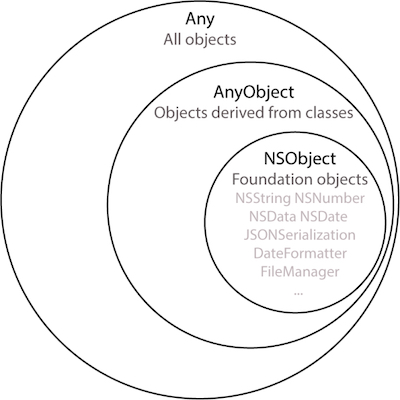

# [Types](https://docs.swift.org/swift-book/documentation/the-swift-programming-language/types/)


## Any, AnyObject and NSObject

`Any`, `AnyObject` and `NSObject` are all data types.

<br/>



<br/>

### [Any](https://docs.swift.org/swift-book/documentation/the-swift-programming-language/types/#Any-Type)

`Any` represents an instance of **any** type at all (functions, classes, structs, ints, bools etc).

Using `Any`, you can create collections that contain many different types:

```swift
struct Book {
    let name: String
}

class Song {
    let name: String

    init(name: String) {
        self.name = name
    }
}

let age = 25
let result = true
let printHello = { print("Hello") }
let book = Book(name: "Harry Potter")
let song = Song(name: "Shake It Off")
let button = UIButton()

let things: [Any] = [age, result, printHello, book, song, button]
```

<br/>

### [AnyObject](https://developer.apple.com/documentation/swift/anyobject)

`AnyObject` is a protocol to which all classes implicitly conform and therefore represents a class type. If the type of the array from the example above were changed to `AnyObject` we would have to remove everything except the class types:

```swift
let objects: [AnyObject] = [song, button]
```

A common use of `AnyObject` is to restrict protocol adoption to class-types only:

```swift
protocol MyProtocol: AnyObject {}

class MyClass: MyProtocol {}

struct MyStruct: MyProtocol {} // Error: Non-class type 'MyStruct' cannot conform to class protocol 'MyProtocol'
```

<br/>

### [NSObject](https://developer.apple.com/documentation/objectivec/1418956-nsobject)

`NSObject` is a universal base class for all Foundation classes:

```swift
let nsObjects: [NSObject] = [button, NSNumber(value: 42), NSString(string: "hello world")]
```

<br/>

## [Opaque Types](https://docs.swift.org/swift-book/documentation/the-swift-programming-language/opaquetypes)

An opaque type conforms to a protocol or protocol composition without specifying the underlying concrete type. Opaque types are indicated by the keyword `some`, and have the form `some <#constraint#>` where the constraint is a class type, protocol type, protocol composition type or `Any`.

Opaque types are often used as the return type of a function or the type of a property. For example, the following function returns an opaque type of the protocol `Numeric`:

```swift
func getRandomNumber() -> some Numeric {
    return Int.random(in: 1...10)
}
```

The compiler knows that the function `getRandomNumber()` will return an `Int`, but users of the function only know that they are getting a type that conforms to `Numeric`. This allows us the flexibility of returning a different type in the future. For example, we could change the function to return a `Double` instead:

```swift
func getRandomNumber() -> some Numeric {
    return Double.random(in: 2.5...5.0)
}
```

> Tip: It is helpful to think of opaque types as the reverse of generic types. Whereas generic types let the code that calls a function pick the type used by that function, opaque types let the function implementation pick the type that is used.

It is important to note that when returning an opaque type from a function, all return paths must return the same underlying type. The following would not compile because the return types are different:

```swift
func getRandomNumber() -> some Numeric { // Error: Function declares an opaque return type 'some Numeric', but the return statements in its body do not have matching underlying types
    if Bool.random() {
        return Int.random(in: 1...10)
    } else {
        return Double.random(in: 2.5...5.0)
    }
}
```

<br/>

## Existential Types

Existential types are indicated by the keyword `any` and can store *any* value whose type conforms to a specific protocol or protocol composition. Like opaque types, the underlying concrete type is unknown to the user, but instead of representing a specific type that conforms to a protocol, existential types represent *any* type that conforms to a protocol.

For example, we could resolve the compiler error from above by changing `some` to `any`, returning an existential type instead of an opaque type:

```swift
func getRandomNumber() -> any Numeric {
    if Bool.random() {
        return Int.random(in: 1...10)
    } else {
        return Double.random(in: 2.5...5.0)
    }
}
```

When you create an existential type, you need to consider the cost of its added flexibility. To achieve existential types’ generality at runtime, Swift erases the underlying type information and uses dynamic dispatch to perform its code. This extra bookkeeping makes existential types slightly less efficient, requiring more memory than a generic parameter that uses static dispatch.

<br/>

## Choosing between `some` and `any`

When returning a protocol from a method, everything is very straight-forward if the protocol doesn't have any associated types. For example, suppose we had the following protocol `Pet`, and two structs, `Dog` and `Cat`, that conform to it:

```swift
protocol Pet {
    var name: String { get set }
}

struct Dog: Pet {
    var name: String
}

struct Cat: Pet {
    var name: String
}
```
We could then write a function for adopting a pet and have it return a type of `Pet`:

```swift
func adoptPet(petName: String) -> Pet {
    return Cat(name: petName)
}

let myPet = adoptPet(petName: "Sprinkles")
```

However, if we wanted to modify the `Pet` protocol to include an associated type like so:

```swift
protocol Pet {
    var name: String { get set }
    associatedtype Food
    func feed(_ food: Food)
}

struct Kibble {}

struct Dog: Pet {
    var name: String
    func feed(_ food: Kibble) {}
}

struct Tuna {}

struct Cat: Pet {
    var name: String
    func feed(_ food: Tuna) {}
}
```

The `adoptPet` function would then raise a compiler error: "*Use of protocol 'Pet' as a type must be written 'any Pet'*":

```swift
func adoptPet(petName: String) -> Pet { // Error: Use of protocol 'Pet' as a type must be written 'any Pet'
    return Cat(name: petName)
}
```

This is because the `Pet` protocol is now genericized and requires dynamic dispatch at runtime to determine the exact type to be returned. Since dynamic dispatch is expensive, Swift 5.6 added the requirement to use `any` to make the use of the existential type more explicit.

As we can see, adding `any` removes the compiler error:

```swift
func adoptPet(petName: String) -> any Pet {
    return Cat(name: petName)
}
```

However, returning an opaque type, using `some`, would also resolve the compiler error and is actually the preferred solution since the compiler can see that a type of `Cat` will always be returned and dynamic dispatch isn't necessary:

```swift
func adoptPet(petName: String) -> some Pet {
    return Cat(name: petName)
}
```

However, if we wanted to sometimes return a `Cat` and other times return a `Dog`, the compiler has no way of knowing which type will be returned until runtime, which means that dynamic dispatch is required. In this case, returning an existential type using `any` is the only option:

```swift
func adoptPet(petName: String) -> any Pet {
    if Bool.random() {
        return Cat(name: petName)
    } else {
        return Dog(name: petName)
    }
}
```

<br/>

## Links

* [AnyObject, Any and any: When to use which](https://www.avanderlee.com/swift/anyobject-any/)
* [Video on Opaque Return Types](https://www.youtube.com/watch?v=KxdHKEUtRNk&ab_channel=VincentPradeilles)
* [Swift Introduction of existential any](https://github.com/apple/swift-evolution/blob/main/proposals/0335-existential-any.md)
* [Understanding some and any](https://swiftsenpai.com/swift/understanding-some-and-any/)
* [The difference between any and some](https://www.donnywals.com/whats-the-difference-between-any-and-some-in-swift-5-7/)