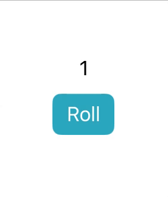

# [@Binding](https://developer.apple.com/documentation/swiftui/binding)

The `@Binding` property wrapper in SwiftUI allows you to create a two-way connection between a parent view and a child view. More specifically, it allows a child view to modify data owned by its parent.

For example, the following view uses `@State` to keep track of the number rolled:

```swift
struct ContentView: View {
    @State private var number: Int = 1

    var body: some View {
        VStack {
            Text("\(number)")
            Button("Roll") {
                number = Int.random(in: 1...6)
            }
        }
    }
}
```



If we wanted to extract the 'Roll' button to a separate view (a child view) but still give it write access to the `number` property, we could use a `@Binding` like so:

```swift
// Parent View
struct ContentView: View {
    @State var number: Int = 1

    var body: some View {
        Text("\(number)")
        RollButton(number: $number) // Pass the binding of the `@State` property to the child view
    }
}

// Child View
struct RollButton: View {
    @Binding var number: Int

    var body: some View {
        Button("Roll") {
            number = Int.random(in: 1...6)
        }
    }
}
```

Notice how when `number` is passed to `RollButton` it is prefixed with a dollar sign `$`. This is how you access the binding of a `@State` property. The dollar sign accesses the '[projected value](https://github.com/brittpinder/ios-reference/tree/main/swift/properties#projected-values)' of a property wrapper which in the case of `@State` is the binding itself.

<br/>

## When to use @Binding

`@Binding` should only be used in cases where a child view needs write access to a `@State` property in a parent view. If a child view only needs read access, simply pass the property to the child without using `$`. For example, if we wanted to extract the text display of the rolled number to a separate view, we could do something like this:

```swift
// Parent View
struct ContentView: View {
    @State var number: Int = 1

    var body: some View {
        NumberDisplay(number: number) // Pass value
        RollButton(number: $number) // Pass binding
    }
}

// Child view with read access to number
struct NumberDisplay: View {
    var number: Int

    var body: some View {
        Text("\(number)")
    }
}

// Child view with read/write access to number
struct RollButton: View {
    @Binding var number: Int

    var body: some View {
        Button("Roll") {
            number = Int.random(in: 1...6)
        }
    }
}
```

<br/>

## @Binding with UI Components

@Binding is commonly used with UI components that support two-way data binding, such as TextField, Stepper, Sheet and Slider. In fact, if you look at the signature of `TextField` you can see that it requires a parameter of type `Binding<String>`:


To pass a binding to TextField, we do the same as above. We create a `@State` property to hold the string value and pass the binding to TextField by prefixing it with `$`:

```swift
struct ContentView: View {

    @State private var name: String = ""

    var body: some View {
        TextField("Name", text: $name)
        Text("\(name)")
    }
}
```


<br/>

## How to Initialize @Binding

If you create a view that has a @Binding and you need to implement a custom initializer for that view, you might run into a few problems. First, the compiler will complain that you need to initialize all stored properties (ie: you need to initialize the @Binding).

```swift
struct RollButton: View {
    @Binding var number: Int

    init() {
        print("Custom initializer")
    } // Error: Return from initializer without initializing all stored properties

    var body: some View {
        Button("Roll") {
            number = Int.random(in: 1...6)
        }
    }
}
```

Before we can initialize the @Binding, we need to declare it as one of the constructor parameters. When doing this, the wrapped value of a Binding needs to be explicitly specified, like `Binding<String>`:

```swift
init(number: Binding<Int>) {
    print("Custom initializer")
}
```

We might then try to initialize our Binding like so:

```swift
init(number: Binding<Int>) {
    self.number = number
    print("Custom initializer")
}
```
But this produces another error: "Cannot assign value of type 'Binding<Int>' to type 'Int'". This is because `self.number` refers to the *value* of the Binding, not the Binding itself. To access the Binding itself, we need to prefix `number` with an underscore `_` like so:

```swift
init(number: Binding<Int>) {
    self._number = number
    print("Custom initializer")
}
```

Now our view with a binding and a custom initializer compiles and works as intended:

```swift
struct RollButton: View {
    @Binding var number: Int

    init(number: Binding<Int>) {
        self._number = number
        print("Custom initializer")
    }

    var body: some View {
        Button("Roll") {
            number = Int.random(in: 1...6)
        }
    }
}
```

<br/>

## Difference between `$` and `_`

When managing state in SwiftUI, understanding what the dollar signs and underscores represent and when to use them can be quite confusing. They aren't anything unique to SwiftUI, they are actually part of the language feature called "[property wrappers](https://github.com/brittpinder/ios-reference/tree/main/swift/properties#property-wrappers)".

Given the following property declaration `@Binding var number: Int`, you can access three variables:

1. `_number` - This is the storage of the `Binding<Int>` property wrapper instance
2. `number` - This is the value that the property wrapper holds and is equivalent to `self._number.wrappedValue`
3. `$number` - This is the 'projected value' of the property wrapper which in the case of @Binding, refers to `self` (`Binding<Int>`) and is equivalent to `self._number.projectedValue`

In this scenario, `_number` and `$number` seem relatively the same since they both refer to `Binding<Int>`. The difference lies in their access level; `_number` can be modified where as `$number` is read-only.


<br/>

## Considerations when using @Binding

- `@Binding` is suitable for situations where you need to directly modify the data in a parent view from a child view
- In complex view hierarchies, passing `@Binding` through multiple levels can make data flow hard to track, in which case other state management methods should be considered
- `@Binding` should not be used in cases where a child view only needs read access. If this is the case, simply pass the `@State` variable to the child without the `$`
- `@Binding` does not hold the data directly but provides a wrapper for read and write access to other data sources
- When defining a custom initializer that takes a binding, the wrapped value type of the binding needs to be explicitly specified in the constructor parameters and the binding needs to be initialized using an underscore

<br/>

## Links

- [How to initialize @Binding in SwiftUI](https://sarunw.com/posts/binding-initialization/)
