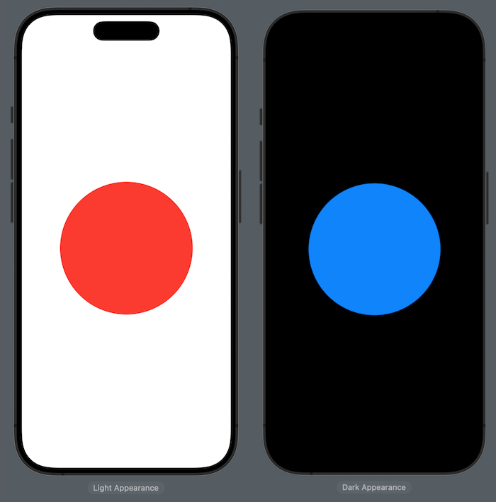
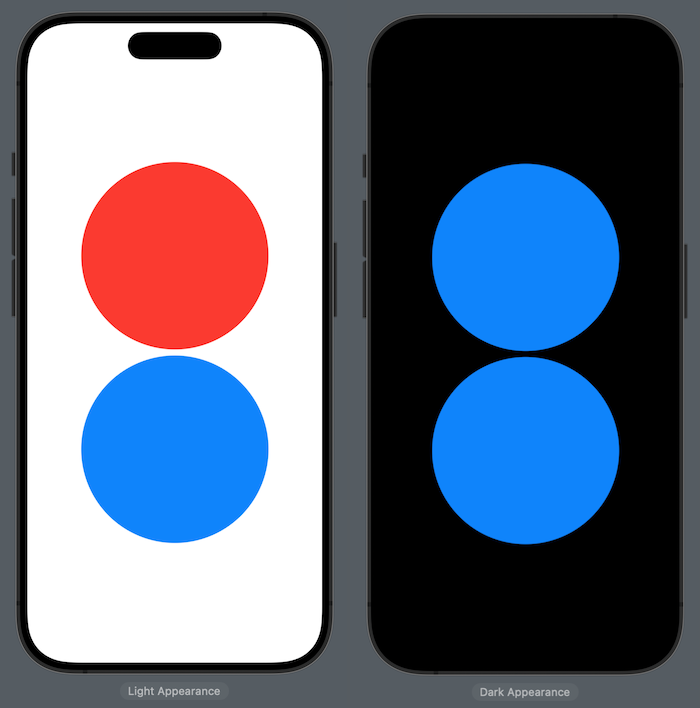

# [@Environment](https://developer.apple.com/documentation/swiftui/environment)

The `@Environment` property wrapper is used to read values from the environment such as the device orientation or whether the device is in light mode or dark mode. Similar to `@EnvironmentObject`, any child view can access `@Environment` properties without them having to be passed down through the app hierarchy. Any time the value in the environment changes, views that access that value will be updated.

For example, we could get access to the current color scheme of the app (light or dark mode) by using `@Environment(\.colorScheme)`. Here we make a circle red if the app is in light mode and blue if it's in dark mode:

```swift
struct ContentView: View {
    var body: some View {
        CircleView()
    }
}

struct CircleView: View {
    @Environment(\.colorScheme) var colorScheme

    var body: some View {
        Circle()
            .frame(width: 250, height: 250)
            .foregroundStyle(colorScheme == .dark ? .blue : .red)
    }
}
```



> SwiftUI provides several predefined environment values and a complete list can be found [here](https://developer.apple.com/documentation/swiftui/environmentvalues).


<br/>

Unlike `@EnvironmentObject`, the `@Environment` property wrapper cannot be used to set values. To set an `@Environment` property on a specific view, you need to use the `.environment` view modifier. For example, we could add another circle and make it always be blue by setting the `colorScheme` environment variable to `.dark`:

```swift
struct ContentView: View {
    var body: some View {
        CircleView()
        CircleView()
            .environment(\.colorScheme, .dark)
    }
}
```



<br/>

You can also create your own custom environment values by defining an `EnvironmentKey` and extending the `EnvironmentValues` struct ([example](https://swiftuipropertywrappers.com/#environment)).

<br/>

## Links

- [SwiftUI Property Wrappers](https://swiftuipropertywrappers.com/#environment)
- [What is the @Environment property wrapper?](https://www.hackingwithswift.com/quick-start/swiftui/what-is-the-environment-property-wrapper)
