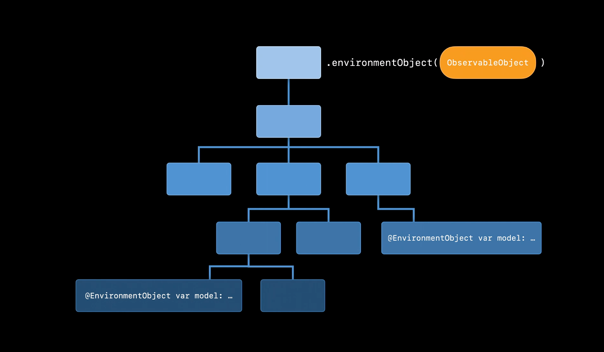

# [@EnvironmentObject](https://developer.apple.com/documentation/swiftui/environmentobject)

> Note: If targeting iOS17 and above, consider using the [observation framework](https://github.com/brittpinder/ios-reference/tree/main/swiftui/observation) instead.

<br/>

The `@EnvironmentObject` property wrapper is used to create a connection between the current view and an `ObservableObject` instance passed down through the environment from a higher-level view. It is similar to `@ObservedObject` except that the `ObservableObject` does not need to be passed directly from its parent view. `@EnvironmentObject` can capture and reference ObservableObjects declared higher up in the view hiearchy without the need to pass them down through each child view.

For example, suppose we had an `ObservableObject` class that represented app settings like whether notifications are enabled or the accent color of the app. 

```swift
class Settings: ObservableObject {
    @Published var notifications: Bool
    @Published var accentColor: Color

    init(notifications: Bool, accentColor: Color) {
        self.notifications = notifications
        self.accentColor = accentColor
    }
}
```

A class like this is likely required by many views in an app and should be instantiated high up in the view hierarchy - typically in the `App` struct:

```swift
import SwiftUI

@main
struct MyApp: App {
    @StateObject var settings = Settings(notifications: true, accentColor: .blue)

    var body: some Scene {
        WindowGroup {
            ContentView()
        }
    }
}
```

Next, we need to attach the `Settings` instance to our `ContentView` so that all child views can get access to it (if required). This is done using the `.environmentObject` modifier:

```swift
import SwiftUI

@main
struct MyApp: App {
    @StateObject var settings = Settings(notifications: true, accentColor: .blue)

    var body: some Scene {
        WindowGroup {
            ContentView()
                .environmentObject(settings)
        }
    }
}
```

<br/>

Inside our `ContentView` we have a `ChildView` that display some text:

```swift
struct ContentView: View {
    var body: some View {
        ChildView()
    }
}

struct ChildView: View {
    var body: some View {
        Text("Child View")
    }
}
```


Suppose we wanted to change the color of the text to match the accent color in our settings. We could use the `@EnvironmentObject` property wrapper to get access like so:

```swift
struct ChildView: View {
    @EnvironmentObject var settings: Settings

    var body: some View {
        Text("Child View")
            .foregroundStyle(settings.accentColor)
    }
}
```


We can even modify the accent color in the `Settings` instance through `@EnvironmentObject` like so:

```swift
struct ChildView: View {
    @EnvironmentObject var settings: Settings

    var body: some View {
        Text("Child View")
            .foregroundStyle(settings.accentColor)

        Button("Change Color") {
            if let newColor = [Color.red, Color.green, Color.blue, Color.purple, Color.orange].randomElement() {
                settings.accentColor = newColor
            }
        }
    }
}
```


Notice how we didn't need to pass the `Settings` instance down through `ContentView`. `ContentView` has no knowledge of `Settings` whatsoever. This is the power of `@EnvironmentObject`: It provides a convenient way to introduce shared data across different view hierarchies without explicitly passing it through each view's constructor.



<br/>

## Pitfalls when using @EnvironmentObject

### Not attaching an ObservableObject to the view hierarchy

Before using `@EnvironmentObject`, you must ensure that the corresponding instance has been provided upstream in the view hierarchy (using the `.environmentObject` modifier). Failure to do so will result in a runtime error.

If we had forgotten to attach our `Settings` instance to our `ContentView`, our code would compile. But at runtime, the `ChildView` would look in the environment for an `ObservableObject` of type `Settings` and not find one which would result in a crash.

```swift
import SwiftUI

@main
struct MyApp: App {
    @StateObject var settings = Settings(notifications: true, accentColor: .blue)

    var body: some Scene {
        WindowGroup {
            ContentView()
                //.environmentObject(settings) // If we remove this line the app will crash
        }
    }
}
```
<br/>

### Only one instance of the same type of environment object is effective

If you have two ObservableObjects of the same type and both of them are attached to a view using `.environmentObject`, only the the closest view is effective:

```swift
@StateObject var a = DataModel()
@StateObject var b = DataModel()

MySubView()
    .environmentObject(a) // The one closer to the view is effective
    .environmentObject(b)
```

<br/>

## Considerations when using @EnvironmentObject

- `@EnvironmentObject` is ideal for sharing the same data model across multiple views, such as user settings, themes, or application states
- It is suitable for building complex view hierarchies where multiple views need access to the same `ObservableObject` instance
- The conditions that trigger view updates for `@EnvironmentObject` are the same as those for `@StateObject` and `@ObservedObject`
- Like `@ObservedObject`, `@EnvironmentObject` supports dynamically switching the associated instance
- Only introduce `@EnvironmentObject` when necessary as it can trigger unnecessary view updates. Often, multiple views from different levels observe and respond to the same instance, and proper optimization is required to avoid performance degradation in the application.

<br/>

## Links

- [SwiftUI: @State vs @StateObject vs @ObservedObject vs @EnvironmentObject](https://purple.telstra.com/blog/swiftui---state-vs--stateobject-vs--observedobject-vs--environme)