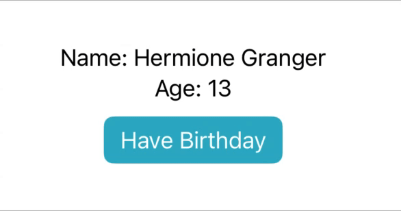
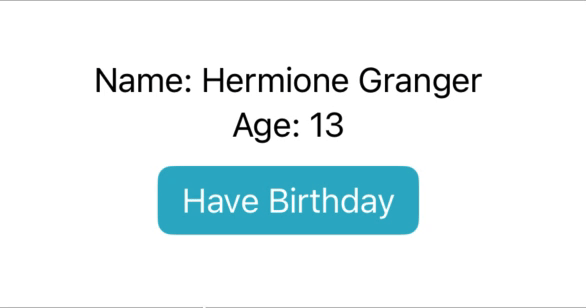
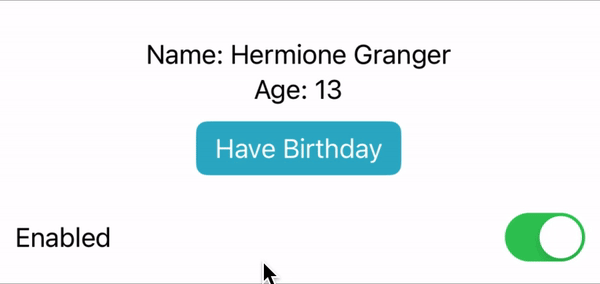

# [@ObservedObject](https://developer.apple.com/documentation/swiftui/observedobject)

`@ObservedObject` is a property wrapper used to establish a connection between a view and an instance of an `ObservableObject` owned by another view. It enables the view to reactively update whenever there are changes to the ObservableObject's properties marked with `@Published`.

For example, suppose we had the following ObservableObject class that represented a person with a name and an age:

```swift
class Person: ObservableObject {
    @Published var name: String
    @Published var age: Int

    init(name: String, age: Int) {
        self.name = name
        self.age = age
    }

    func haveBirthday() {
        age += 1
    }
}
```

We could then create an instance of this object in our parent view (`BirthdayView`) using `@StateObject` and pass it to a child view (`PersonView`) to display the data:

```swift
struct BirthdayView: View {
    @StateObject private var person = Person(name: "Hermione Granger", age: 13)

    var body: some View {
        PersonView(person: person)
        Button("Have Birthday") {
            person.haveBirthday()
        }
    }
}

struct PersonView: View {
    var person: Person

    var body: some View {
        Text("Name: \(person.name)")
        Text("Age: \(person.age)")
    }
}
```

However, when we press the 'Have Birthday' button to increase the person's age, it is not reflected in PersonView:



This is because we haven't told PersonView to listen for changes to the @Published properties of `person`. To do so, we must prefix `person` with `@ObservedObject`:

```swift
struct PersonView: View {
    @ObservedObject var person: Person

    var body: some View {
        Text("Name: \(person.name)")
        Text("Age: \(person.age)")
    }
}
```

Now PersonView will update itself every time the age is changed:



<br/>

## Difference between @StateObject and @ObservedObject

@StateObject and @ObservedObject are both property wrappers used for objects that conform to the `ObservableObject` protocol. Their difference comes down to ownership and lifespan of the object. @StateObject owns the object and guarantees its lifespan across recreations of the view it belongs to whereas @ObservedObject does not own the object and does not guarantee its lifespan. In fact, if the view in which an @ObservableObject exists is destroyed and recreated, that @ObservableObject will also be destroyed and recreated. This is best explained by modifying our example from earlier.

Suppose we changed the `@StateObject` in our BirthdayView to `@ObservedObject` instead:

```swift
struct BirthdayView: View {
    @ObservedObject private var person = Person(name: "Hermione Granger", age: 13)

    var body: some View {
        PersonView(person: person)
        Button("Have Birthday") {
            person.haveBirthday()
        }
    }
}
```

Our application would still behave as expected and we might think that this code is perfectly acceptable and safe to use.


However, if we wrap our BirthdayView inside another view that has @State properties, we can see that our use of @ObservedObject is causing a problem:

```swift
struct WrapperView: View {
    @State private var isEnabled = true

    var body: some View {
        BirthdayView()

        Toggle(isOn: $isEnabled, label: {
            Text("Enabled")
        })
    }
}
```


Every time we toggle the switch, the age resets back to 13. This is because our Person instance is created with @ObservedObject which doesn't guarantee its lifetime. Every time the switch is toggled, the @State property `isEnabled` changes which causes `WrapperView` to destroy and recreate itself. This in turn destroys and recreates BirthdayView and since our Person instance is instantiated with @ObservedObject, it is destroyed and recreated as well. To solve this, @StateObject should be used instead, which will ensure that the instance of Person lives across re-creations of BirthdayView.

```swift
struct BirthdayView: View {
    @StateObject private var person = Person(name: "Hermione Granger", age: 13)

    var body: some View {
        PersonView(person: person)
        Button("Have Birthday") {
            person.haveBirthday()
        }
    }
}
```



<br/>

## Considerations when using @ObservedObject

- @ObservedObject does not own the observed instance and does not guarantee its lifespan
- Observed objects are specifically designed for data that is external to your view, which means it might be shared across more than one view.
- Do not use @ObservedObject to *create* instances of `ObservableObject`. Use `@ObservedObject` only with objects that have already been created elsewhere, otherwise SwiftUI might destroy your object
- @ObservableObject is often used in conjunction with @StateObject, where a parent view creates an instance using @StateObject and a child view introduces this instance through @ObservedObject, responding to changes in the instance
- Any type you mark with @ObservedObject must conform to the ObservableObject protocol, which in turn means it must be a class rather than a struct.

<br/>

## Links

- [SwiftUI: @State vs @StateObject vs @ObservedObject vs @EnvironmentObject](https://purple.telstra.com/blog/swiftui---state-vs--stateobject-vs--observedobject-vs--environme)
- [What is the @ObservedObject property wrapper?](https://www.hackingwithswift.com/quick-start/swiftui/what-is-the-observedobject-property-wrapper)
- [@StateObject vs. @ObservedObject: The differences explained](https://www.avanderlee.com/swiftui/stateobject-observedobject-differences/)