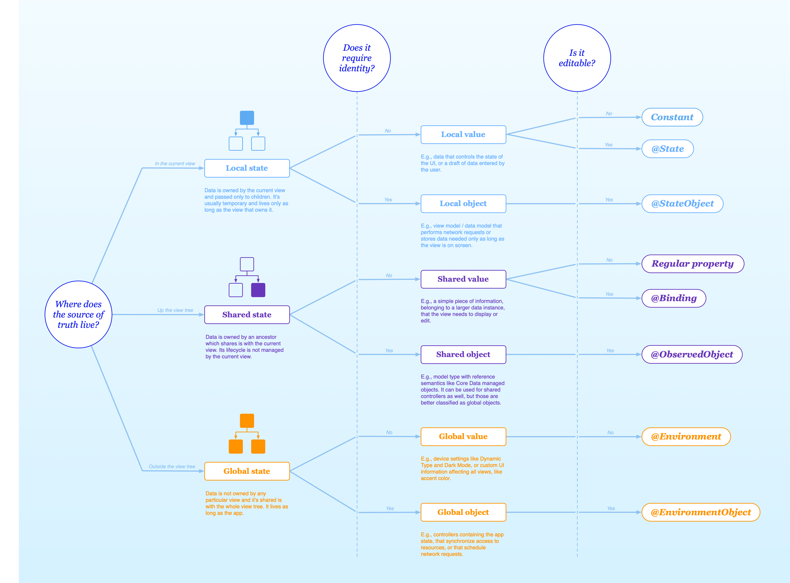

# SwiftUI Property Wrappers

Property Wrapper | Description | Owns its Data
---|---|---
[@State](https://github.com/brittpinder/ios-reference/tree/main/swiftui/property-wrappers/State) | Manages a view's local state that can be modified within the view. | :heavy_check_mark:
[@Binding](https://github.com/brittpinder/ios-reference/tree/main/swiftui/property-wrappers/Binding) | Creates a reference to a @State variable in a parent view, allowing for two-way data binding. | 
@Published | Declares a property inside an ObservableObject that triggers view updates when the property changes. | :heavy_check_mark:
[@StateObject](https://github.com/brittpinder/ios-reference/tree/main/swiftui/property-wrappers/StateObject) | Initializes and owns an ObservableObject, ensuring it's created only once during the view's lifecycle. | :heavy_check_mark:
[@ObservedObject](https://github.com/brittpinder/ios-reference/tree/main/swiftui/property-wrappers/ObservedObject) | Observes an external ObservableObject, updating the view when the object changes. | 
[@EnvironmentObject](https://github.com/brittpinder/ios-reference/tree/main/swiftui/property-wrappers/EnvironmentObject) | Provides a shared ObservableObject across the view hierarchy, allowing any child view to read and write to it. | 
[@Environment](https://github.com/brittpinder/ios-reference/tree/main/swiftui/property-wrappers/Environment) | Accesses and observes environment values from the system like color scheme and accessibility options | 
@FetchRequest | Fetches and observes data from a Core Data entity, automatically updating the view when the data changes. | :heavy_check_mark:
@AppStorage | Reads and writes values to UserDefaults, providing persistent storage for simple data types. | :heavy_check_mark:
@SceneStorage | Preserves and restores values that are specific to a particular scene, helping manage state during scene transitions | :heavy_check_mark:

 

### Other Property Wrappers

- @FocusedBinding
- @FocusedValue
- @GestureState
- @Namespace
- @NSApplicationDelegateAdaptor
- @UIApplicationDelegateAdaptor
- @ScaledMetric

 

### Property Wrapper Decision Tree

 

## Links

- [All SwiftUI Property Wrappers Explained and Compared](https://www.hackingwithswift.com/quick-start/swiftui/all-swiftui-property-wrappers-explained-and-compared)
- [Exploring Key Property Wrappers in SwiftUI](https://fatbobman.com/en/posts/exploring-key-property-wrappers-in-swiftui/)
- [SwiftUI Property Wrappers](https://swiftuipropertywrappers.com/)
- [SwiftUI: @State vs @StateObject vs @ObservedObject vs @EnvironmentObject](https://purple.telstra.com/blog/swiftui---state-vs--stateobject-vs--observedobject-vs--environme)