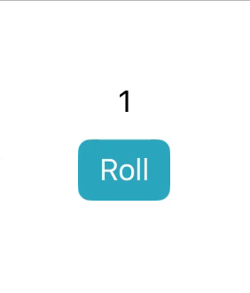
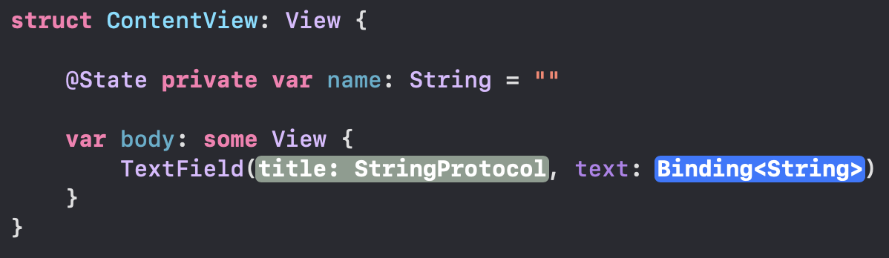

# [@State](https://developer.apple.com/documentation/swiftui/state)

Suppose we wanted to create a button that would roll a die and have the resulting number displayed on screen. We might attempt something like this:

```swift
struct ContentView: View {
    private var number: Int = 1

    var body: some View {
        VStack {
            Text("\(number)")
            Button("Roll") {
                number = Int.random(in: 1...6) // Error: Cannot assign to property: 'self' is immutable
            }
        }
    }
}
```

However, this would result in a compiler error: "Cannot assign to property: 'self' is immutable". This is because in SwiftUI, all views are structs, and structs are immutable which means their properties cannot be modified.

We can resolve this by prefixing the `number` property with the `@State` property wrapper:

```swift
struct ContentView: View {
    @State private var number: Int = 1

    var body: some View {
        VStack {
            Text("\(number)")
            Button("Roll") {
                number = Int.random(in: 1...6)
            }
        }
    }
}
```



Now, every time the 'Roll' button is pressed, `number` is assigned a new value and the body of the view is recalculated and redrawn to reflect this. In SwiftUI, views are constantly being destroyed and recreated to reflect changes within the app. Using `@State` allows you to persist data across recreations of a view.

<br/>

## Accessing the Binding of @State

It's important to note that a `@State` property isn't the value itself - it's a means of reading and writing the value (a binding). This becomes evident when working with certain UI controls like `TextField` which require you to pass a type of `Binding<String>`:



To access the binding of a `@State` property rather than the value it manages, add `$` in front of the property name.

Here we have a `@State` property called `name` of type `String`. If we use `$` to access its binding we can pass it to a `TextField` and its value will update every time the text within the `TextField` changes:

```swift
struct ContentView: View {

    @State private var name: String = ""

    var body: some View {
        TextField("Name", text: $name)

        Text("\(name)")
            .font(.title)
    }
}
```


> The dollar sign accesses the '[projected value](https://github.com/brittpinder/ios-reference/tree/main/swift/properties#projected-values)' of a property wrapper which in the case of `@State` is the binding itself.

<br/>


## Considerations when using @State

- SwiftUI manages the storage of any property you declare with `@State`. When the state value changes, the view invalidates its appearance and recomputes the body.
- The `@State` property wrapper should be used to manage the state of a property that is local to a view and its subviews. Data that requires complex cross-view sharing should not use `@State`.
- `@State` is well suited for value-type data (strings, integers, enums, small structs) but not large amounts of data or complex data models. In these cases, consider using `@StateObject` instead.
- Declare a `@State` property as private in the highest view in the view hierarchy that needs access to the value. Then share the state with any subviews that also need access, either directly for read-only access, or as a binding for read-write access.
- If you pass a `@State` property to a subview, SwiftUI updates the subview any time the value changes in the container view.
- `@State` is thread-safe and can be modified on non-main threads.

<br/>

## Links

- [What is the State Property Wrapper](https://www.hackingwithswift.com/quick-start/swiftui/what-is-the-state-property-wrapper)
- [Exploring Key Property Wrappers in SwiftUI](https://fatbobman.com/en/posts/exploring-key-property-wrappers-in-swiftui/)
- [SwiftUI Property Wrappers](https://swiftuipropertywrappers.com/)

