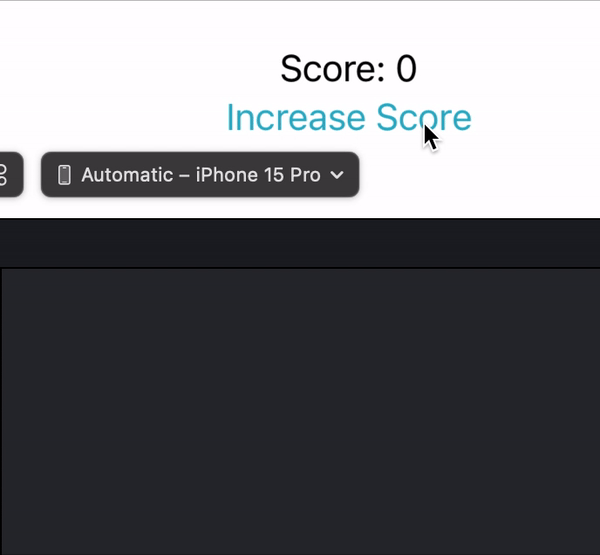
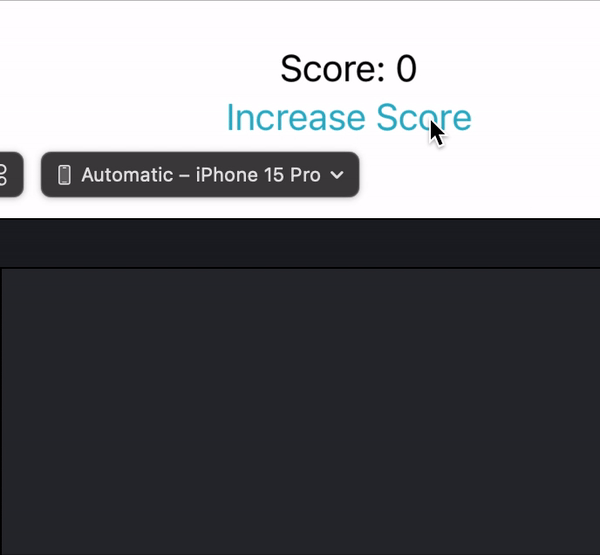

# [@StateObject](https://developer.apple.com/documentation/swiftui/stateobject)

The [@State](https://github.com/brittpinder/ios-reference/tree/main/swiftui/property-wrappers/State) property wrapper is great for managing the state of simple pieces of data like ints, strings or small structs, but it doesn't work as expected when used with more complex types like classes.

Suppose we had the following class that represented a game with a score property:

```swift
class Game {
    var score: Int = 0
}
```

We might then try to use it with @State inside a view like so:


```swift
struct ContentView: View {
    @State private var game = Game()

    var body: some View {
        Text("Score: \(game.score)")
        Button("Increase Score") {
            game.score += 1
            print("\(game.score)")
        }
    }
}
```

However, something peculiar happens. Every time the 'Increase Score' button is pressed, we can see the updated score value printed to the console, but it is not reflected in the Text view - it remains at 0.



This is because @State only triggers the body property to be re-computed when its value has been changed. In this scenario, @State is tracking an instance of a class which is a reference type. Even though the property `score` is being changed, the reference to `game` itself is not being changed - therefore no re-draw of the view is triggered. This is where @StateObject comes in.

<br/>

## How to use @StateObject

By definition, @StateObject is a property wrapper used to manage instances of objects that conform to the [`ObservableObject`](https://developer.apple.com/documentation/Combine/ObservableObject) protocol:

```swift
@frozen @propertyWrapper
struct StateObject<ObjectType> where ObjectType : ObservableObject
```

An ObservableObject is always a reference type (class) and informs SwiftUI whenever one of its @Published properties will change. Using our example from above, we can modify the `Game` class so that it conforms to `ObservableObject`:

```swift
class Game: ObservableObject {
    @Published var score: Int = 0
}
```
By prefixing `score` with the property wrapper `@Published` we ensure that any views who are listening will be notified when the value has changed, and reload themselves to reflect those changes.

Finally, we initialize our `Game` instance with `@StateObject` instead of `@State`:

```swift
struct ContentView: View {
    @StateObject private var game = Game()

    var body: some View {
        Text("Score: \(game.score)")
        Button("Increase Score") {
            game.score += 1
            print("\(game.score)")
        }
    }
}
```

By using @StateObject, we are letting our view know that whenever any of the @Published properties within the ObservableObject change, we want the view to re-render. So now, whenever the 'Increase Score' button is pressed, our Text view updates accordingly. We don’t face the same issue as when using @State, because we are no longer simply watching the object itself, but rather listening for changes to any of its @Published properties.



> Note: Marking the properties of an ObservableObject with @Published is *not* mandatory. You can have regular properties for internal use within an ObservableObject that won't force SwiftUI to reload views when they change. You should only use @Published for properties that *should* trigger a re-render - otherwise you could degrade performance by re-rendering views unnecessarily.

<br/>

## [Initializing state objects using external data](https://developer.apple.com/documentation/swiftui/stateobject#Initialize-state-objects-using-external-data)

When a state object’s initial state depends on data that comes from outside its container, you can call the object’s initializer explicitly from within its container’s initializer. For example, suppose we wanted to modify the example from above to be initialized with a score that we pass in rather than defaulting to 0.

Adding an initializer to `Game` is straight-forward:

```swift
class Game: ObservableObject {
    @Published var score: Int

    init(score: Int) {
        self.score = score
    }
}
```

But adding an initializer to `ContentView` is a little different because we need to initialize the @StateObject directly:

```swift
struct ContentView: View {
    @StateObject private var game: Game

    init(score: Int) {
        _game = StateObject(wrappedValue: Game(score: score))
    }

    var body: some View {
        Text("Score: \(game.score)")
        Button("Increase Score") {
            game.score += 1
            print("\(game.score)")
        }
    }
}
```

Just like when initializing a [@Binding](https://github.com/brittpinder/ios-reference/tree/main/swiftui/property-wrappers/Binding#how-to-initialize-binding), the synthesized storage of the @StateObject is accessed by prefixing the property name with an underscore.

<br/>

## Considerations when using @StateObject

- `@StateObject` is a property wrapper in SwiftUI for managing instances of objects conforming to the `ObservableObject` protocol.
- Compared to `@State`, `@StateObject` is more suitable for managing complex data models like classes
- `@StateObject` is commonly used for data models or business logic that need to persist throughout the entire lifecycle of the view
- Use `@StateObject` only in views that must respond to changes in instance properties. If you only need to read data without observing changes, consider other options
- Introducing `@StateObject` implies that all related operations occur on the main thread, including asynchronous operations. Code that needs to run on a non-main thread should be separated from the view code
- `@StateObject` properties should be declared as private to prevent setting them from a memberwise initializer, which can conflict with the storage management that SwiftUI provides

<br/>

## Links

- [SwiftUI: @State vs @StateObject vs @ObservedObject vs @EnvironmentObject](https://purple.telstra.com/blog/swiftui---state-vs--stateobject-vs--observedobject-vs--environme)
- [What is the @Published property wrapper?](https://www.hackingwithswift.com/quick-start/swiftui/what-is-the-published-property-wrapper)