# Auto Layout

Traditionally, apps would lay out their user interface programmatically by setting the frame for each view in the view hierarchy:

```swift
let view1 = UIView(frame: CGRect(x: 20, y: 100, width: 200, height: 100))
view1.translatesAutoresizingMaskIntoConstraints = true
view1.backgroundColor = .systemMint
view.addSubview(view1)

let view2 = UIView(frame: CGRect(x: 200, y: 400, width: 150, height: 250))
view2.translatesAutoresizingMaskIntoConstraints = true
view2.backgroundColor = .systemPink
view.addSubview(view2)
```

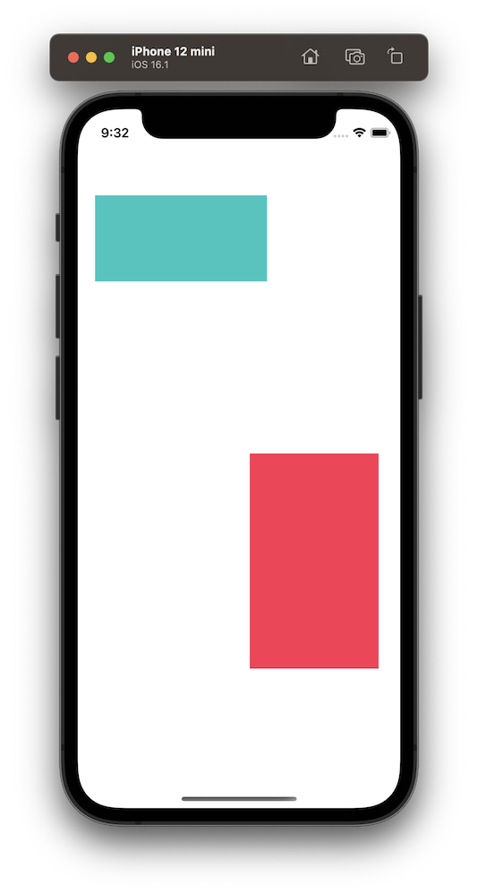

Auto Layout is much more powerful because it allows your user interface to dynamically respond to both internal and external changes such as internationalization (changing language, text direction and text size based on locale), varying screen sizes and device rotations.

<br/>

## Constraints

Auto Layout defines your user interface using a series of constraints. Constraints typically represent a relationship between two views. Auto Layout then calculates the size and location of each view based on these constraints: 

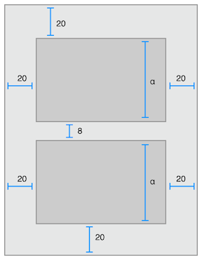

Every view has a list of attributes ([`NSLayoutConstraint.Attribute`](https://developer.apple.com/documentation/uikit/nslayoutconstraint/attribute)) that can be constrained. There are two main types of attributes:

##### Size Attributes

* Width
* Height

##### Location Attributes

* Top
* Bottom
* Leading/Left
* Trailing/Right
* CenterX
* CenterY
* FirstBaseline (for alinging views to text)
* LastBaseline (for alinging views to text)

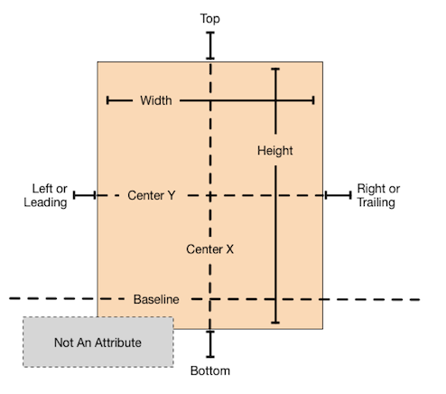

### Layout Anchors

There are three choices when it comes to [programmatically creating constraints](https://developer.apple.com/library/archive/documentation/UserExperience/Conceptual/AutolayoutPG/ProgrammaticallyCreatingConstraints.html) but the most common way is to use layout anchors ([`NSLayoutAnchor`](https://developer.apple.com/documentation/appkit/nslayoutanchor))

In this example, a rectangle is centered in the middle of the view by setting its center X and Y anchors equal to its superview's center X and Y anchors respectively. Its size is set by constraining its width and height anchors.

```swift
let rectangle = UIView()
rectangle.backgroundColor = .systemMint
rectangle.translatesAutoresizingMaskIntoConstraints = false
view.addSubview(rectangle)

rectangle.centerXAnchor.constraint(equalTo: view.centerXAnchor).isActive = true
rectangle.centerYAnchor.constraint(equalTo: view.centerYAnchor).isActive = true
rectangle.widthAnchor.constraint(equalToConstant: 200).isActive = true
rectangle.heightAnchor.constraint(equalToConstant: 100).isActive = true
```
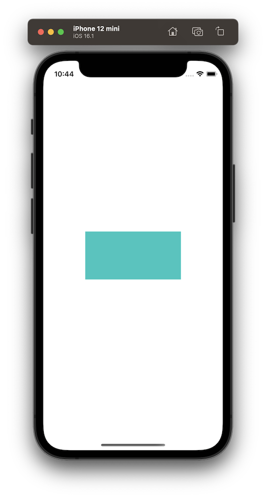

>Important: If you want to dynamically calculate the size and position of a view using Auto Layout, you *must* set `translatesAutoresizingMaskIntoConstraints` to false. If this flag is not set to false, your view will not appear on the screen.

The following shows how you can pin views to the top, bottom, leading and trailing edges of a view:

```swift
blue.topAnchor.constraint(equalTo: view.topAnchor).isActive = true
blue.leadingAnchor.constraint(equalTo: view.leadingAnchor).isActive = true

red.topAnchor.constraint(equalTo: view.topAnchor).isActive = true
red.trailingAnchor.constraint(equalTo: view.trailingAnchor).isActive = true

yellow.bottomAnchor.constraint(equalTo: view.bottomAnchor).isActive = true
yellow.leadingAnchor.constraint(equalTo: view.leadingAnchor).isActive = true

green.bottomAnchor.constraint(equalTo: view.bottomAnchor).isActive = true
green.trailingAnchor.constraint(equalTo: view.trailingAnchor).isActive = true
```
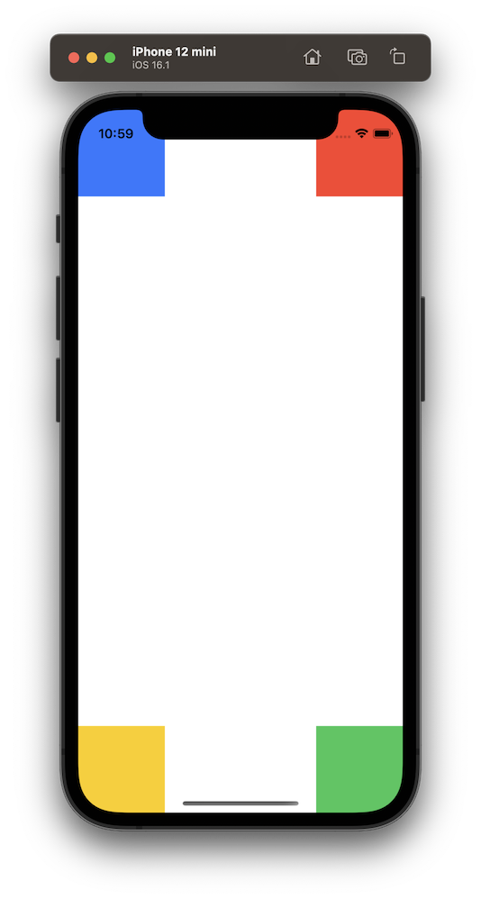

> Constraints can be activated one at a time as shown above but you can also activate an array of constraints:
>
> ```swift
>NSLayoutConstraint.activate([
>    blue.topAnchor.constraint(equalTo: view.topAnchor),
>    blue.leadingAnchor.constraint(equalTo: view.leadingAnchor),
>    red.topAnchor.constraint(equalTo: view.topAnchor),
>    red.trailingAnchor.constraint(equalTo: view.trailingAnchor),
>    yellow.bottomAnchor.constraint(equalTo: view.bottomAnchor),
>    yellow.leadingAnchor.constraint(equalTo: view.leadingAnchor),
>    green.bottomAnchor.constraint(equalTo: view.bottomAnchor),
>    green.trailingAnchor.constraint(equalTo: view.trailingAnchor)
>])
>```

<br/>

### Layout Guides

[Layout Guides](https://developer.apple.com/documentation/uikit/uilayoutguide) are rectangular regions defined in their owning view's coordinate system that can interact with Auto Layout. You can use predefined layout guides or you can create your own. The most commonly used one is the "Safe Area Layout Guide" which defines the region of the screen where views won't be blocked or hidden by navigation bars, tab bars, tool bars etc. Using `view.safeAreaLayoutGuide`, we can now update the previous example so that the squares are placed within the safe area of the screen:

```swift
blue.topAnchor.constraint(equalTo: view.safeAreaLayoutGuide.topAnchor).isActive = true
blue.leadingAnchor.constraint(equalTo: view.safeAreaLayoutGuide.leadingAnchor).isActive = true

red.topAnchor.constraint(equalTo: view.safeAreaLayoutGuide.topAnchor).isActive = true
red.trailingAnchor.constraint(equalTo: view.safeAreaLayoutGuide.trailingAnchor).isActive = true

yellow.bottomAnchor.constraint(equalTo: view.safeAreaLayoutGuide.bottomAnchor).isActive = true
yellow.leadingAnchor.constraint(equalTo: view.safeAreaLayoutGuide.leadingAnchor).isActive = true

green.bottomAnchor.constraint(equalTo: view.safeAreaLayoutGuide.bottomAnchor).isActive = true
green.trailingAnchor.constraint(equalTo: view.safeAreaLayoutGuide.trailingAnchor).isActive = true
```
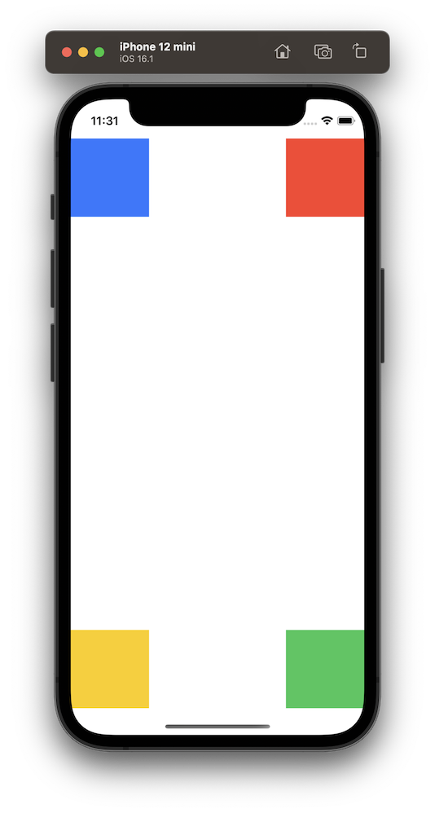

Other predefined layout guides include:

* `layoutMarginsGuide`
* `directionalLayoutMarginsGuide`
* `readableContentGuide`
* `keyboardLayoutGuide`

<br/>

### Constraints are Linear Equations

Every constraint represents a linear equation (y = mx + b). We define the relationship (=, <=, >=), the multiplier (m) and the constant (b) and Auto Layout solves the equation, finding values for y and x (the view attributes that we want to constrain).


> This constraint states that the red view’s leading edge must be 8.0 points after the blue view’s trailing edge.

<br/>

When defining constraints, there are a variety of options available depending on the type of attribute you are applying the constraint to.

Constraint Signature | Width/Height | Top/Bottom/Leading/Trailing/CenterY/CenterX 
---|---|---
[`constraint(equalTo:)`](https://developer.apple.com/documentation/uikit/nslayoutanchor/1500946-constraint) | :heavy_check_mark: | :heavy_check_mark:
[`constraint(equalTo: constant:)`](https://developer.apple.com/documentation/uikit/nslayoutanchor/1500937-constraint) | :heavy_check_mark: | :heavy_check_mark:
[`constraint(equalTo: multiplier:)`](https://developer.apple.com/documentation/uikit/nslayoutdimension/1500951-constraint) | :heavy_check_mark: |
[`constraint(equalTo: multiplier: constant:)`](https://developer.apple.com/documentation/uikit/nslayoutdimension/1500934-constraint) | :heavy_check_mark: |
[`constraint(equalToConstant:)`](https://developer.apple.com/documentation/uikit/nslayoutdimension/1500941-constraint) | :heavy_check_mark: |
[`constraint(equalToSystemSpacingBelow/After: multiplier:)`](https://developer.apple.com/documentation/uikit/nslayoutxaxisanchor/2866112-constraint) |  | :heavy_check_mark:

> Each of the six constraint signatures above contains two variations, "greaterThanOrEqualTo" and "lessThanOrEqualTo", which were omitted for brevity

<br/>

#### constraint(equalTo:)

Returns a constraint that defines one item’s attribute as equal to another. Often used to pin the edges of views to the edges of other views. It can also be used to maintain uniform width and height between different views. Refer to the code snippets above for examples.

<br/>

#### constraint(equalTo: constant:)

Returns a constraint that defines one item’s attribute as equal to another item’s attribute plus a constant offset. It's often used to apply padding between views. In this example, all views are positioned 20 points from the edge of the screen. The blue and yellow views are positioned 20 points away from their neighbours and their dimensions are 40 points more than their neighbours. Notice that when working with the bottom and trailing constraints you need to provide negative values for the `constant`.

```swift
red.topAnchor.constraint(equalTo: view.topAnchor, constant: 20).isActive = true
red.leadingAnchor.constraint(equalTo: view.leadingAnchor, constant: 20).isActive = true

blue.topAnchor.constraint(equalTo: red.bottomAnchor, constant: 20).isActive = true
blue.leadingAnchor.constraint(equalTo: view.leadingAnchor, constant: 20).isActive = true
blue.widthAnchor.constraint(equalTo: red.widthAnchor, constant: 40).isActive = true
blue.heightAnchor.constraint(equalTo: red.heightAnchor, constant: 40).isActive = true

green.trailingAnchor.constraint(equalTo: view.trailingAnchor, constant: -20).isActive = true
green.bottomAnchor.constraint(equalTo: view.bottomAnchor, constant: -20).isActive = true

yellow.trailingAnchor.constraint(equalTo: green.leadingAnchor, constant: -20).isActive = true
yellow.bottomAnchor.constraint(equalTo: view.bottomAnchor, constant: -20).isActive = true
yellow.widthAnchor.constraint(equalTo: green.widthAnchor, constant: 40).isActive = true
yellow.heightAnchor.constraint(equalTo: green.heightAnchor, constant: 40).isActive = true
```
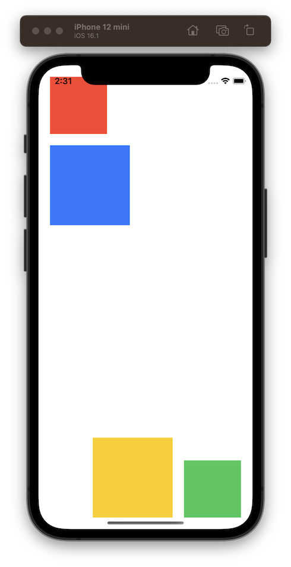

<br/>

#### constraint(equalTo: multiplier:)

Returns a constraint that defines the anchor’s size attribute as equal to the specified anchor multiplied by the constant. In the below example, the purple view's width and height are exactly half of the parent view's width and height respectively.

```swift
purple.topAnchor.constraint(equalTo: view.topAnchor).isActive = true
purple.leadingAnchor.constraint(equalTo: view.leadingAnchor).isActive = true
purple.widthAnchor.constraint(equalTo: view.widthAnchor, multiplier: 0.5).isActive = true
purple.heightAnchor.constraint(equalTo: view.heightAnchor, multiplier: 0.5).isActive = true
```
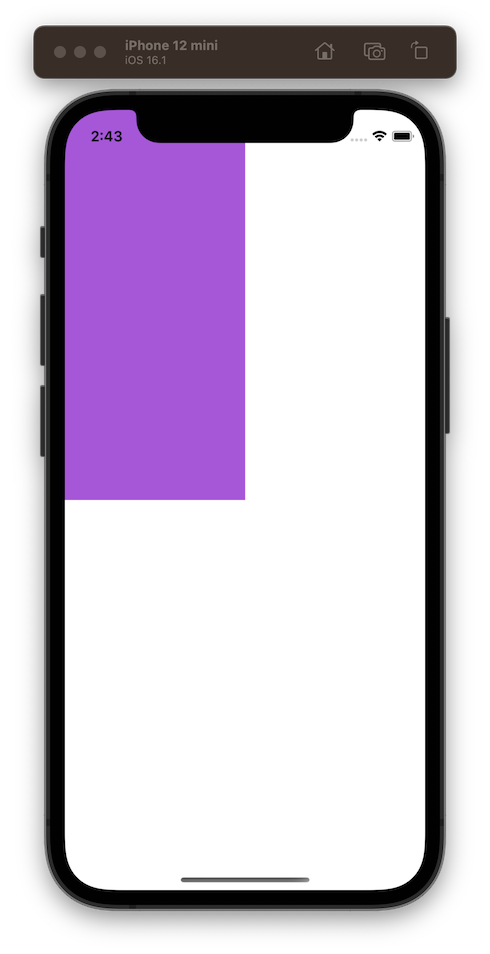

<br/>

#### constraint(equalTo: multiplier: constant:)

Returns a constraint that defines the anchor’s size attribute as equal to the specified size attribute multiplied by a constant plus an offset. In the below example, the blue view's width is twice the red view's width, plus 10. It's height is 3 times the red view's height, plus 20.

```swift
red.bottomAnchor.constraint(equalTo: view.centerYAnchor).isActive = true
red.centerXAnchor.constraint(equalTo: view.centerXAnchor).isActive = true

blue.topAnchor.constraint(equalTo: red.bottomAnchor, constant: 8).isActive = true
blue.centerXAnchor.constraint(equalTo: view.centerXAnchor).isActive = true
blue.widthAnchor.constraint(equalTo: red.widthAnchor, multiplier: 2, constant: 10).isActive = true
blue.heightAnchor.constraint(equalTo: red.heightAnchor, multiplier: 3, constant: 20).isActive = true
```
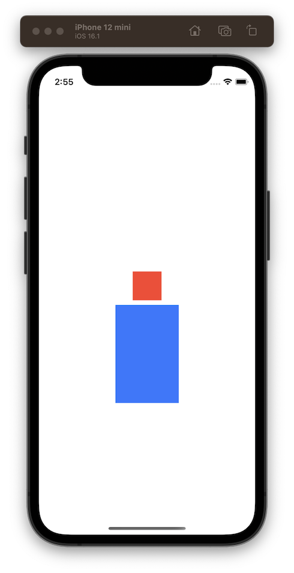

<br/>

#### constraint(equalToConstant:)

Returns a constraint that defines a constant size for the anchor’s size attribute. Refer to the example in the [Layout Anchors Section](#layout-anchors)

<br/>

#### constraint(equalToSystemSpacingBelow/After: multiplier:)

Returns a constraint that defines by how much the current anchor trails the specified anchor. In this case, `multiplier` is a multiple of the system spacing which by default is 8 points. In the below example, the orange view is pinned 16 points (2 * 8) from the edges of the safe area. Note that when dealing with the trailing and bottom anchors you need to reverse the order of the attributes.

```swift
orange.topAnchor.constraint(equalToSystemSpacingBelow: view.safeAreaLayoutGuide.topAnchor, multiplier: 2).isActive = true
orange.leadingAnchor.constraint(equalToSystemSpacingAfter: view.safeAreaLayoutGuide.leadingAnchor, multiplier: 2).isActive = true
view.safeAreaLayoutGuide.trailingAnchor.constraint(equalToSystemSpacingAfter: orange.trailingAnchor, multiplier: 2).isActive = true
view.safeAreaLayoutGuide.bottomAnchor.constraint(equalToSystemSpacingBelow: orange.bottomAnchor, multiplier: 2).isActive = true
```
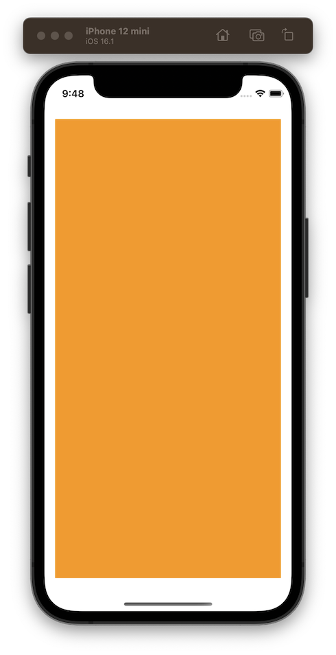

<br/>

## Intrinsic Content Size

Each view in your hierarchy requires a position and a size. Some views will have a natural (intrinsic) size based on their content (labels, textfields, images etc.) so you don't need to define their size explicitly. You will still need to provide a position though.

In the below example, the label's intrinsic content size is calculated based on its text so we only need to provide it with a position.

```swift
let label = UILabel()
label.text = "Hello World"
label.backgroundColor = .systemYellow
label.translatesAutoresizingMaskIntoConstraints = false

view.addSubview(label)

label.centerYAnchor.constraint(equalTo: view.centerYAnchor).isActive = true
label.centerXAnchor.constraint(equalTo: view.centerXAnchor).isActive = true

print(label.intrinsicContentSize) // (88.0, 20.33)
```
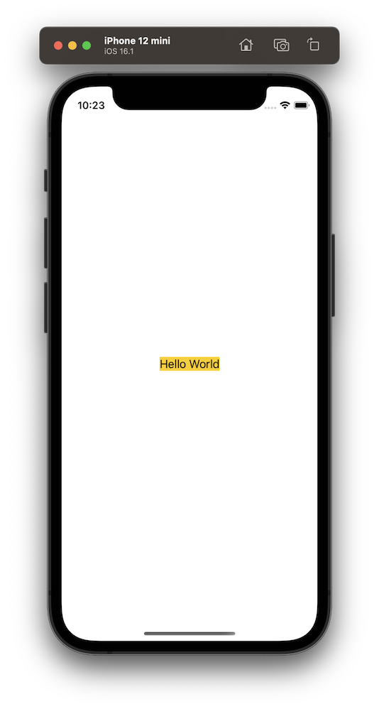

`UIView` doesn't have a default intrinsic content size so unless you are sizing a view solely through constraints, you will need to provide an intrinsic content size. You can do this by overriding the [`intrinsicContentSize`](https://developer.apple.com/documentation/uikit/uiview/1622600-intrinsiccontentsize) property:

```swift
class CustomView: UIView {
    override var intrinsicContentSize: CGSize {
        return CGSize(width: 300, height: 200)
    }
}

let customView = CustomView()
customView.backgroundColor = .systemIndigo
customView.translatesAutoresizingMaskIntoConstraints = false

view.addSubview(customView)

customView.centerXAnchor.constraint(equalTo: view.centerXAnchor).isActive = true
customView.centerYAnchor.constraint(equalTo: view.centerYAnchor).isActive = true
```
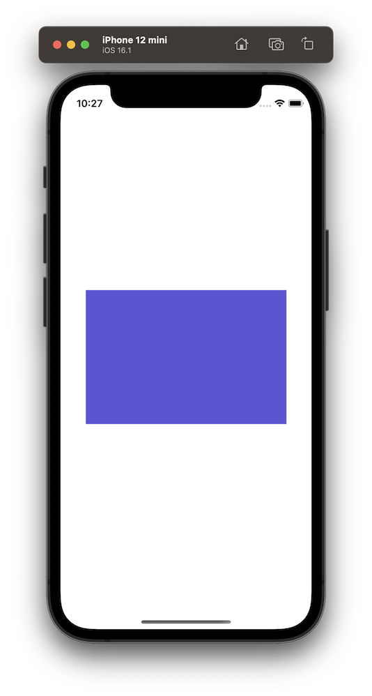

Whenever possible, you should provided an intrinsic content size for your views as it lets your layout dynamically adapt to views' content changes. It also reduces the number of constraints you need to create a nonambiguous, nonconflicting layout.

<br/>

### Content Hugging and Compression Resistance (CHCR)

Auto Layout represents a view's intrinsic content size using a pair of constraints for each dimension (vertical and horizontal). These constraints are called *Content Hugging* and *Compression Resistance*.

* **Content Hugging** pulls the view inward so that it fits snugly around the content. It controls how much a view should or should not stretch.
* **Compression Resistance** pushes the view outward so that it does not clip the content. It controls how much a view should or should not shrink.


Under the hood, content hugging and compression resistance are defined using the following inequalities:

```swift
// Content Hugging
View.height <= 0.0 * NotAnAttribute + IntrinsicHeight
View.width <= 0.0 * NotAnAttribute + IntrinsicWidth

// Compression Resistance
View.height >= 0.0 * NotAnAttribute + IntrinsicHeight
View.width >= 0.0 * NotAnAttribute + IntrinsicWidth
```

Content Hugging is important when you have more room than you need and Auto Layout needs to decide which views to stretch whereas Compression Resistance is important when you don't have enough space and Auto Layout needs to decide which views to shrink.

<br/>

### Priorities

Since every constraint represents a linear equation, your view hierarchy is simply a series of linear equations. Your goal is to declare a series of equations that have one and only one possible solution. Ambiguous constraints have more than one possible solution and unsatisfiable constraints don't have a valid solution.

To help resolve ambiguity, every constraint has a priority ([`UILayoutPriority`](https://developer.apple.com/documentation/uikit/uilayoutpriority)) between 1 and 1000 where a priority of 1000 is required and all others are optional. When calculating solutions, Auto Layout will attempt to satisfy all the constraints in priority order from highest to lowest. If it cannot satisfy an optional constraint, that constraint is skipped and it continues on to the next constraint.

> Note: Even if an optional constraint cannot be satisfied, it can still influence the layout. If there is any ambiguity in the layout after skipping the constraint, the system selects the solution that comes closest to the constraint. In this way, unsatisfied optional constraints act as a force pulling views towards them.

You can set priorities using raw values or using some predefined priorities:

* `.required` = 1000
* `.defaultHigh` = 750
* `.defaultLow` = 250

By default, views have `.defaultLow` priority for their content hugging and `.defaultHigh` priority for their compression resistance making it easier for them to stretch rather than shrink. Anchor constraints have a priority of `.required` by default. Therefore anchors will always override intrinsic content size.

<br/>

#### Content Hugging Example

When Auto Layout has determined there is more than enough space to accommodate all your views at their natural size, it has to make a decision about which view to stretch to fill the extra space. The lower you set a view's content hugging priority, the more likely it will be stretched.

In the below example we have two labels. The first label is pinned to the top, leading and trailing edges of its parent view and the second label is pinned to the bottom, leading and trailing edges of its parent view. The bottom of the first label is pinned to the top of the second label. The height of each label is ambiguous so Auto Layout will attempt to resolve the ambiguity by looking at the priorities. But as you can see in the print statements, each label has the same priorities for content hugging and compression resistance. In this situation, Auto Layout simply chooses one label to stretch (`label2`).

```swift
NSLayoutConstraint.activate([
    label1.topAnchor.constraint(equalTo: view.safeAreaLayoutGuide.topAnchor),
    label1.leadingAnchor.constraint(equalTo: view.leadingAnchor),
    label1.trailingAnchor.constraint(equalTo: view.trailingAnchor),
    label1.bottomAnchor.constraint(equalTo: label2.topAnchor),

    label2.leadingAnchor.constraint(equalTo: view.leadingAnchor),
    label2.trailingAnchor.constraint(equalTo: view.trailingAnchor),
    label2.bottomAnchor.constraint(equalTo: view.safeAreaLayoutGuide.bottomAnchor)
])

print(label1.contentHuggingPriority(for: .vertical)) // 250
print(label2.contentHuggingPriority(for: .vertical)) // 250

print(label1.contentCompressionResistancePriority(for: .vertical)) // 750
print(label2.contentCompressionResistancePriority(for: .vertical)) // 750
```
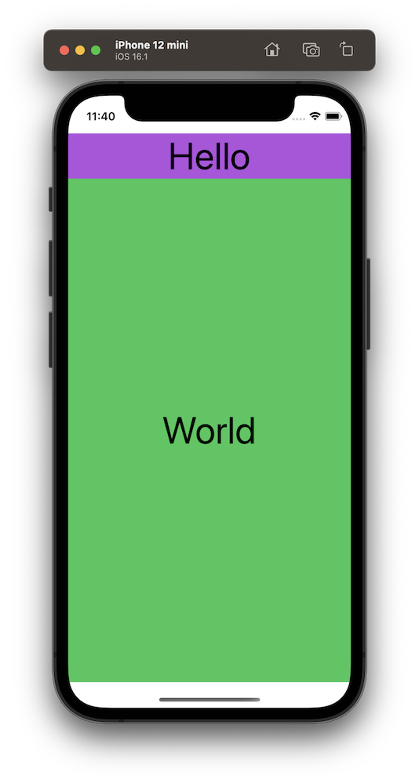

However, if we would prefer for the first label to stretch and the second label to "hug" itself, we could change the content hugging priority on either of the labels so that the second label has a higher content hugging priority than the first label. Either of these lines would do the trick:

```swift
label2.setContentHuggingPriority(UILayoutPriority(rawValue: 251), for: .vertical)
label1.setContentHuggingPriority(UILayoutPriority(rawValue: 249), for: .vertical)
```
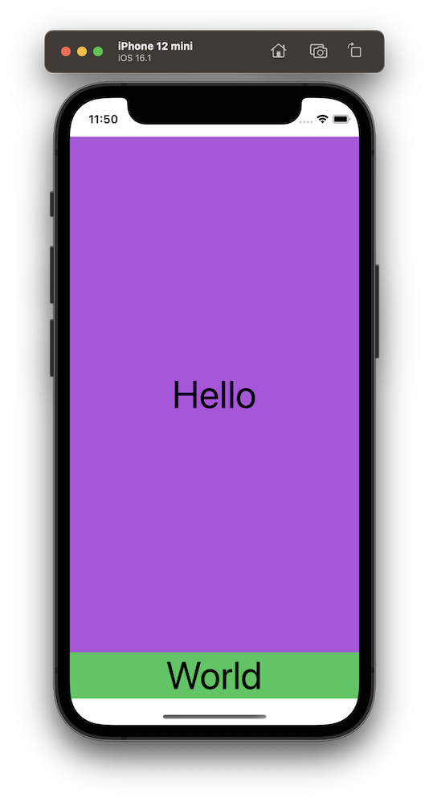

<br/>

#### Compression Resistance Example

When Auto Layout has determined there isn't enough space to accommodate all your views at their natural size, it has to make a decision about which view to squash to make space for the others. The lower you set a view's compression resistance priority, the more likely it is to be squashed.

In the below example we have have two labels pinned to the top, leading and trailing edges of their parent view. The first label's trailing edge is pinned to the second label's leading edge. Because of the length of the text in each label, the view simply cannot accomodate both of their intrinsic widths, so Auto Layout needs to decide which one to squash. In this case it chooses to squash the first label:

```swift
NSLayoutConstraint.activate([
    label1.topAnchor.constraint(equalTo: view.safeAreaLayoutGuide.topAnchor),
    label1.leadingAnchor.constraint(equalTo: view.leadingAnchor),
    label1.trailingAnchor.constraint(equalTo: label2.leadingAnchor),

    label2.topAnchor.constraint(equalTo: view.safeAreaLayoutGuide.topAnchor),
    label2.trailingAnchor.constraint(equalTo: view.trailingAnchor)
])
```
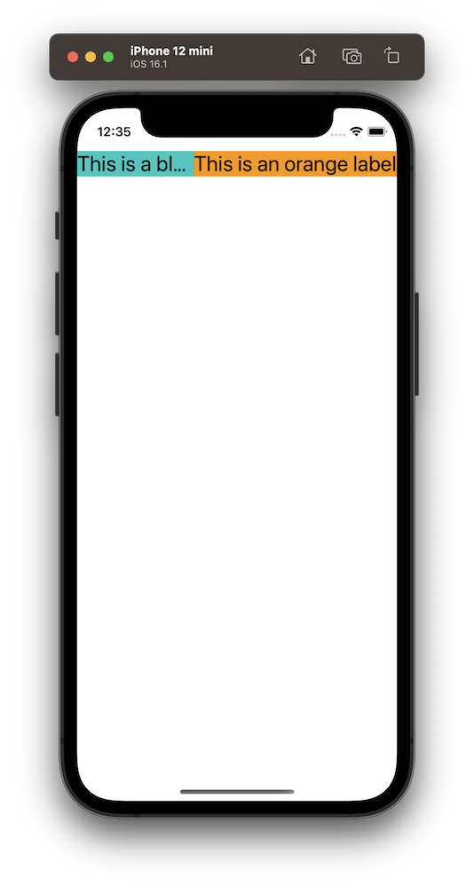

If we would prefer that the second label gets squashed, we would need to change the compression resistance priority on either label so that the second label has a lower compression resistance priority than the first label. Either of these would do the trick:

```swift
label1.setContentCompressionResistancePriority(UILayoutPriority(rawValue: 751), for: .horizontal)
label2.setContentCompressionResistancePriority(UILayoutPriority(rawValue: 749), for: .horizontal)
```


<br/>

## Links
* [Auto Layout Documentation](https://developer.apple.com/library/archive/documentation/UserExperience/Conceptual/AutolayoutPG/)
* [Anatomy of a Constraint](https://developer.apple.com/library/archive/documentation/UserExperience/Conceptual/AutolayoutPG/AnatomyofaConstraint.html)
* [Views with Intrinsic Content Size](https://developer.apple.com/library/archive/documentation/UserExperience/Conceptual/AutolayoutPG/ViewswithIntrinsicContentSize.html)