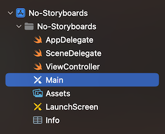
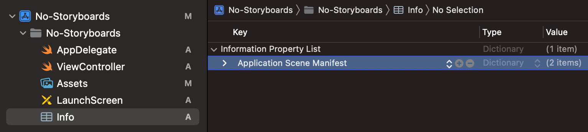
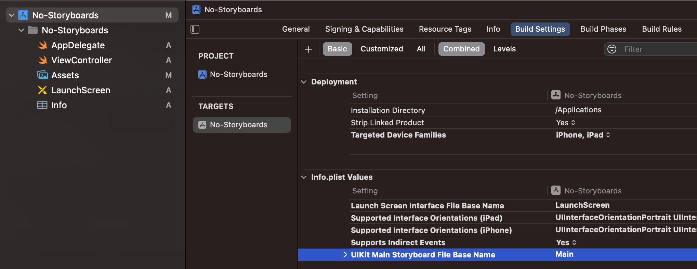
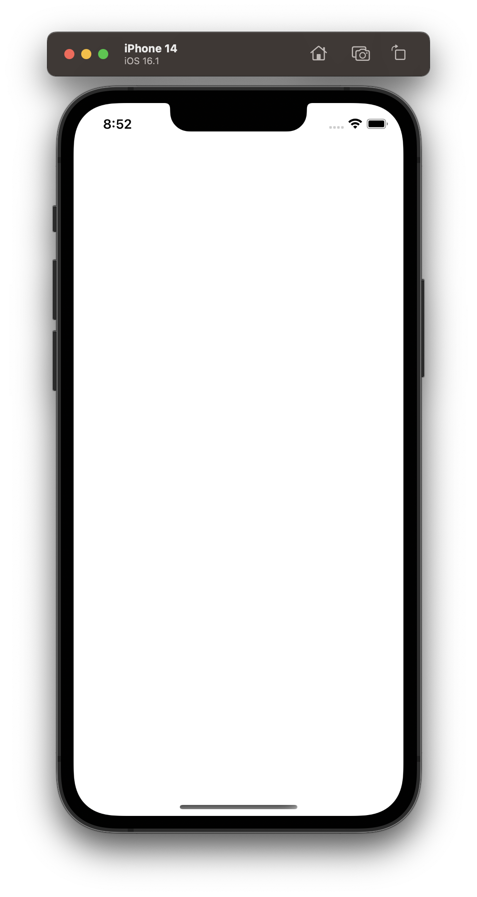

# Creating a Project Without Storyboards

Storyboards are great for prototyping or when you are working alone, but on larger, more professional projects, it is more common to create the UI of the application programmatically instead. This is because large storyboards can become very slow in the editor and it is very difficult to resolve merge conflicts in storyboard files which consist of generated xml. When working with storyboards, Xcode will make assumptions and generate code behind the scenes, so creating the UI programmatically also gives you better control and visibility over code.

<br/>

## Steps

After creating a project, there are three steps to get started building your UI programmatically:

1. Remove the Storyboard file
2. Remove all references to the Storyboard
3. Setup the window in SceneDelegate

<br/>

### 1. Remove the Storyboard

Delete the Main.Storyboard file:



<br/>

### 2. Remove References to the Storyboard

Click on the target and then select the "Info" tab. You should see a key called "Main storyboard file base name". Remove the value "Main".



Click on the Info.plist file and search for a key called "Storyboard Name". Click on the minus button to remove this key.



<br/>

### 3. Setup window in SceneDelegate

Locate the `scene(scene: session: connectionOptions:)` function and replace it with this:

```swift
func scene(_ scene: UIScene, willConnectTo session: UISceneSession, options connectionOptions: UIScene.ConnectionOptions) {
    guard let windowScene = (scene as? UIWindowScene) else { return }

    window = UIWindow(frame: windowScene.coordinateSpace.bounds)
    window?.windowScene = windowScene
    window?.rootViewController = ViewController()
    window?.makeKeyAndVisible()
}
```

Now you are ready to start building the UI programmatically!



<br/>

## Links

* [Video Tutorial](https://www.youtube.com/watch?v=Htn4h51BQsk&ab_channel=SeanAllen)
* [Another Video Tutorial](https://www.youtube.com/watch?v=OfOcKVkQw5E&ab_channel=SeanAllen)
* [No Storyboard without SceneDelegate](https://www.youtube.com/watch?v=jpe-rrBHRSU&ab_channel=SwiftArcade)


