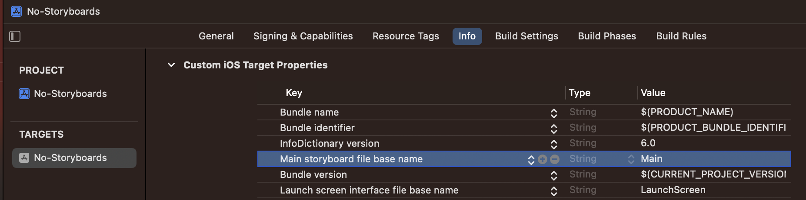
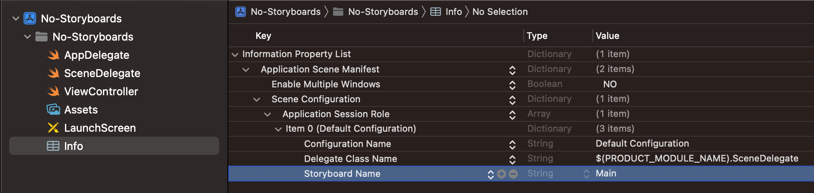

# Creating a Project Without Storyboards

It is very difficult to work with storyboards on a large project with lots of developers because it is very difficult to resolve merge conflicts in the storyboard file which consists of generated xml. Storyboards are great for prototyping or when you are working alone, but on larger, more professional projects, it is more common to create the UI of the application programmatically instead.

## Steps
After creating a project, there are three steps to get started building your UI programmatically:

1. Remove unnecessary files
2. Update info.plist
3. Update AppDelegate

### 1. Remove Unnecessary Files

Delete the SceneDelegate and the Main.Storyboard files:


### 2. Update info.plist

Click on the Info.plist file and delete the "Application Scene Manifest":



Click on your project and go into the Build Settings. Under "Info.plist Values" you should find something called "UIKit Main Storyboard File Base Name". Delete it:



### 3. Update AppDelegate

Delete all of the functions inside the AppDelegate and replace with this:

```swift
import UIKit

@main
class AppDelegate: UIResponder, UIApplicationDelegate {

    var window: UIWindow?

    func application(_ application: UIApplication, didFinishLaunchingWithOptions launchOptions: [UIApplication.LaunchOptionsKey: Any]?) -> Bool {

        window = UIWindow(frame: UIScreen.main.bounds)
        window?.makeKeyAndVisible()
        window?.backgroundColor = .systemBackground
        window?.rootViewController = ViewController()

        return true
    }

}
```
Now you are ready to start building the UI programmatically!


