# UIStackView

Distribution ↓ / Alignment → | Fill | Leading | Center | Trailing
---|---|---|---|---
**Fill** | 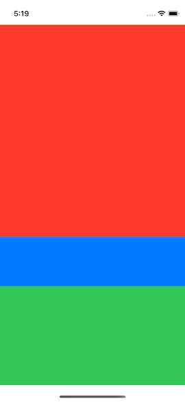 | 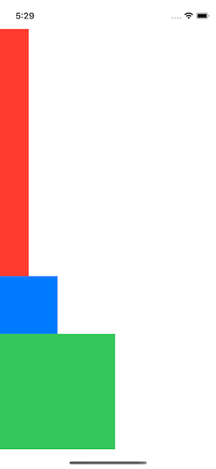 | 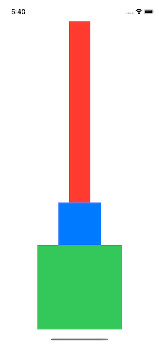 | 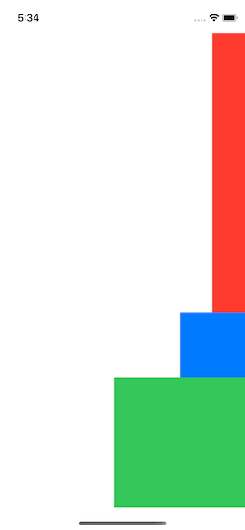
**Fill Equally** | 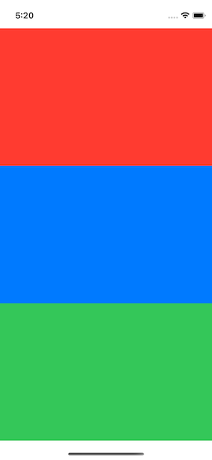 | 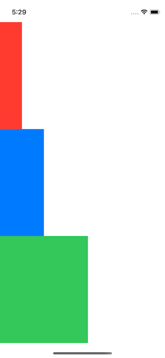 | 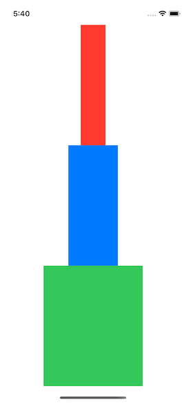 | 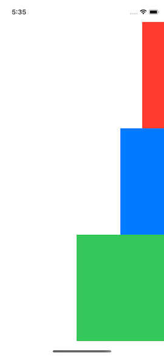
**Fill Proportionally** | 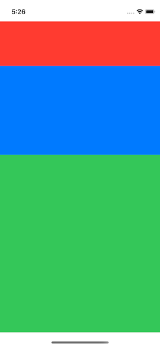 | 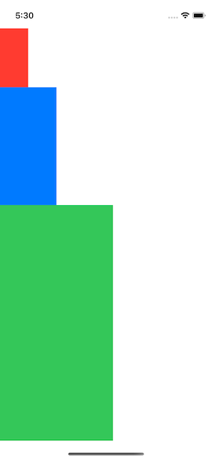 | 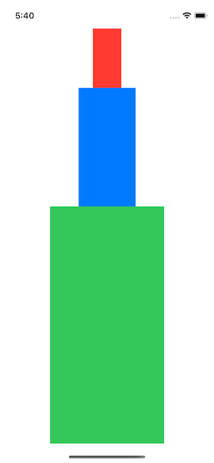 | 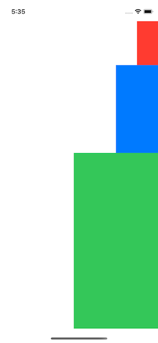
**Equal Spacing** |  |  |  | 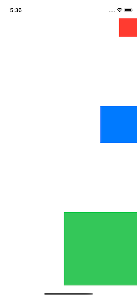
**Equal Centering** | 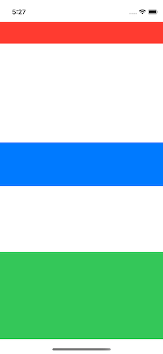 | 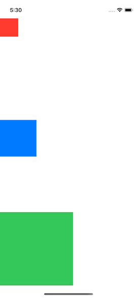 | 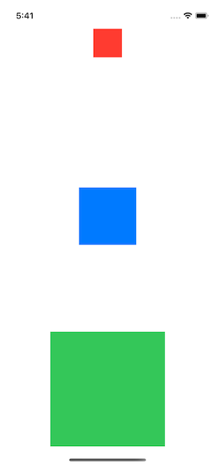 | 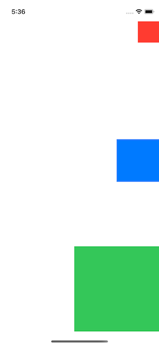 
