# UIStackView

## Distribution and Alignment

### Distribution

* **Fill**
	* The default setting
	* Fills all of the available space along the stackview's axis
	* Tries to respect the intrinsic content size of inner views but will stretch some if necessary to fill the space
	* Use CHCR to indicate to Auto Layout which views should stretch if needed
* **Fill Equally**
	* Fills the space by making all controls the same size (along the stackview's axis)
	* Does not respect intrinsic content size of the inner views
* **Fill Proportionally**
	* Fills the space along the stackview's axis but respects the relative proportions of the inner views' intrinsic sizes
	* All inner views will stretch proportionally
* **Equal Spacing**
	* Fills the available space with equal spacing between each inner view
	* Inner views are not stretched and retain their intrinsic content size
* **Equal Centering**
	* Similar to equal spacing in that inner views retain their intrinsic content size and space is added between inner views instead of stretching them
	* The space between each inner view is not necessarily equal. Rather, the distance between the center position of each inner view is the same


### Alignment

* **Fill**
* **Leading (vertical axis)**
* **Trailing (vertical axis)**
* **Center**
* **Bottom (horizontal axis)**
* **Top (horizontal axis)**

<br/>

### StackViews with Fixed Size

In the below table, each stack view is pinned to the edges of the safe area, giving the stack view a fixed size. Three views have been placed inside the stackview: a red view with an intrinsic size of (50, 50), a blue view with an intrinsic size of (100, 100) and a green view with an intrinsic size of (200, 200). Since the stackview's size is larger than its combined inner views, the inner views need to stretch or position themselves to fill the available space. The distribution and alignment settings will dictate how they do this.

```swift
let stackView = UIStackView()
stackView.translatesAutoresizingMaskIntoConstraints = false
stackView.axis = .vertical
stackView.alignment = .fill // Change this to see different behaviour
stackView.distribution = .fill // Change this to see different behaviour

let red = makeView(color: .systemRed, width: 50, height: 50)
let blue = makeView(color: .systemBlue, width: 100, height: 100)
let green = makeView(color: .systemGreen, width: 200, height: 200)

view.addSubview(stackView)
stackView.addArrangedSubview(red)
stackView.addArrangedSubview(blue)
stackView.addArrangedSubview(green)

NSLayoutConstraint.activate([
    stackView.topAnchor.constraint(equalTo: view.safeAreaLayoutGuide.topAnchor),
    stackView.leadingAnchor.constraint(equalTo: view.leadingAnchor),
    stackView.trailingAnchor.constraint(equalTo: view.trailingAnchor),
    stackView.bottomAnchor.constraint(equalTo: view.safeAreaLayoutGuide.bottomAnchor)
])
```

Distribution ↓ / Alignment → | <div style="width:140px">Fill</div> | <div style="width:140px">Leading</div> | <div style="width:140px">Center</div> | <div style="width:140px">Trailing</div> | Notes about Distribution
---|---|---|---|---|---
**Fill** | 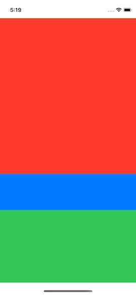 | 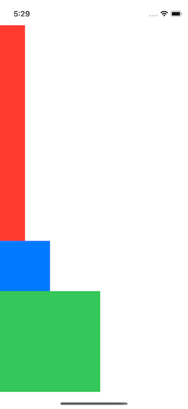 | 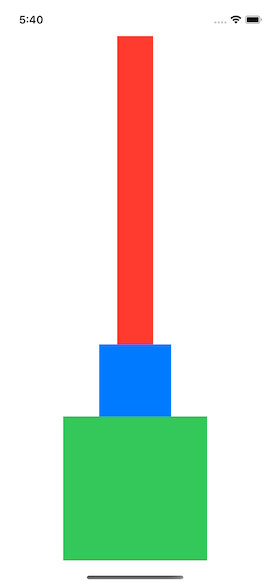 | 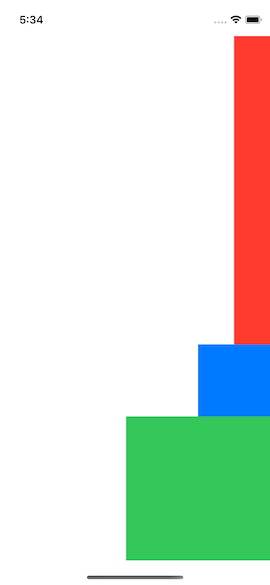 | The stack view overrides the intrinsic height of the red view and stretches it to fill the space. Changing the content hugging priority of the inner views would allow us to control which inner view gets stretched
**Fill Equally** | 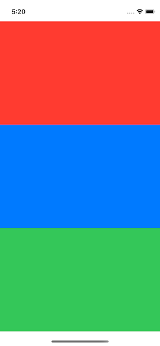 | 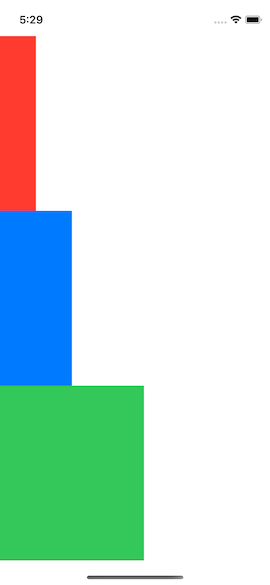 | 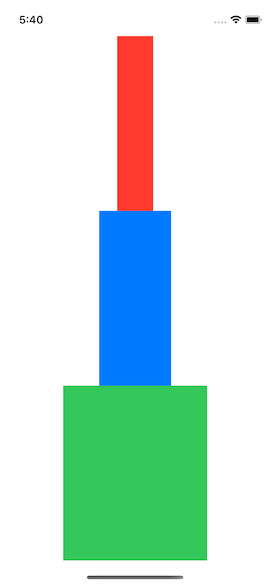 | 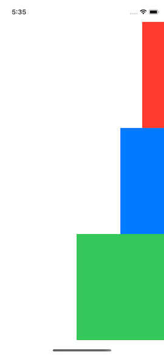 | The stack view overrides the intrinsic height of all the inner views and gives them equal height to fill the space
**Fill Proportionally** | 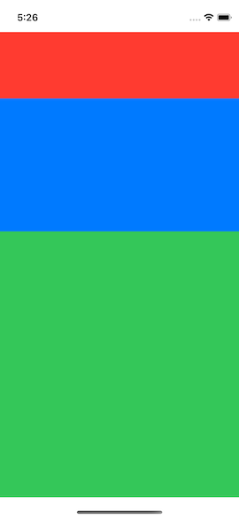 | 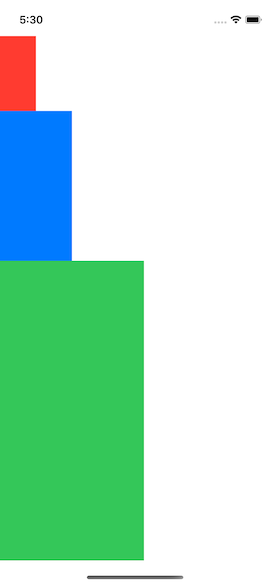 | 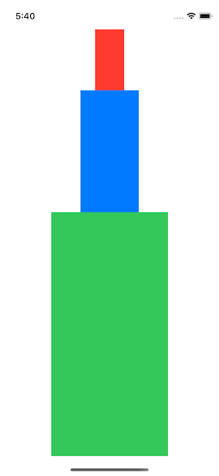 | 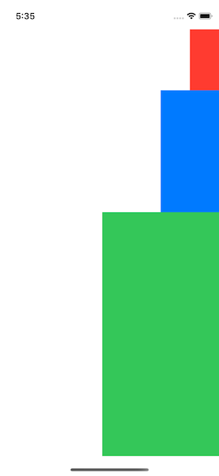 | Each inner view is stretched to fill the space, but they maintain their relative proportions
**Equal Spacing** |  | 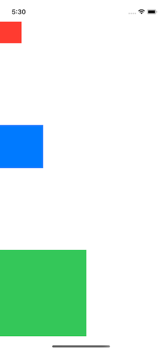 | 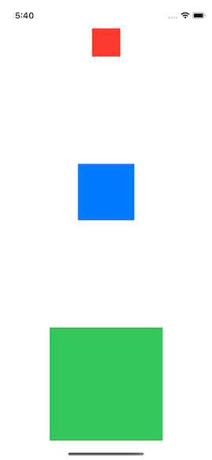 | 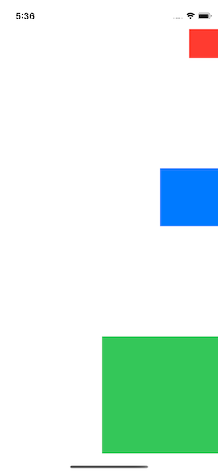 | The intrinsic height of each inner view is respected. They are positioned so that they touch the top and bottom of the stack view, with equal spacing in between.
**Equal Centering** | 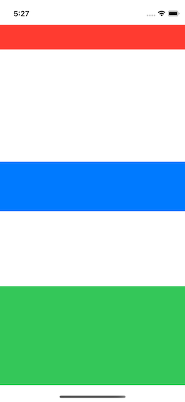 | 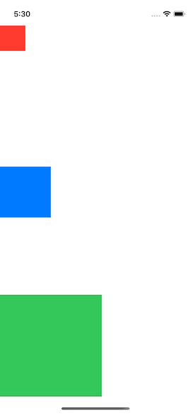 | 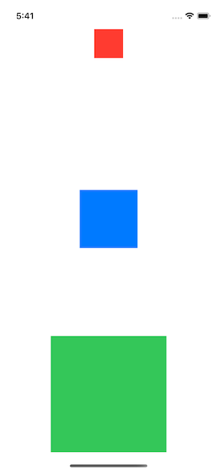 | 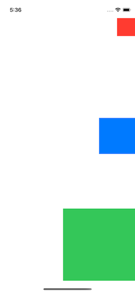 | The intrinsic height of each inner view is respected. They are positioned so that they touch the top and bottom of the stack view, but they are spaced so that the center Y of each view is equal distance apart.
**Notes about Alignment** | The intrinsic width of each inner view is stretched to fill the width of the stack view | The intrinsic width of each inner view is maintained. All inner views are aligned along the leading edge of the stack view. | The intrinsic width of each inner view is maintained. All inner views are aligned along the center X of the stack view. | The intrinsic width of each inner view is maintained. All inner views are aligned along the trailing edge of the stack view. |

<br/>

### StackViews with No Size

In the below table, the same example is used from above except that the stack view is not given any size. Instead it is positioned in the center of the screen:

```swift
NSLayoutConstraint.activate([
    stackView.centerYAnchor.constraint(equalTo: view.centerYAnchor),
    stackView.centerXAnchor.constraint(equalTo: view.centerXAnchor)
])
```

Since the stack view doesn't have an explicit size, its size will be determined by its inner views. The inner views will not need to stretch to fill any available space, so in most cases their intrinsic content size will be respected.

Distribution ↓ / Alignment → | Alignment: Fill | Alignment: Leading | Alignment: Center | Alignment: Trailing | Notes
---|---|---|---|---|---
**Fill** | 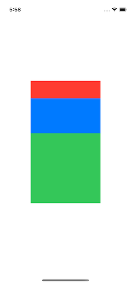 |  | 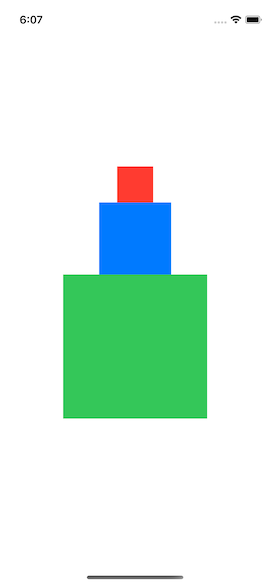 |  | There is no extra space to fill so the inner views can maintain their intrinsic heights
**Fill Equally** | 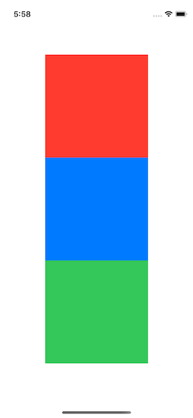 | 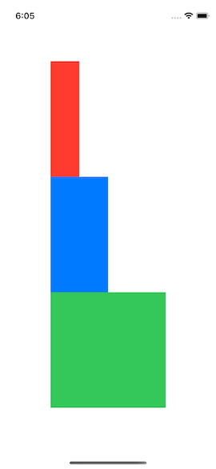 | 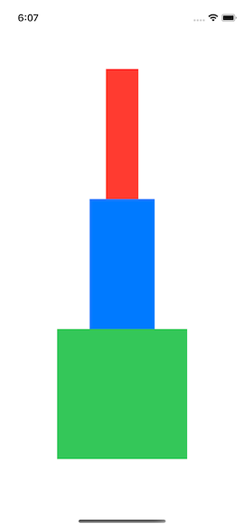 | 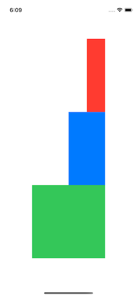 | All inner views need to have the same height so some views need to shrink or stretch. By default, views will prioritize stretching over shrinking so the red and blue views stretch to match the height of the green view.
**Fill Proportionally** | 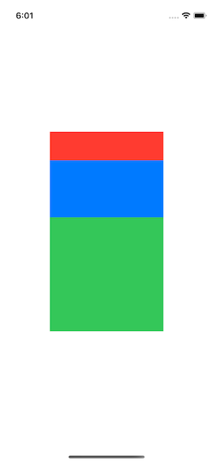 | 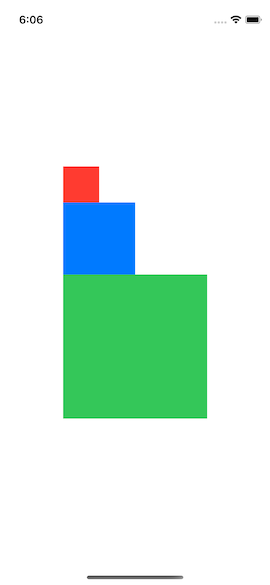 | 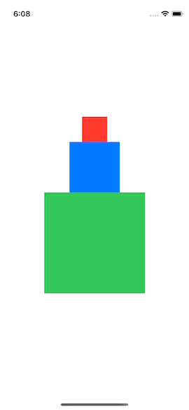 | 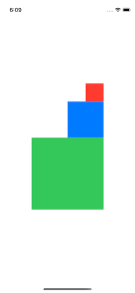 | There is no extra space to fill so the inner views can maintain their intrinsic heights which automatically maintains their relative proportions
**Equal Spacing** |  |  |  |  | There is no extra space to fill so each inner view can maintain their position. They have equal spacing of zero.
**Equal Centering** | 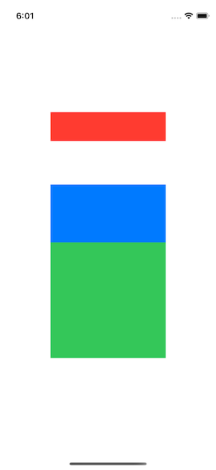 | 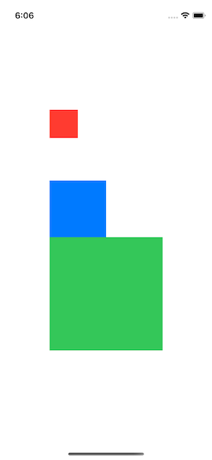 | 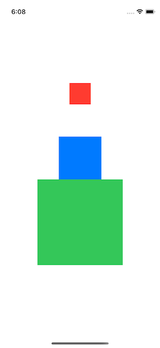 | 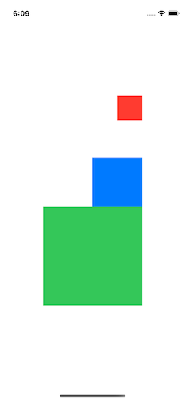 | Each inner view maintains its intrinsic height, but they must be positioned so that their centerY positions are equal distance apart. This results in the space between the red view and the blue view.