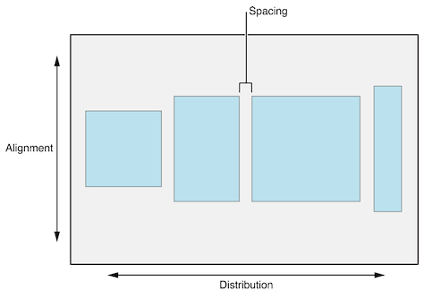
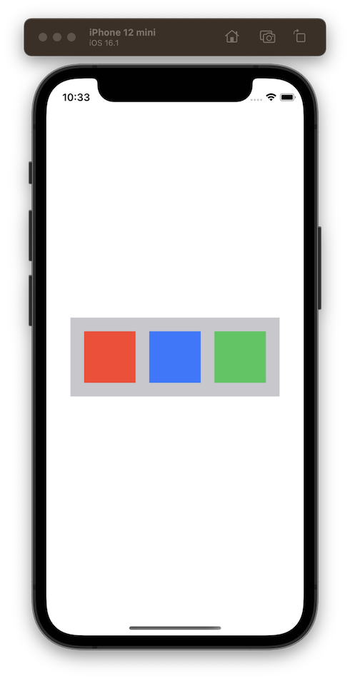

# [UIStackView](https://developer.apple.com/documentation/uikit/uistackview)

Stack views allow you to arrange inner views along either a horizontal or vertical axis with optional spacing in between. The exact layout of the inner views depends on the stack views axis, distribution, alignment and spacing, as well as whether or not the stack view is given a size (through constraints).



Below is an example of a stack view with a horizontal axis and spacing of 20:

```swift
let stackView = UIStackView()
stackView.translatesAutoresizingMaskIntoConstraints = false
stackView.axis = .horizontal
stackView.spacing = 20

let red = makeView(color: .systemRed, width: 75, height: 75)
let blue = makeView(color: .systemBlue, width: 75, height: 75)
let green = makeView(color: .systemGreen, width: 75, height: 75)

view.addSubview(stackView)
stackView.addArrangedSubview(red)
stackView.addArrangedSubview(blue)
stackView.addArrangedSubview(green)

NSLayoutConstraint.activate([
    stackView.centerYAnchor.constraint(equalTo: view.centerYAnchor),
    stackView.centerXAnchor.constraint(equalTo: view.centerXAnchor)
])
```
> Notice that when adding views to a stack view, you need to call `addArrangedSubview()`, not `addSubview()`


Stack views are very useful because they minimize the number of constraints you need to define yourself. Stack views are essentially containers that have no intrinsic size of their own. Unless a stack view is given an explicit size through constraints, its size will be derived by the size of its contents. Because of this, it is important that every view placed inside a stack view has an intrinsic content size.

<br/>

## Distribution and Alignment

### [Distribution](https://developer.apple.com/documentation/uikit/uistackview/distribution)

A stack view's distribution property defines the size and position of the arranged views along the stack view's axis. These are the available options:

* **Fill**
	* The default setting
	* The stack view resizes its arranged views so that they fill the available space along the stack view’s axis.
	* Tries to respect the intrinsic content size of its arranged views but will stretch some if necessary to fill the space
	* Use CHCR to indicate to Auto Layout which views should stretch if needed
* **Fill Equally**
	* The stack view resizes its arranged views so that they fill the available space along the stack view’s axis.
	* It fills the space by making all controls the same size (same height if axis is vertical, same width if axis is horizontal)
	* Does not respect intrinsic content size of the inner views
* **Fill Proportionally**
	* The stack view resizes its arranged views so that they fill the available space along the stack view’s axis.
	* It fills the space by stretching the arranged views while maintaining the relative proportions of their intrinsic sizes
	* All inner views will stretch proportionally
* **Equal Spacing**
	* The stack view positions its arranged views so that they fill the available space along the stack view’s axis.
	* Arranged views are not stretched and retain their intrinsic content size
	* Arranged views are placed so that they have equal spacing between them
* **Equal Centering**
	* The stackview attempts to position the arranged views with equal center-to-center spacing along the stack view’s axis, while maintaining the spacing property’s distance between views.
	* Similar to equal spacing in that inner views retain their intrinsic content size and space is added between inner views instead of stretching them
	* The space between each inner view is not necessarily equal. Rather, the distance between the center position of each inner view is the same


### [Alignment](https://developer.apple.com/documentation/uikit/uistackview/alignment)

A stack view's alignment property defines the size and position of the arranged views along the perpendicular axis. These are the available options:

* **Fill**
	* The default setting
	* The stack view resizes its arranged views so that they fill the available space perpendicular to the stack view’s axis.
* **Center**
	* The stack view aligns the center of its arranged views with its center along its axis.
* **Leading (vertical axis)**
	* The stack view aligns the leading edge of its arranged views along its leading edge.
* **Trailing (vertical axis)**
	* The stack view aligns the trailing edge of its arranged views along its trailing edge.
* **Bottom (horizontal axis)**
	* The stack view aligns the bottom edge of its arranged views along its bottom edge.
* **Top (horizontal axis)**
	* The stack view aligns the top edge of its arranged views along its top edge.
* **First Baseline (horizontal axis)**
	* The stack view aligns its arranged views based on their first baseline.
* **Last Baseline (horizontal axis)**
	* The stack view aligns its arranged views based on their last baseline.

<br/>

### StackViews with Fixed Size

In the below table, each stack view is pinned to the edges of the safe area, giving the stack view a fixed size. Three views have been placed inside the stackview: a red view with an intrinsic size of (50, 50), a blue view with an intrinsic size of (100, 100) and a green view with an intrinsic size of (200, 200). Since the stackview's size is larger than its combined inner views, the inner views need to stretch or position themselves to fill the available space. The distribution and alignment settings will dictate how they do this.

```swift
let stackView = UIStackView()
stackView.translatesAutoresizingMaskIntoConstraints = false
stackView.axis = .vertical
stackView.alignment = .fill // Change this to see different behaviour
stackView.distribution = .fill // Change this to see different behaviour

let red = makeView(color: .systemRed, width: 50, height: 50)
let blue = makeView(color: .systemBlue, width: 100, height: 100)
let green = makeView(color: .systemGreen, width: 200, height: 200)

view.addSubview(stackView)
stackView.addArrangedSubview(red)
stackView.addArrangedSubview(blue)
stackView.addArrangedSubview(green)

NSLayoutConstraint.activate([
    stackView.topAnchor.constraint(equalTo: view.safeAreaLayoutGuide.topAnchor),
    stackView.leadingAnchor.constraint(equalTo: view.leadingAnchor),
    stackView.trailingAnchor.constraint(equalTo: view.trailingAnchor),
    stackView.bottomAnchor.constraint(equalTo: view.safeAreaLayoutGuide.bottomAnchor)
])
```

Distribution ↓ / Alignment → | Alignment: Fill | Alignment: Leading | Alignment: Center | Alignment: Trailing | Notes about Distribution
---|---|---|---|---|---
**Fill** |  |  |  |  | The stack view overrides the intrinsic height of the red view and stretches it to fill the space. Changing the content hugging priority of the inner views would allow us to control which inner view gets stretched
**Fill Equally** |  |  |  |  | The stack view overrides the intrinsic height of all the inner views and gives them equal height to fill the space
**Fill Proportionally** |  |  |  |  | Each inner view is stretched to fill the space, but they maintain their relative proportions
**Equal Spacing** |  |  |  |  | The intrinsic height of each inner view is respected. They are positioned so that they touch the top and bottom of the stack view, with equal spacing in between.
**Equal Centering** |  |  |  |  | The intrinsic height of each inner view is respected. They are positioned so that they touch the top and bottom of the stack view, but they are spaced so that the center Y of each view is equal distance apart.

**Notes about Alignment:** When the alignment is set to Fill, the intrinsic width of each inner view is overridden and each inner view is stretched to fill the width of the stackview. With all other alignment options, the intrinsic widths of the inner views are maintained.

<br/>

### StackViews with No Size

In the below table, the same example is used from above except that the stack view is not given any size. Instead it is positioned in the center of the screen:

```swift
NSLayoutConstraint.activate([
    stackView.centerYAnchor.constraint(equalTo: view.centerYAnchor),
    stackView.centerXAnchor.constraint(equalTo: view.centerXAnchor)
])
```

Since the stack view doesn't have an explicit size, its size will be determined by its inner views. The inner views will not need to stretch to fill any available space, so in most cases their intrinsic content size will be respected.

Distribution ↓ / Alignment → | Alignment: Fill | Alignment: Leading | Alignment: Center | Alignment: Trailing | Notes
---|---|---|---|---|---
**Fill** |  |  |  |  | There is no extra space to fill so the inner views can maintain their intrinsic heights
**Fill Equally** |  |  |  |  | All inner views need to have the same height so some views need to shrink or stretch. By default, views will prioritize stretching over shrinking so the red and blue views stretch to match the height of the green view.
**Fill Proportionally** |  |  |  |  | There is no extra space to fill so the inner views can maintain their intrinsic heights which automatically maintains their relative proportions
**Equal Spacing** |  |  |  |  | There is no extra space to fill so each inner view can maintain their position. They have equal spacing of zero.
**Equal Centering** |  |  |  |  | Each inner view maintains its intrinsic height, but they must be positioned so that their centerY positions are equal distance apart. This results in the space between the red view and the blue view.

**Notes about Alignment:** When the alignment is set to Fill, the width of each inner view needs to stretch to fill the width of the stack view. Since the stack view's width is determined by its largest inner view (in this case the green view), the red and blue views need to stretch to the same width as the green view. With all other alignment options, the intrinsic widths of the inner views are maintained.

<br/>

## Stackviews with Margins

By default, a stack view will position its arranged views so that they are touching the top, bottom, leading and trailing edges of the stack view. However, there is an option to give your stack view a margin. Using the same example from the beginning, we can add a 20 point margin by adding these lines:

```swift
stackView.isLayoutMarginsRelativeArrangement = true
stackView.directionalLayoutMargins = NSDirectionalEdgeInsets(top: 20, leading: 20, bottom: 20, trailing: 20)
```



> Note: The stack view's background color has been set to gray to show stack view's size and margins

This technique is often used when stack views are embedded within scroll views so that you can have scrolling content with a nice margin.

## Links
[Auto Layout Cookbook](https://developer.apple.com/library/archive/documentation/UserExperience/Conceptual/AutolayoutPG/LayoutUsingStackViews.html)