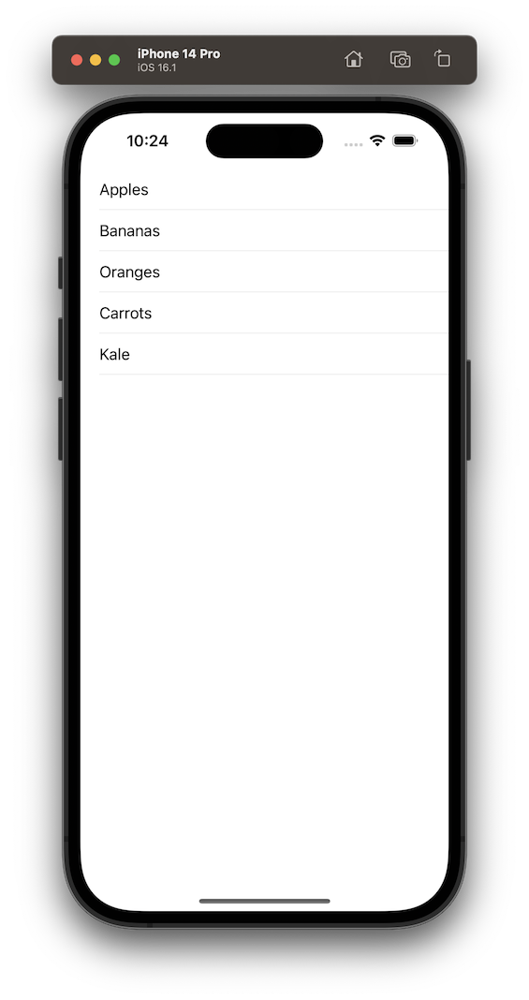
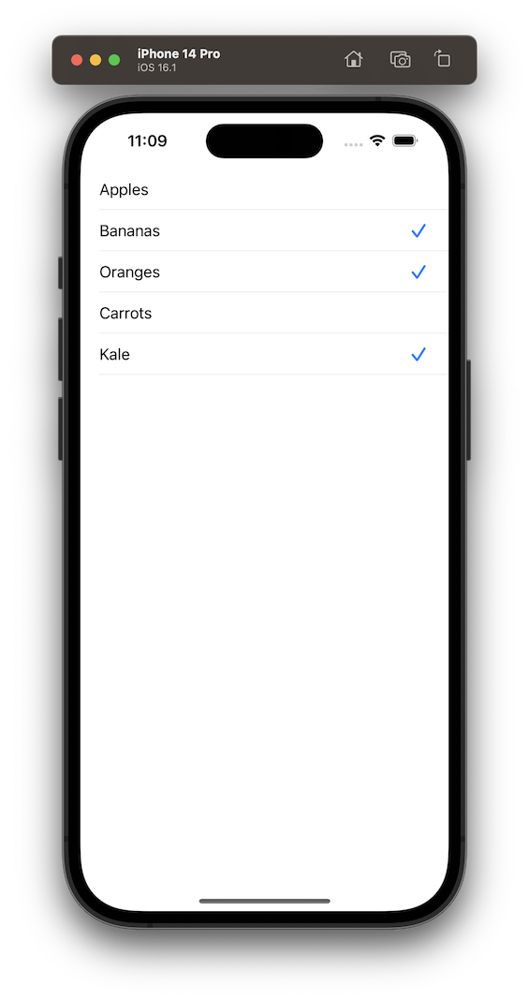

# UITableView

## Basic Table View

Here is the bare minimum needed to create a table view:

```swift
import UIKit

class BasicTableViewController: UIViewController {

    var data = ["Apples", "Bananas", "Oranges", "Carrots", "Kale"]

    var tableView = UITableView()

    override func viewDidLoad() {
        super.viewDidLoad()
        configureTableView()
    }

    private func configureTableView() {
        tableView.register(UITableViewCell.self, forCellReuseIdentifier: "cell")
        tableView.dataSource = self

        view.addSubview(tableView)
        tableView.pin(to: view) // My own function that takes care of layout and constraints
    }
}

extension BasicTableViewController: UITableViewDataSource {
    func tableView(_ tableView: UITableView, numberOfRowsInSection section: Int) -> Int {
        return data.count
    }

    func tableView(_ tableView: UITableView, cellForRowAt indexPath: IndexPath) -> UITableViewCell {
        let cell = tableView.dequeueReusableCell(withIdentifier: "cell", for: indexPath)
        cell.textLabel?.text = data[indexPath.row]
        return cell
    }
}
```


Besides adding the tableview to your view controller and applying layout and constraints, there are two more required steps:

### 1. Implement the `UITableViewDataSource` protocol

Implement the `UITableViewDataSource` and the two required functions, `numberOfRowsInSection` and `cellForRowAt` which define what information will be displayed in the table view.

```swift
extension BasicTableViewController: UITableViewDataSource {
    func tableView(_ tableView: UITableView, numberOfRowsInSection section: Int) -> Int {
        return data.count
    }

    func tableView(_ tableView: UITableView, cellForRowAt indexPath: IndexPath) -> UITableViewCell {
        let cell = UITableViewCell()
        cell.textLabel?.text = data[indexPath.row]
        return cell
    }
}
```
Make sure to also set the table view's data source to `self`:

```swift
tableView.dataSource = self
```

The `numberOfRowsInSection` function defines how many rows are in each section. In this example we have only one section so we just return the number of items in our `data` array.

The `cellForRowAt` function configures and returns the cell that is used for a particular row. In the above code snippet a new `UITableViewCell` is being created every time the function is called which is not good for performance. Instead it is encouraged to reuse cells by using the `dequeueReusableCell` function:

```swift
let cell = tableView.dequeueReusableCell(withIdentifier: "cell", for: indexPath)
```

### 2. Register a `UITableViewCell`

To be able to reuse cells using the `dequeueReusableCell` function, you first need to register the cell:

```swift
tableView.register(UITableViewCell.self, forCellReuseIdentifier: "cell")
```

The first argument is the `UITableViewCell` class. In this example we are using the default class but you can register custom classes if you want. The second argument is the "reuseIdentifier" which can be whatever you want as long as it matches the reuse identifier used in `dequeueReusableCell`.

## Selecting Table Rows
In order to select table rows, you need to implement the `UITableViewDelegate` protocol, implement the `didSelectRowAt` function and set your table view's delegate to `self`:

```swift
tableView.delegate = self
```

```swift
extension BasicTableViewController: UITableViewDelegate {
    func tableView(_ tableView: UITableView, didSelectRowAt indexPath: IndexPath) {
        tableView.cellForRow(at: indexPath)?.accessoryType = .checkmark
        tableView.deselectRow(at: indexPath, animated: true)
    }
}
```
In the above example, a checkmark is added to every row that is selected.




## To Do
* Select row
* Custom cell (with and without nib)
* Adding and removing
* Search and filter
* Sections
* Swipe actions
* Moving cells
* Notes about reuse of cells
* section and table headers/footers