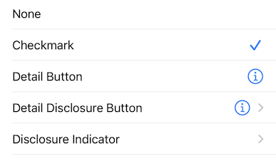

# UITableView

## Basic Table View

Below is an example of a basic table view:

```swift
import UIKit

class BasicTableVC: UIViewController {

    var data = ["Apples", "Bananas", "Oranges", "Carrots", "Kale"]

    var tableView = UITableView()

    override func viewDidLoad() {
        super.viewDidLoad()
        configureTableView()
    }

    private func configureTableView() {
        tableView.register(UITableViewCell.self, forCellReuseIdentifier: "cell")
        tableView.dataSource = self

        view.addSubview(tableView)
        tableView.pin(to: view) // Custom function that takes care of layout and constraints
    }
}

extension BasicTableVC: UITableViewDataSource {
    func tableView(_ tableView: UITableView, numberOfRowsInSection section: Int) -> Int {
        return data.count
    }

    func tableView(_ tableView: UITableView, cellForRowAt indexPath: IndexPath) -> UITableViewCell {
        let cell = tableView.dequeueReusableCell(withIdentifier: "cell", for: indexPath)
        cell.textLabel?.text = data[indexPath.row]
        return cell
    }
}
```


Besides adding the tableview to your view controller and applying layout and constraints, there are two more required steps:

<br/>

### 1. Adopt the `UITableViewDataSource` protocol

Adopt the `UITableViewDataSource` protocol and implement the two required functions, `numberOfRowsInSection` and `cellForRowAt` which define the information that will be displayed in the table view.

```swift
extension BasicTableVC: UITableViewDataSource {
    func tableView(_ tableView: UITableView, numberOfRowsInSection section: Int) -> Int {
        return data.count
    }

    func tableView(_ tableView: UITableView, cellForRowAt indexPath: IndexPath) -> UITableViewCell {
        let cell = tableView.dequeueReusableCell(withIdentifier: "cell", for: indexPath)
        cell.textLabel?.text = data[indexPath.row]
        return cell
    }
}
```
Make sure to also set the table view's data source to `self`:

```swift
tableView.dataSource = self
```

The `numberOfRowsInSection` function defines how many rows are in each section. In this example we have only one section so we just return the number of items in our `data` array.

The `cellForRowAt` function configures and returns the cell that is used for a particular row. Technically, you can simply create and return a UITableViewCell (`return UITableViewCell()`), however this would create a new cell every time the function is called which is not good for performance. Instead it is encouraged to reuse cells by using the `dequeueReusableCell` function:

```swift
let cell = tableView.dequeueReusableCell(withIdentifier: "cell", for: indexPath)
```

<br/>

### 2. Register a `UITableViewCell`

To be able to reuse cells using the `dequeueReusableCell` function, you first need to register the cell:

```swift
tableView.register(UITableViewCell.self, forCellReuseIdentifier: "cell")
```

The first argument is the `UITableViewCell` class. In this example we are using the default class but you can register custom classes if you want. The second argument is the "reuseIdentifier" which can be whatever you want as long as it matches the reuse identifier used in `dequeueReusableCell`.

<br/>

## Cell Accessory Types
The default table view cell has five different accessory options that can be enabled which display an icon on the right hand side of the cell:

```swift
cell.accessoryType = .detailButton
```


<br/>

## Selecting Table Rows
In order to select table rows, you need to adopt the `UITableViewDelegate` protocol, implement the `didSelectRowAt` function and set your table view's delegate to `self`:

```swift
tableView.delegate = self
```

```swift
extension BasicTableVC: UITableViewDelegate {
    func tableView(_ tableView: UITableView, didSelectRowAt indexPath: IndexPath) {
        tableView.cellForRow(at: indexPath)?.accessoryType = .checkmark
        tableView.deselectRow(at: indexPath, animated: true)
    }
}
```
In the above example, a checkmark is added to every row that is selected.


<br/>

## Custom Cells

The above examples use the default `UITableView` cell but it's possible to create your own custom cells. You can do this entirely through code or by making use of a nib (.xib) file.

<br/>

### Creating Custom Cells Programmatically

#### 1. Create a class that subclasses `UITableViewCell`

Below is a custom `UITableViewCell` class that displays an icon and a label.

```swift
class CustomCell: UITableViewCell {

    static let identifier = "CustomCell"

    let icon = UIImageView()
    let titleLabel = UILabel()

    override init(style: UITableViewCell.CellStyle, reuseIdentifier: String?) {
        super.init(style: style, reuseIdentifier: reuseIdentifier)
        configureCell()
    }

    required init?(coder: NSCoder) {
        fatalError("init(coder:) has not been implemented")
    }

    func configureCell() {
        addSubview(icon)
        addSubview(titleLabel)

        icon.contentMode = .scaleAspectFit
        titleLabel.font = .systemFont(ofSize: 18)

        icon.translatesAutoresizingMaskIntoConstraints = false
        titleLabel.translatesAutoresizingMaskIntoConstraints = false

        NSLayoutConstraint.activate([
            icon.centerYAnchor.constraint(equalTo: centerYAnchor),
            icon.leadingAnchor.constraint(equalTo: leadingAnchor, constant: 20),
            icon.widthAnchor.constraint(equalToConstant: 25),

            titleLabel.centerYAnchor.constraint(equalTo: centerYAnchor),
            titleLabel.leadingAnchor.constraint(equalTo: icon.trailingAnchor, constant: 20)
        ])
    }

    func set(category: Category) {
        icon.image = category.image
        titleLabel.text = category.title
    }
}
```

<br/>

#### 2. Register your custom cell

Inside the view controller that contains the table where you will use your custom cell, make sure to register the cell:

```swift
tableView.register(CustomCell.self, forCellReuseIdentifier: CustomCell.identifier)
```

<br/>

#### 3. Dequeue your custom cell

In the `cellForRowAt` function, dequeue your custom cell and configure it:

```swift
func tableView(_ tableView: UITableView, cellForRowAt indexPath: IndexPath) -> UITableViewCell {
    let cell = tableView.dequeueReusableCell(withIdentifier: CustomCell.identifier, for: indexPath) as! CustomCell
    cell.set(category: data[indexPath.row])
    return cell
}
```


### Custom Cells with Nibs

This example will create the exact same custom cell shown above except that it will make use of a ".xib" file which allows you to design the cell in Interface Builder.

#### 1. Create a subclass of `UITableViewCell` along with a ".xib" file

Create a new Cocoa Touch Class file and make it subclass `UITableViewCell`. Be sure to check the "*Also create XIB file*" checkbox.


This will create two files: a `.swift` file and a `.xib` file.

<br/>

#### 2. Design your cell in the Interface Builder

Open the .xib file and add UI components such as labels, images etc. and give them constraints


<br/>

#### 3. Fill in the Reuse Identifier

Select your nib in the hierarchy and then open the Attributes Inspector. Give the "Identifier" a unique name. Make a note of this name as it will later be used in your code to create an instance of this cell.


<br/>

#### 4. Create IBOutlets

Open the Assistant Editor and create IBoutlets for any of the controls that you want to dynamically configure.


<br/>

#### 5. Register your custom cell

This step is the same as if you were creating a custom cell programmatically except that you register a `UINib` instead of a Cell class. Make sure to use the same identifier string that you assigned to your .xib file.

```swift
tableView.register(UINib(nibName: CustomNibCell.nibName, bundle: nil), forCellReuseIdentifier: CustomNibCell.nibIdentifier)
```

<br/>

#### 6. Dequeue your custom cell

This step is the same as if you were creating a custom cell programmatically.

```swift
func tableView(_ tableView: UITableView, cellForRowAt indexPath: IndexPath) -> UITableViewCell {
    let cell = tableView.dequeueReusableCell(withIdentifier: CustomNibCell.nibIdentifier, for: indexPath) as! CustomNibCell
    cell.set(category: data[indexPath.row])
    return cell
}
```

<br/>

## Good to Know
* The function `func tableView(_ tableView: UITableView, cellForRowAt indexPath: IndexPath) -> UITableViewCell` is called every time a new cell comes into view. So when you scroll, this function is called repeatedly. Therefore it is important to keep this function as lightweight as possible.

<br/>

## Helpful Links
* [Custom Cell Tutorial](https://www.youtube.com/watch?v=bXHinfFMkFw&list=PL8seg1JPkqgGCLhYmf-zwG2Y2f06yJOyc&ab_channel=SeanAllen)

<br/>

## To Add
* Adding and removing cells
* Search and filter
* Sections
* Swipe actions
* Moving cells
* Notes about reuse of cells
* section and table headers/footers
* [prepareForReuse()](https://developer.apple.com/documentation/uikit/views_and_controls/table_views/configuring_the_cells_for_your_table)
* UITableViewDiffableDataSource
* beginUpdates, endUpdates, reloadData()