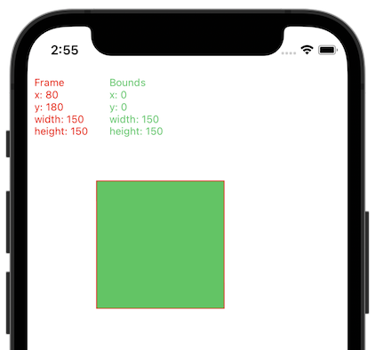
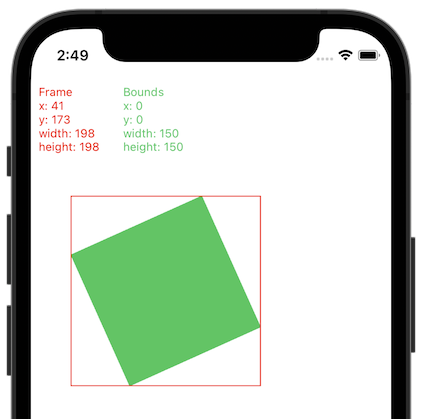
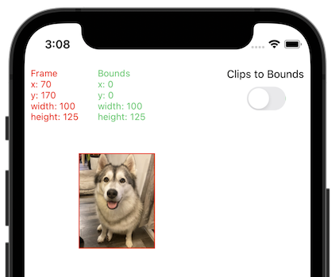
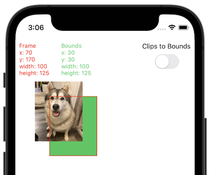
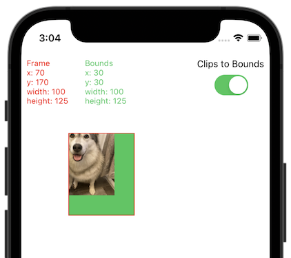

# [UIView](https://developer.apple.com/documentation/uikit/uiview)

A `UIView` is an object that manages the content for a rectangular area on the screen. Views are the fundamental building blocks of an app's user interface.

 

## Frame vs Bounds

The [`frame`](https://developer.apple.com/documentation/uikit/uiview/1622621-frame) and [`bounds`](https://developer.apple.com/documentation/uikit/uiview/1622580-bounds) of a view are two properties of type `CGRect` that define a view's geometry. The frame defines the position and dimensions of a view in the coordinate system of its superview (a view's position relative to its parent), whereas the bounds defines a view's position and dimensions relative to its own coordinate system (a view's position relative to itself).

Another way to think of it is that the bounds refers to the local space of a view, whereas the frame refers to the world space of a view (where the world is the parent view).

> Note: The origin of both the frame and bounds is in the top left corner of the view with positive X going right and positive Y going down.

For example, the green view below has been given a frame of CGRect(x: 80, y: 180, width: 150, height: 150). We can see that it is positioned at (x: 80, y: 180) relative to its superview, however its bounds have a position of (x: 0, y: 0). Notice how the dimensions of the frame and the bounds are the same.

 

If we apply a rotation to the green view and draw the frame in red, we can see that the frame changes position and size to accomodate the green view, however the bounds of the green view remain unchanged because they reflect the local space of the view.

 

### Adjusting the Bounds

Below we have a container view with an image inside. The container has a frame of CGRect(x: 70, y: 170, width: 100, height: 125).

 

When we set the origin of the container view's bounds to (x: 30, y: 30), it looks like the image has been moved up and to the left, but what is really happening is that we are seeing the contents of the container view shifted relative to its own coordinate space. Another way to think of it is like having a camera positioned at (x: 0, y: 0), moving 30 to the right and 30 down.

 

If we set the [`clipsToBounds`](https://developer.apple.com/documentation/uikit/uiview/1622415-clipstobounds) property to true, we can see that the contents of the container view are clipped to its bounds:

 

## Links

* [Video about Frame and Bounds](https://www.youtube.com/watch?v=IzNvHIsD03E&ab_channel=Kodeco)