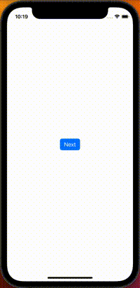
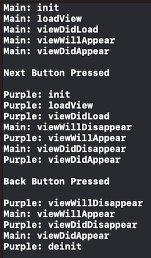

# [UIViewController](https://developer.apple.com/documentation/uikit/uiviewcontroller)

## View Controller Lifecycle

View controller lifecycle methods are called automatically at various points throughout a view controller's lifetime. You can override these methods to add custom functionality at these points in time, but if you do, you must call `super` at some point in your implementation. All of these methods are called no matter if the view controller is created programmatically or from a nib file.

#### [`init`](https://docs.swift.org/swift-book/documentation/the-swift-programming-language/initialization#Initializers)

* Called when the view controller is first created
* Override this method if you need to inject any dependencies into your view controller

#### [`loadView`](https://developer.apple.com/documentation/uikit/uiviewcontroller/1621454-loadview)

* Creates the view that the view controller manages
* The view controller calls this method when its `view` property is requested but is currently `nil`. It loads or creates a view and assigns it to the `view` property.
* You should never call this method directly
* If you use Interface Builder to create your views and initialize the view controller, you must not override this method
* If are creating your views programmatically, you can override this method in order to create your views manually. If you do this, assign the root view of your view hierarchy to the `view` property and do not call `super`. The views you create should be unique instances and should not be shared with any other view controller object

#### [`viewDidLoad`](https://developer.apple.com/documentation/uikit/uiviewcontroller/1621495-viewdidload)

* Called after the view controller's view is loaded into memory
* This method is only called once, after the view is initialized and loaded
* Use this method to perform additional initialization
* If you need to perform tasks every time the view becomes visible (ex: navigating forward and back), put those tasks inside `viewDidAppear` instead.

#### [`viewWillAppear`](https://developer.apple.com/documentation/uikit/uiviewcontroller/1621510-viewwillappear)

* Called right before the view controller's view is added to a view hierarchy
* Use this method to perform custom tasks associated with displaying the view like changing the style of the status bar to coordinate with the style of the view being presented

#### [`viewDidAppear`](https://developer.apple.com/documentation/uikit/uiviewcontroller/1621423-viewdidappear)

* Called right after the view controller's view is added to a view hierarchy
* Use this method to perform any tasks that should start when the user first sees the view controller (like playing an animation, starting a timer or triggering an analytics event)

> Note: It is important to note that these methods `viewWillAppear` and `viewDidAppear` will still be called even if the view controller isn't necessarily visible on the screen (due to it being blocked by another component or `view.isHidden` being set to true). Despite the naming, it's not about whether the view is actually visible on screen, it's about whether or not it's in the view hierarchy.

#### [`viewWillDisappear`](https://developer.apple.com/documentation/uikit/uiviewcontroller/1621485-viewwilldisappear)

* Called right before the view controller's view is removed from a view hierarchy
* Use this method to do things like save changes, stop animations or revert alterations to the UI that were made in `viewWillAppear`

#### [`viewDidDisappear`](https://developer.apple.com/documentation/uikit/uiviewcontroller/1621477-viewdiddisappear)

* Called right after the view controller's view is removed from a view hierarchy
* Use this method to perform additional tasks associated with dismissing or hiding the view
* Note: The view still exists in memory at this point, it’s just not visible to the user

#### [`deinit`](https://docs.swift.org/swift-book/documentation/the-swift-programming-language/deinitialization)

* This method is called immediately before the view controller instance is deallocated
* Override this method to perform any necessary cleanup actions such as removing notification observers (`NotificationCenter.default.removeObserver(self)`)

 

### Example

In the below example we have a `MainViewController` which contains a button that navigates to another view controller `PurpleViewController`. The purple view controller has a button that navigates back to the main view controller. If we add print statements to the lifecycle methods of each of these view controllers we can see the timeline of when they are called.

> Notice that the `deinit` function of the main view controller is never called. This is because it still exists "underneath" the purple view controller.

 

## Other View-Related Events

#### [`viewWillLayoutSubviews`](https://developer.apple.com/documentation/uikit/uiviewcontroller/1621437-viewwilllayoutsubviews)

* This method is called when the view controller's view's bounds change, but *before* it lays out its subviews
* The default implementation of this methods does nothing so you do not need to call `super` if you override this method

#### [`viewDidLayoutSubviews`](https://developer.apple.com/documentation/uikit/uiviewcontroller/1621398-viewdidlayoutsubviews)

* Called when the view controller's view's bounds change, but *after* it has finished laying out its subviews
* The default implementation of this methods does nothing so you do not need to call `super` if you override this method

> Note: Whenever a view's bounds change (ex: by rotating from portrait to landscape), the view adjusts the position of its subviews. This is what is referred to by "LayoutSubviews" in the `viewWillLayoutSubviews` and `viewDidLayoutSubviews` methods.

 

## Links
* [Showing and Hiding View Controllers](https://developer.apple.com/documentation/uikit/view_controllers/showing_and_hiding_view_controllers)
* [View Controller Rotations](https://developer.apple.com/documentation/uikit/uiviewcontroller#1652814)
* [ViewController Lifecycle Video](https://www.youtube.com/watch?v=d7ZqxvbiTyg&ab_channel=SeanAllen)